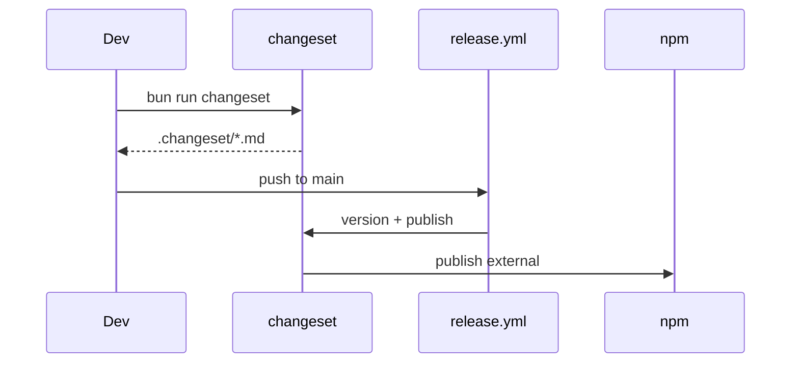

# Changeset Versioning

Versioning and releases via Changesets. Only `external` is published.

## When to use

- After adding new feature (new export, subpath)
- After bug fix
- Before release
- When bumping versions

## Commands

```bash
bun run changeset        # create .changeset/*.md
mchangeset version       # bump versions from changesets
mchangeset publish       # publish to npm
mchangeset init          # ensure config (run by prepare)
```

## Workflow



## Types

- `patch`: bug fixes
- `minor`: new features (new exports, subpaths)
- `major`: breaking changes

## Config

- `configs/changeset/config.json` — ignores `internal`, `example`, `configs/*`
- `mchangeset` bakes in config path
- `.changeset/` dir contains markdown changesets

## References

- [Changeset README](../../changeset/README.md)
- [Changeset AGENT](../../changeset/AGENT.md)
