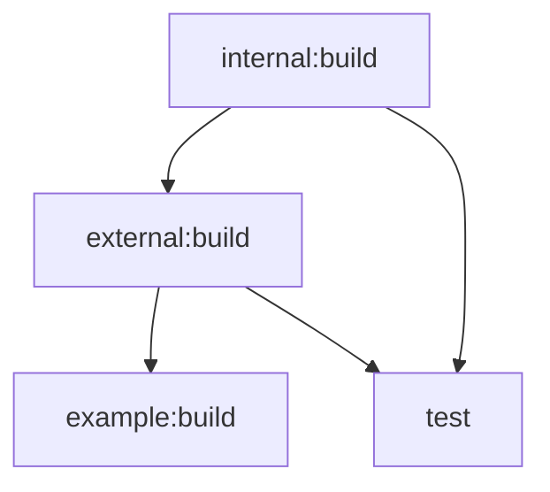

# Turborepo Orchestration

Turbo manages build ordering, caching, and persistent dev tasks for the monorepo.

## When to use

- Building packages in dependency order
- Running dev servers
- Type-checking all packages
- Understanding task dependencies
- Debugging cache issues

## Commands

```bash
bun run build        # build all (dependency order, cached)
bun run dev          # watch all (persistent, no cache)
bun run typecheck    # type-check all
bun run test         # test all via mturbo
mturbo build         # direct
mturbo dev           # direct
```

## Task Graph

| Task | Depends | Output | Cache |
| :--- | :--- | :--- | :---: |
| `build` | `^build` | `dist/` | ✅ |
| `typecheck` | `^build` | — | ✅ |
| `test` | `^build` | `coverage/` | ✅ |
| `dev` | — | — | ❌ |
| `coverage` | `^build` | `lcov.info` | ✅ |



## Config

- `configs/turbo/turbo.base.json` — root task graph (no root `turbo.json`)
- `mturbo` bakes in `--root-turbo-json`
- Cache in `.turbo/`

## Do NOT

- Create root `turbo.json`
- Run `tsc` or `bunup` directly from root
- Commit `.turbo/`

## References

- [Turbo README](../../turbo/README.md)
- [Turbo AGENT](../../turbo/AGENT.md)
