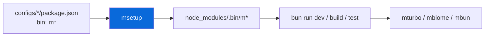
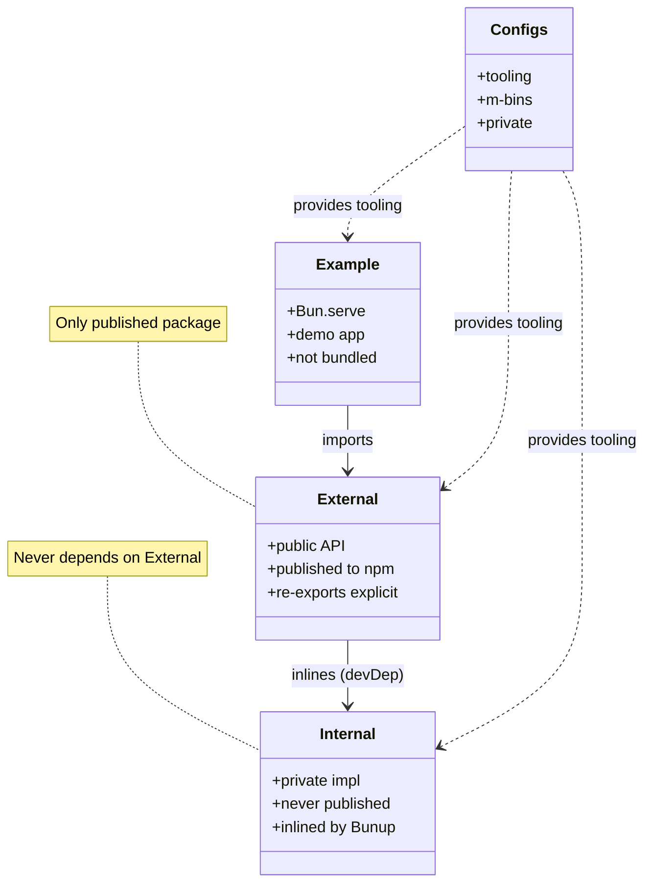
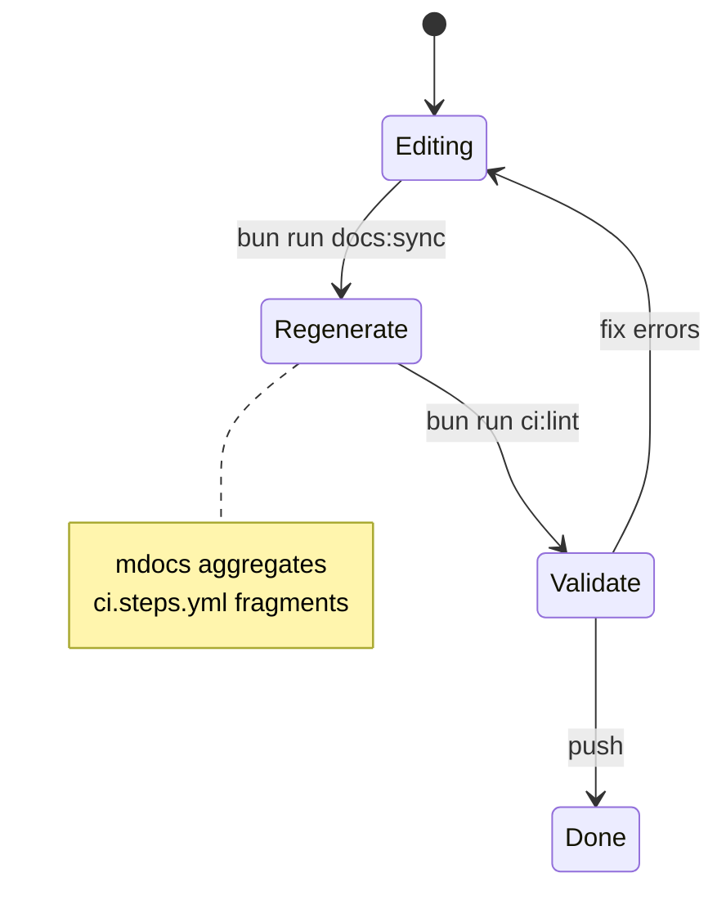
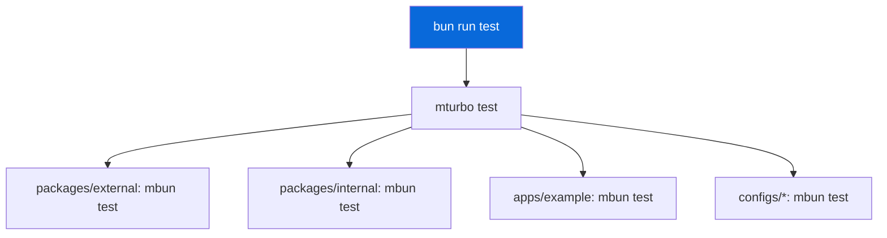

<!-- TEMPLATE-ONLY:START(template) -->
# AGENTS.md - Template

> System prompt for AI coding agents working in this **template** repository.

This repository is a **template** for TypeScript monorepos. It contains opt-in configs (Playwright, UnoCSS, NAPI-RS, AI skills, Devcontainer) and a data-driven scaffolder in `configs/template/` that turns the template into a reusable monorepo via `bun create`.

> [!NOTE]
> Template mode: this intro is stripped after scaffolding.

## Using this template

```bash
bun create Archont561/ts-monorepo-template my-app
cd my-app
bun install
```

During scaffolding, `@myorg` is replaced with your scope, `TEMPLATE-ONLY` blocks are stripped, template-only files and disabled configs are pruned, and CI workflows are regenerated from survivors.

After scaffolding, this file will describe your monorepo (see below).

---

<!-- TEMPLATE-ONLY:END(template) -->
# AGENTS.md

> System prompt for AI coding agents working in this repository.

## Absolute Constraints

> [!CAUTION]
> These rules are non-negotiable. Violations break CI or publishing.

- **CRITICAL**: Use **Bun** for everything. Never invoke `npm`, `pnpm`, `yarn`, or `npx`.
- **CRITICAL**: Use **Biome** (`bun run check`, `bun run check:fix`) for formatting and linting. Never invoke `eslint`, `prettier`, or `lint-staged`.
- **CRITICAL**: Never add `typescript`, `bunup`, or `@types/bun` to individual package devDependencies. They are owned by `@myorg/ts` (`configs/ts`) and hoisted from there.
- **CRITICAL**: Do not modify any file inside `dist/` directories. They are generated by Bunup.
- **CRITICAL**: Do not use `baseUrl` in any `tsconfig.json`. It was removed in TypeScript 7.0 (TS5102).
- **CRITICAL**: All tool config lives in `configs/*` and is referenced by CLI flags. Do not create root-level `turbo.json`, `biome.json`, `bunfig.toml`, `commitlint.config.js`, or `.actrc` files.

## Setup

```bash
bun install
```

This installs dependencies and runs the `prepare` script, which:

- Links the config packages' `m`-prefixed CLI bins into `node_modules/.bin`
- Regenerates the root `lefthook.yml` wrapper (from `configs/lefthook/lefthook.yml`) plus the installed Lefthook Git hooks
- Ensures `.changeset/config.json` exists (from `configs/changeset/config.json`)

> [!TIP]
> `prepare` uses `msetup lefthook` + `mchangeset init` — no generated state is committed.

## CLI Aliases (m-commands)

All tool invocations use `m`-prefixed aliases that bake in config paths. Each config package exposes exactly one `m`-command (with subcommands where needed). They are linked into `node_modules/.bin` on install (the root ships zero `devDependencies`), so just `bun run <script>` — do not invoke tools directly.

| Alias | Wraps | Description |
| :--- | :--- | :--- |
| `mturbo` | `turbo` | Build orchestration with `turbo.base.json` |
| `mbiome` | `biome` | Lint + format with shared config |
| `mbun` | `bun` + `mturbo coverage` | Bun runtime with `bunfig.toml`; `mbun coverage` merges LCOV (citty) |
| `mbunup` | `bunup` | Package bundler |
| `mchangeset` | `changeset` | Versioning + releases; `mchangeset init` ensures config (citty) |
| `mci` | `actionlint` + `act` | CI: `mci lint` validates workflows, `mci act` runs locally (citty) |
| `mcitty` | `citty` | CLI builder info |
| `me2e` | `playwright test` | E2E with browser detection and auto-skip |
| `mskills` | `citty` + `skills` | AI agent skill management (citty, 8 subcommands) |
| `msetup` | `citty` | Links m-bins, regenerates `lefthook.yml`, hooks (citty) |
| `mdocs` | `citty` | Regenerates workflows from `configs/*` (citty) |
| `mtsc` | `tsc` | TypeScript type-checking |

<details>
<summary>Bin linking flow</summary>



- `msetup` scans `configs/*/package.json` `bin` fields and symlinks them
- Root `package.json` has zero `devDependencies` — all tools are workspaces

</details>

## Development Commands

```bash
bun run dev            # Start all packages in watch mode via Turbo
bun run build          # Build all packages (Turbo orchestrates dependency order)
bun run typecheck      # Type-check all packages
bun run test           # Run all unit tests (Turbo runs each package's mbun test)
bun run test:e2e       # Run Playwright E2E tests (auto-skips if browsers missing)
bun run coverage       # Collect unit-test coverage (mbun coverage + merged LCOV)
bun run check          # Lint and format check (Biome)
bun run check:fix      # Auto-fix lint and format issues
bun run ci:lint        # Validate GitHub Actions workflows (mci lint)
bun run skills:list    # List available AI agent skills
bun run skills:sync    # Sync curated → vendored + validate + index
bun run skills:add <pkg> # Add via skills.sh (e.g. vercel-labs/agent-skills)
bun run skills:update  # Update via skills.sh
bun run skills:validate # Validate SKILL.md frontmatter
bun run skills:index   # Build skills.index.json
bun run docs:sync      # Regenerate workflows from configs/* (mdocs)
```

The root scripts are clean one-liners backed by the m-commands above. The shared tool configs live in `configs/*` and are never re-declared at root.

## Package Architecture



```text
apps/example → @myorg/external → (inlines) @myorg/internal
```

- `@myorg/external`: The **only published package**. Contains the public API.
- `@myorg/internal`: **Private**. Implementation details inlined into external by Bunup.
- `configs/*`: **Private**. Shared tooling configurations (see Configs section).
- `apps/example`: **Private**. Bun.serve HTTP demo app. Not bundled.

### Dependency Rules

> [!WARNING]
> Circular deps break the build. `internal` must never depend on `external`.

1. `external` may depend on `internal` (as devDependency, inlined by Bunup).
2. `internal` must **never** depend on `external` (circular dependency).
3. Apps should only import from `@myorg/external`, not from `@myorg/internal` directly.
4. All inter-package dependencies use `workspace:*` protocol.

## Configs

Tool configs and their agent-facing docs (reference, not concatenated):

| Config | File | Purpose |
| :--- | :--- | :--- |
| Biome | [AGENT.md](configs/biome/AGENT.md) | Lint and format |
| Bun Config | [AGENT.md](configs/bun-config/AGENT.md) | Bun runtime and coverage (citty) |
| Bunup | [AGENT.md](configs/bunup/AGENT.md) | Bundling presets |
| Changeset | [AGENT.md](configs/changeset/AGENT.md) | Releases (citty) |
| Citty | [AGENT.md](configs/citty/AGENT.md) | CLI builder (citty) |
| Commitlint | [AGENT.md](configs/commitlint/AGENT.md) | Commit messages |
| GitHub Actions | [AGENT.md](configs/gh-actions/AGENT.md) | CI workflow validation and local act (citty) |
| Lefthook | [AGENT.md](configs/lefthook/AGENT.md) | Git hooks (citty) |
| TypeScript | [AGENT.md](configs/ts/AGENT.md) | Shared tsconfigs |
| Turbo | [AGENT.md](configs/turbo/AGENT.md) | Task orchestration |

<!-- TEMPLATE-ONLY:START(playwright,skills,template,unocss,native,devcontainer,pages) -->
#### Opt-in configs (present only when selected)

<!-- TEMPLATE-ONLY:END(playwright,skills,template,unocss,native,devcontainer,pages) -->
<!-- TEMPLATE-ONLY:START(devcontainer) -->
- Devcontainer | [AGENT.md](configs/devcontainer/AGENT.md) | Codespaces / Dev Containers, opt-in
<!-- TEMPLATE-ONLY:END(devcontainer) -->
<!-- TEMPLATE-ONLY:START(native) -->
- Native | [AGENT.md](configs/native/AGENT.md) | NAPI-RS opt-in
<!-- TEMPLATE-ONLY:END(native) -->
<!-- TEMPLATE-ONLY:START(playwright) -->
- Playwright | [AGENT.md](configs/playwright/AGENT.md) | E2E testing
<!-- TEMPLATE-ONLY:END(playwright) -->
<!-- TEMPLATE-ONLY:START(skills) -->
- Skills | [AGENT.md](configs/skills/AGENT.md) | AI agent skills, opt-in
<!-- TEMPLATE-ONLY:END(skills) -->
<!-- TEMPLATE-ONLY:START(template) -->
- Template | [AGENT.md](configs/template/AGENT.md) | Scaffolder, template-only
<!-- TEMPLATE-ONLY:END(template) -->
<!-- TEMPLATE-ONLY:START(unocss) -->
- UnoCSS | [AGENT.md](configs/unocss/AGENT.md) | Atomic CSS, opt-in
<!-- TEMPLATE-ONLY:END(unocss) -->
<!-- TEMPLATE-ONLY:START(pages) -->
- Pages | [AGENT.md](configs/pages/AGENT.md) | GitHub Pages deployment, opt-in
<!-- TEMPLATE-ONLY:END(pages) -->

## Workflows

> [!NOTE]
> Workflows in `.github/workflows/` are generated from skeletons in `configs/gh-actions/*.base.yml` with fragments from `configs/*/ci.steps.yml`. Edit skeletons and fragments, then run `bun run docs:sync` (`mdocs`).



## Code Style

- Biome handles all formatting, linting, and import sorting. There is no root `biome.json`.
- Run `bun run check:fix` before committing.

> [!IMPORTANT]
> The pre-commit hook reformats staged files automatically (`mbiome check --write {staged_files}`).

## Testing

- Unit tests use `bun:test` and live in `tests/` directories. They are orchestrated by Turbo (`bun run test` → `mturbo test`); each package runs its own `mbun test`. Playwright e2e specs are excluded because they live in `e2e/`.
- Do not import `bun:test` in Playwright specs, and do not import `@playwright/test` in unit tests.

<details>
<summary>Test orchestration</summary>



- Turbo runs tasks in dependency order with caching (`.turbo/`)
- Each package uses `mbun test` which injects `bunfig.toml`

</details>

## Important Rules

- [ ] Do not add runtime dependencies to `@myorg/external`. Internal code is inlined by Bunup.
- [ ] Do not use `export *` in `@myorg/external`. Use explicit named re-exports.
- [ ] Do not commit `node_modules/`, `dist/`, `.turbo/`, or `test-results/`.
- [ ] Do not commit `.env` files. Use `.env.example` as a template.

> [!CAUTION]
> `dist/` is generated by Bunup — never edit manually.
