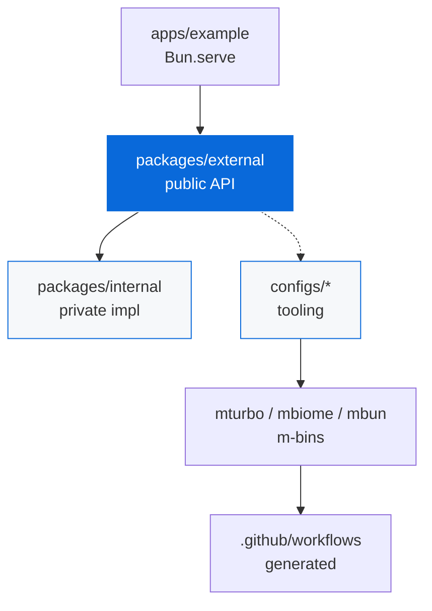
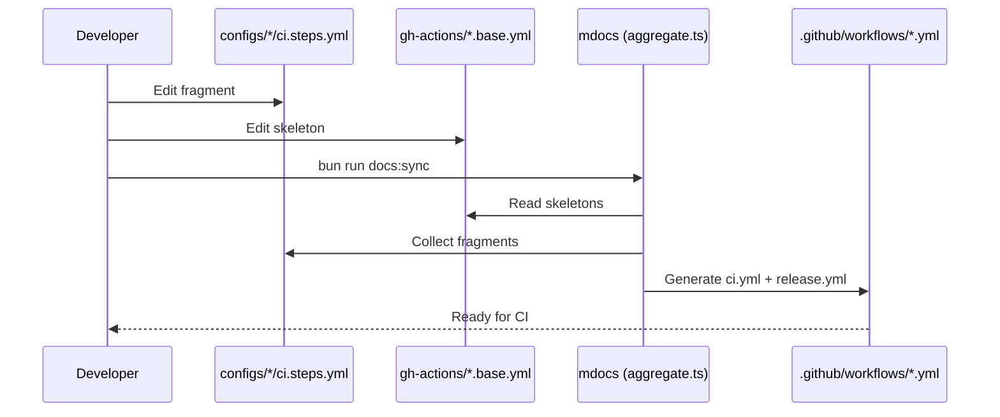

<!-- TEMPLATE-ONLY:START(template) -->
# TypeScript Monorepo Template

> A reusable template for TypeScript monorepos built with Bun, Turborepo, and Bunup.

This repository is a **template**, not a regular monorepo. Use it to scaffold a new monorepo with `bun create`.

> [!NOTE]
> Template mode is active. This intro is stripped after scaffolding — the monorepo docs below remain.

## Using this template

```bash
bun create Archont561/ts-monorepo-template my-app
cd my-app
bun install
bun run dev
```

The example server starts at [http://localhost:3000](http://localhost:3000).

During scaffolding you will be prompted for:

- [ ] Organization scope (e.g. `@acme`) — replaces `@myorg`
- [ ] Opt-in configs:
  - [x] Playwright E2E (`me2e`) — enabled by default
  - [ ] UnoCSS — atomic CSS
  - [ ] NAPI-RS — native bindings
  - [ ] AI skills (`mskills`)

> [!TIP]
> Use `bun create Archont561/ts-monorepo-template my-app -- --scope @acme --no-interactive` for CI.

<details>
<summary>What the scaffolder does</summary>

- Replaces `@myorg` with your scope in `package.json`, `tsconfig.json`, `config.json`
- Strips `TEMPLATE-ONLY` blocks (`<!-- TEMPLATE-ONLY:START(...) -->`)
- Removes template-only files (`configs/template/`, `docs:sync` script)
- Prunes disabled opt-in configs (`playwright`, `unocss`, `native`, `skills`)
- Regenerates CI workflows from survivors (`configs/gh-actions/*.base.yml` + `*/ci.steps.yml`)

</details>

After scaffolding, this README will describe your monorepo (see below).

---

<!-- TEMPLATE-ONLY:END(template) -->
# Monorepo

A TypeScript library monorepo built with Bun, Turborepo, and Bunup.

> [!IMPORTANT]
> All tool configs live in `configs/*` and are reached via `m`-prefixed bins. No root `turbo.json`, `biome.json`, `bunfig.toml`.

## Quick Start

```bash
bun install
bun run dev
```

The example server starts at [http://localhost:3000](http://localhost:3000).

## Architecture



### Dependency Rules

| Rule | Description |
| :--- | :--- |
| `external → internal` | Allowed, inlined by Bunup |
| `internal → external` | :x: Forbidden (circular) |
| `apps → external` | Only public import |
| `workspace:*` | All inter-package deps |

## Project Structure

<details>
<summary>Core structure</summary>

```
apps/
  example/          Bun.serve HTTP server
packages/
  external/         Public library (published to npm)
  internal/         Private implementation (inlined into external by Bunup)
configs/
  biome/            Lint and format (mbiome)
  bun-config/       Bun runtime, test, coverage (mbun)
  bunup/            Bundling presets (mbunup)
  changeset/        Versioning and releases (mchangeset)
  commitlint/       Conventional Commits (commitlint)
  gh-actions/       GitHub Actions CI + act (mci)
  lefthook/         Git hooks (msetup)
  ts/               TypeScript presets (mtsc)
  turbo/            Task orchestration (mturbo)
```

</details>

<!-- TEMPLATE-ONLY:START(playwright,skills,unocss,native) -->
<details>
<summary>Opt-in configs (present only when selected)</summary>

```
configs/
  playwright/       E2E testing (me2e)
  skills/           AI agent skills (mskills)
  unocss/           Atomic CSS
  native/           NAPI-RS bindings
```

</details>
<!-- TEMPLATE-ONLY:END(playwright,skills,unocss,native) -->

<!-- TEMPLATE-ONLY:START(template) -->
<details>
<summary>Template-only (removed after scaffolding)</summary>

```
configs/
  template/         Scaffolder (mdocs)
```

</details>
<!-- TEMPLATE-ONLY:END(template) -->

> [!NOTE]
> Every tool config lives in its own `configs/*` package and is reached through `m`-prefixed CLI bins that bake in config paths. There are no root tool-config files and the root ships zero `devDependencies`.

## Tooling

Tool configs and their docs (reference, not concatenated):

| Config | Bin | Description |
| :--- | :--- | :--- |
| [Biome](configs/biome/README.md) | `mbiome` | Lint and format |
| [Bun Config](configs/bun-config/README.md) | `mbun` | Bun runtime, test, coverage |
| [Bunup](configs/bunup/README.md) | `mbunup` | Bundling presets |
| [Changeset](configs/changeset/README.md) | `mchangeset` | Versioning and releases |
| [Commitlint](configs/commitlint/README.md) | — | Conventional Commits |
| [GitHub Actions](configs/gh-actions/README.md) | `mci` | CI workflows, `mci lint` / `mci act` |
| [Lefthook](configs/lefthook/README.md) | `msetup` | Git hooks |
<!-- TEMPLATE-ONLY:START(playwright) -->
| [Playwright](configs/playwright/README.md) | `me2e` | E2E testing |
<!-- TEMPLATE-ONLY:END(playwright) -->
<!-- TEMPLATE-ONLY:START(skills) -->
| [Skills](configs/skills/README.md) | `mskills` | AI agent skills (opt-in) |
<!-- TEMPLATE-ONLY:END(skills) -->
<!-- TEMPLATE-ONLY:START(template) -->
| [Template](configs/template/README.md) | `mdocs` | Scaffolder, template-only |
<!-- TEMPLATE-ONLY:END(template) -->
| [TypeScript](configs/ts/README.md) | `mtsc` | Shared tsconfigs |
| [Turbo](configs/turbo/README.md) | `mturbo` | Task orchestration |
<!-- TEMPLATE-ONLY:START(unocss) -->
| [UnoCSS](configs/unocss/README.md) | — | Atomic CSS, opt-in |
<!-- TEMPLATE-ONLY:END(unocss) -->
<!-- TEMPLATE-ONLY:START(native) -->
| [Native](configs/native/README.md) | — | NAPI-RS, opt-in |
<!-- TEMPLATE-ONLY:END(native) -->

See [AGENTS.md](AGENTS.md) for agent-facing documentation and [CONTRIBUTING.md](CONTRIBUTING.md) for development workflow.

## Commands

| Command | Description |
| :--- | :--- |
| `bun run dev` | Start all packages in watch mode (Turbo) |
| `bun run build` | Build all packages (Turbo orchestrated) |
| `bun run test` | Run all unit tests (Turbo orchestrates per-package `mbun test`) |
| `bun run test:e2e` | Run Playwright E2E tests (auto-skips if browsers missing) |
| `bun run coverage` | Collect unit-test coverage (merged LCOV at `coverage/lcov.info`) |
| `bun run typecheck` | Type-check all packages |
| `bun run check` | Lint and format check (Biome) |
| `bun run check:fix` | Auto-fix lint and format issues |
| `bun run ci:lint` | Validate GitHub Actions workflows (`mci lint`) |
| `bun run ci:list` | List `act` jobs (`mci act -l`) |
| `bun run ci:dry` | Dry-run CI locally (`mci act push -n`) |
| `bun run ci:local` | Run CI locally in Docker (`mci act push`) |
| `bun run skills:list` | List available AI agent skills |
| `bun run skills:sync` | Sync AI agent skills into `.agents/skills/` |
| `bun run docs:sync` | Regenerate workflows from `configs/*` (`mdocs`) |

## Workflows

> [!TIP]
> Workflows in `.github/workflows/` are generated from skeletons in `configs/gh-actions/*.base.yml` with fragments from `configs/*/ci.steps.yml`. Edit the skeletons and fragments, then run `bun run docs:sync`.



<details>
<summary>Workflow files</summary>

- `ci.yml` — generated from `ci.base.yml` + all `ci.steps.yml`
- `release.yml` — generated from `release.base.yml` + release fragments
- Fragments are discovered via `discoverConfigs()` scanning `configs/*/package.json` `scaffold` metadata

</details>

## Contributing

See [CONTRIBUTING.md](CONTRIBUTING.md) for development workflow.

- [ ] `bun install` — install deps + link m-bins
- [ ] `bun run dev` — start watch mode
- [ ] `bun run check:fix` — fix lint before commit
- [ ] `bun run test` — run unit tests

## License

[MIT](LICENSE.md)
