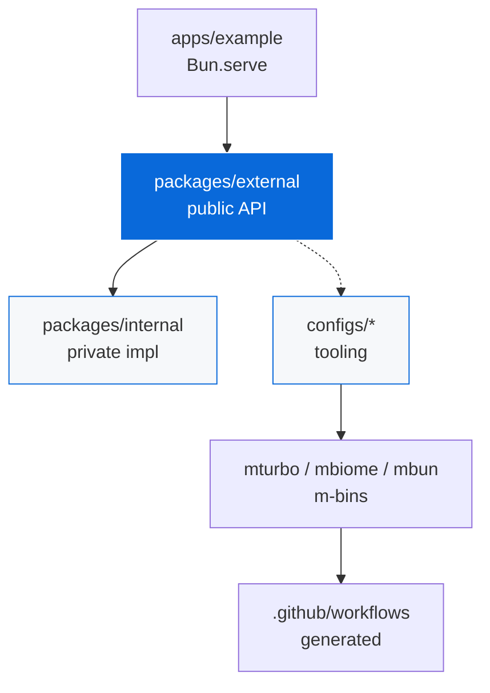
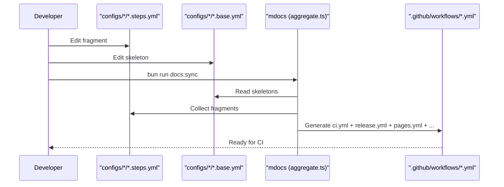

<!-- TEMPLATE-ONLY:START(template) -->
# TypeScript Monorepo Template

[](https://github.com/Archont561/ts-monorepo-template/actions/workflows/ci.yml)
[](https://archont561.github.io/ts-monorepo-template/)
[](https://codecov.io/gh/Archont561/ts-monorepo-template)
[](https://codecov.io/gh/Archont561/ts-monorepo-template)
[](https://Archont561.github.io/ts-monorepo-template/coverage/)
[](LICENSE.md)
[](https://bun.sh)
[](https://www.typescriptlang.org/)

> A reusable template for TypeScript monorepos built with Bun, Turborepo, and Bunup.

This repository is a **template**, not a regular monorepo. Use it to scaffold a new monorepo with `bun create`.

> [!NOTE]
> Template mode is active. This intro is stripped after scaffolding — the monorepo docs below remain.

## Using this template

```bash
bun create Archont561/ts-monorepo-template my-app
cd my-app
bun install
bun run dev
```

The example server starts at [http://localhost:3000](http://localhost:3000) (override with the `PORT` env var).

During scaffolding you will be prompted for:

- [ ] Organization scope (e.g. `@acme`) — replaces `@myorg`
- [ ] Opt-in configs:
  - [x] Playwright E2E (`me2e`) — enabled by default
  - [ ] UnoCSS — atomic CSS
  - [ ] NAPI-RS — native bindings
  - [ ] AI skills (`mskills`)
  - [ ] Devcontainer — Codespaces / Dev Containers
  - [ ] GitHub Pages — static site deployment

> [!TIP]
> Use `bun create Archont561/ts-monorepo-template my-app -- --scope @acme --no-interactive` for CI.

📖 **Documentation**: <https://archont561.github.io/ts-monorepo-template/> — guide, config matrix, and a [Status page](https://archont561.github.io/ts-monorepo-template/status) with coverage, CI status and versions.

<details>
<summary>What the scaffolder does</summary>

- Replaces `@myorg` with your scope in `package.json`, `tsconfig.json`, `config.json`
- Strips `TEMPLATE-ONLY` blocks (`<!-- TEMPLATE-ONLY:START(...) -->`)
- Removes template-only files (`configs/template/`, `docs/`, `docs:sync` script, `template-docs.yml`)
- Prunes disabled opt-in configs (`playwright`, `unocss`, `native`, `skills`, `devcontainer`, `pages`, `codeql`, `trivy`, `stale`)
- Regenerates CI workflows from survivors (`configs/*/*.base.yml` + `*/*.steps.yml`)

</details>

After scaffolding, this README will describe your monorepo (see below).

#### Template-only GitHub Pages docs

This template ships a **template-only** docs site in `docs/`, deployed by `.github/workflows/template-docs.yml` to <https://archont561.github.io/ts-monorepo-template/>. It's **removed** during `bun create` via `configs/template` `extraRemovals: ["docs", ".github/workflows/template-docs.yml"]`, so generated monorepos use `configs/pages` → `pages.yml` for `apps/example` instead.

| URL | What it serves |
| :--- | :--- |
| `/` | Landing page |
| `/guide/` | Introduction + config matrix |
| `/status` | Coverage %, CI status badges, package and toolchain versions |
| `/coverage/` | HTML coverage report (`mcoverage html`) |
| `/example/` | Demo app built from `apps/example` |

One rule keeps this honest: **only one workflow may deploy to Pages**.
`template-docs.yml` is that workflow here, so `bun run docs:sync` deliberately
does not generate `pages.yml` or `coverage.yml` while `docs/` exists (see
`configs/template/src/aggregate.ts`). Scaffolded monorepos have no `docs/`, so
they get `pages.yml` — and `coverage.yml` when Pages is off — as usual.

Everything the site ships is assembled by one command:

```bash
bun run docs:site   # mdocs site → coverage + demo app + VitePress build
                    # (bun run docs:dev / docs:build / docs:preview also work)
```

To add your own template-only docs page:
1. Put markdown files in `docs/` (VitePress) — `docs/public/**` is copied to the site root
2. Keep workflow `template-docs.yml` template-only (wrapped in `# TEMPLATE-ONLY:START(template)` or removed via `extraRemovals`)
3. Enable Pages once: Settings → Pages → Source: GitHub Actions
4. Push to `main` — `mdocs site` builds the whole artifact and deploys it

---

<!-- TEMPLATE-ONLY:END(template) -->
# Monorepo

[](https://github.com/Archont561/ts-monorepo-template/actions/workflows/ci.yml)
[](https://codecov.io/gh/Archont561/ts-monorepo-template)
[](https://codecov.io/gh/Archont561/ts-monorepo-template)
[](./coverage/html/)
[](LICENSE.md)
[](https://bun.sh)
[](https://www.typescriptlang.org/)

A TypeScript library monorepo built with Bun, Turborepo, and Bunup.

> [!TIP]
> After scaffolding, update badges in this README and in `packages/*/README.md`, `apps/*/README.md` to point to your repo:
> `Archont561/ts-monorepo-template` → `YOUR_ORG/YOUR_REPO`, `@myorg` → `YOUR_SCOPE`.
> Coverage badge uses Codecov (requires `CODECOV_TOKEN` secret if private) + local HTML at `./coverage/html/` + Pages at `/coverage/` when Pages enabled.

> [!IMPORTANT]
> All tool configs live in `configs/*` and are reached via `m`-prefixed bins. No root `turbo.json`, `biome.json`, `bunfig.toml`.

## Quick Start

```bash
bun install
bun run dev
```

The example server starts at [http://localhost:3000](http://localhost:3000) (override with the `PORT` env var).

## Architecture



### Dependency Rules

| Rule | Description |
| :--- | :--- |
| `external → internal` | Allowed, inlined by Bunup |
| `internal → external` | :x: Forbidden (circular) |
| `apps → external` | Only public import |
| `workspace:*` | All inter-package deps |

## Project Structure

<details>
<summary>Core structure (always)</summary>

```
apps/
  example/          Bun.serve HTTP server + static public for Pages
packages/
  external/         Public library (published to npm)
  internal/         Private implementation (inlined into external by Bunup)
configs/
  badges/           CI, coverage, license badges — always
  biome/            Lint and format (mbiome) — always
  bun-config/       Bun runtime, test, coverage (mbun) — always
  bunup/            Bundling presets (mbunup) — always
  changeset/        Versioning and releases (mchangeset) — always
  citty/            CLI builder (mcitty) — always
  commitlint/       Conventional Commits — always
  community/        Community health (CODEOWNERS, templates, SECURITY) — always
  coverage/         LCOV coverage reporting (HTML, artifact, Pages) — always
  dependabot/       Automated dependency updates — always
  editorconfig/     Editor consistency (.editorconfig) — always
  gh-actions/       GitHub Actions skeletons (mci) — always
  gitattributes/    Git file handling (.gitattributes) — always
  gitleaks/         Secret scanning (mgitleaks) — always
  lefthook/         Git hooks (msetup) — always
  ts/               TypeScript presets (mtsc) — always
  turbo/            Task orchestration (mturbo) — always
```

</details>

<!-- TEMPLATE-ONLY:START(playwright,skills,unocss,native,devcontainer,pages,codeql,trivy,stale) -->
<details>
<summary>Opt-in configs (present only when selected)</summary>

```
configs/
  codeql/           SAST via CodeQL — opt-in default true
  devcontainer/     Codespaces / Dev Containers — opt-in
  native/           NAPI-RS bindings (mnative) — opt-in (publish/docker/none)
  pages/            GitHub Pages deployment — opt-in
  playwright/       E2E testing (me2e) — opt-in default true
  skills/           AI agent skills (mskills) — opt-in
  stale/            Auto-close inactive issues/PRs — opt-in
  trivy/            Container + FS vuln scanning — opt-in
  unocss/           Atomic CSS — opt-in
```

</details>
<!-- TEMPLATE-ONLY:END(playwright,skills,unocss,native,devcontainer,pages,codeql,trivy,stale) -->

<!-- TEMPLATE-ONLY:START(template) -->
<details>
<summary>Template-only (removed after scaffolding)</summary>

```
configs/
  template/         Scaffolder (mdocs) — self-destruct
docs/               Template-only VitePress docs (GitHub Pages) — removed via extraRemovals
.github/workflows/
  template-docs.yml Template-only Pages workflow for docs/ — removed
```

</details>
<!-- TEMPLATE-ONLY:END(template) -->

> [!NOTE]
> Every tool config lives in its own `configs/*` package and is reached through `m`-prefixed CLI bins that bake in config paths. There are no root tool-config files and the root ships zero `devDependencies`.

## Adding a Package or an App

### New library package

```bash
mkdir -p packages/my-lib/src packages/my-lib/tests
```

`packages/my-lib/package.json`:

```json
{
  "name": "@myorg/my-lib",
  "version": "0.1.0",
  "type": "module",
  "exports": {
    ".": { "types": "./dist/index.d.ts", "import": "./dist/index.js" }
  },
  "files": ["dist"],
  "scripts": {
    "build": "mbunup",
    "dev": "mbunup --watch",
    "typecheck": "mtsc --noEmit",
    "test": "mbun test",
    "test:watch": "mbun test --watch",
    "coverage": "mbun test --coverage"
  },
  "devDependencies": {
    "@myorg/ts": "workspace:*",
    "@myorg/bunup": "workspace:*"
  }
}
```

Then add two files:

- `tsconfig.json` — extends `@myorg/ts/library.json`, sets `rootDir`, `outDir` and the
  `@src/*` / `@tests/*` paths. Never add `baseUrl` (removed in TS 7.0).
- `bunup.config.ts` — `defineConfig({ ...baseConfig, entry: ["src/index.ts"] })`,
  or `...cliConfig` if the package ships a bin.

Finish with `bun install`, then `bun run build`.

> [!TIP]
> Code that should never be published lives in a `private: true` package and is
> inlined by Bunup at build time — see `packages/internal` for the pattern.

### New app

Apps extend `@myorg/ts/app.json` (no emit) and run unbundled (`mbun --hot src/index.ts`).
They depend on packages, never the reverse — Biome enforces that boundary.

### Depending on another workspace package

```bash
bun add @myorg/external --filter @myorg/example
```

or add `"@myorg/external": "workspace:*"` to the consumer's `dependencies` and run
`bun install`. Inter-package deps are always `workspace:*`.

## Tooling

Tool configs live in `configs/*` and are reached via `m`-prefixed bins. No root config files.

#### Always-on

| Config | Bin | Description |
| :--- | :--- | :--- |
| [Badges](configs/badges/README.md) | — | CI, coverage, license badges — always |
| [Biome](configs/biome/README.md) | `mbiome` | Lint and format — always |
| [Bun Config](configs/bun-config/README.md) | `mbun` | Bun runtime, test, coverage merge — always |
| [Bunup](configs/bunup/README.md) | `mbunup` | Bundling presets — always |
| [Changeset](configs/changeset/README.md) | `mchangeset` | Versioning and releases — always |
| [Citty](configs/citty/README.md) | `mcitty` | CLI builder — always |
| [Commitlint](configs/commitlint/README.md) | — | Conventional Commits — always |
| [Community](configs/community/README.md) | — | CODEOWNERS, templates, SECURITY — always |
| [Coverage](configs/coverage/README.md) | `mcoverage` | LCOV HTML, artifact, Pages, threshold, PR comment — always |
| [Dependabot](configs/dependabot/README.md) | — | Dependency updates — always |
| [EditorConfig](configs/editorconfig/README.md) | — | `.editorconfig` — always |
| [GitAttributes](configs/gitattributes/README.md) | — | `.gitattributes` — always |
| [GitHub Actions](configs/gh-actions/README.md) | `mci` | CI skeletons, `lint`/`act` — always |
| [Gitleaks](configs/gitleaks/README.md) | `mgitleaks` | Secret scanning — always |
| [Lefthook](configs/lefthook/README.md) | `msetup` | Git hooks — always |
| [TypeScript](configs/ts/README.md) | `mtsc` | Shared tsconfigs — always |
| [Turbo](configs/turbo/README.md) | `mturbo` | Task orchestration — always |

<!-- TEMPLATE-ONLY:START(playwright,skills,template,unocss,native,devcontainer,pages,codeql,trivy,stale) -->
#### Opt-in (pruned when disabled)

| Config | Bin | Default | Description |
| :--- | :--- | :--- | :--- |
<!-- TEMPLATE-ONLY:END(playwright,skills,template,unocss,native,devcontainer,pages,codeql,trivy,stale) -->
<!-- TEMPLATE-ONLY:START(codeql) -->
| [CodeQL](configs/codeql/README.md) | `mcodeql` | true | SAST via CodeQL |
<!-- TEMPLATE-ONLY:END(codeql) -->
<!-- TEMPLATE-ONLY:START(devcontainer) -->
| [Devcontainer](configs/devcontainer/README.md) | — | false | Codespaces / Dev Containers |
<!-- TEMPLATE-ONLY:END(devcontainer) -->
<!-- TEMPLATE-ONLY:START(native) -->
| [Native](configs/native/README.md) | `mnative` | none | NAPI-RS bindings (publish/docker/none) |
<!-- TEMPLATE-ONLY:END(native) -->
<!-- TEMPLATE-ONLY:START(pages) -->
| [Pages](configs/pages/README.md) | `mpages` | false | GitHub Pages deployment (`mpages build` + `mpages base`) |
<!-- TEMPLATE-ONLY:END(pages) -->
<!-- TEMPLATE-ONLY:START(playwright) -->
| [Playwright](configs/playwright/README.md) | `me2e` | true | E2E testing |
<!-- TEMPLATE-ONLY:END(playwright) -->
<!-- TEMPLATE-ONLY:START(skills) -->
| [Skills](configs/skills/README.md) | `mskills` | false | AI agent skills |
<!-- TEMPLATE-ONLY:END(skills) -->
<!-- TEMPLATE-ONLY:START(stale) -->
| [Stale](configs/stale/README.md) | — | false | Auto-close inactive issues/PRs |
<!-- TEMPLATE-ONLY:END(stale) -->
<!-- TEMPLATE-ONLY:START(trivy) -->
| [Trivy](configs/trivy/README.md) | `mtrivy` | false | Container + FS vuln scanning |
<!-- TEMPLATE-ONLY:END(trivy) -->
<!-- TEMPLATE-ONLY:START(unocss) -->
| [UnoCSS](configs/unocss/README.md) | `munocss` | false | Atomic CSS — `munocss build`/`watch` |
<!-- TEMPLATE-ONLY:END(unocss) -->

<!-- TEMPLATE-ONLY:START(template) -->
#### Template-only (removed after scaffolding)

| Config | Bin | Description |
| :--- | :--- | :--- |
| [Template](configs/template/README.md) | `mdocs` | Scaffolder, data-driven engine |

<!-- TEMPLATE-ONLY:END(template) -->

See [AGENTS.md](AGENTS.md) for agent-facing documentation and [CONTRIBUTING.md](CONTRIBUTING.md) for development workflow.

## Commands

| Command | Description |
| :--- | :--- |
| `bun run dev` | Start all packages in watch mode (Turbo) |
| `bun run build` | Build all packages (Turbo orchestrated) |
| `bun run test` | Run all unit tests (Turbo orchestrates per-package `mbun test`) |
| `bun --filter @myorg/external run test:watch` | Re-run one package's tests on change |
| `bun run test:template` | Run template scaffolding tests (all opt-in combinations) |
| `bun run test:template:cases` | Run only template combination cases (`cases.test.ts`) |
| `bun run test:e2e` | Run Playwright E2E tests (auto-skips if browsers missing) |
| `bun run coverage` | Per-package coverage via Turbo, then `mcoverage merge` → `coverage/lcov.info` |
| `bun run coverage:html` | Generate HTML report (`mcoverage html`) |
| `bun run typecheck` | Type-check all packages |
| `bun run check` | Lint and format check (Biome) |
| `bun run check:fix` | Auto-fix lint and format issues |
| `bun run ci:lint` | Validate GitHub Actions workflows (`mci lint`) |
| `bun run ci:list` | List `act` jobs (`mci act -l`) |
| `bun run ci:dry` | Dry-run CI locally (`mci act push -n`) |
| `bun run ci:local` | Run CI locally in Docker (`mci act push`) |
| `bun run security:gitleaks` | Scan repo for secrets (gitleaks) |
| `bun run security:trivy` | FS vuln scan (Trivy HIGH,CRITICAL) |
| `bun run security:audit` | Rust audit (cargo audit via mnative) |
| `bun run security:check` | Run gitleaks + trivy (if installed) |
| `bun run skills <cmd>` | One command for agent skills — `list`, `sync`, `add <pkg>`, `update`, `validate`, `index` |
<!-- TEMPLATE-ONLY:START(template) -->
| `bun run docs:sync` | Regenerate workflows from `configs/*` (`mdocs`) — template-only |
<!-- TEMPLATE-ONLY:END(template) -->

### Agent Skills (skills.sh)

We use the [skills.sh](https://skills.sh) ecosystem to vendor skills into this repo.

- Install: `bun run skills add vercel-labs/agent-skills`
- Update: `bun run skills update`
- Sync: `bun run skills sync`

Skills live in: `.agents/skills/` — each is a folder containing `SKILL.md` with YAML frontmatter (`name`, `description`). See [.agents/README.md](.agents/README.md).

> [!CAUTION]
> Review skill content before use; skills.sh cannot guarantee every skill is safe.

## Workflows

> [!TIP]
> Workflows in `.github/workflows/` are generated from skeletons in `configs/*/*.base.yml` with fragments from `configs/*/*.steps.yml`. Edit the skeletons and fragments, then run `bun run docs:sync` (template repo) to regenerate.



<details>
<summary>Workflow files</summary>

- `ci.yml` — generated from `ci.base.yml` + all `ci.steps.yml` (includes coverage: LCOV + HTML + artifact + threshold + PR comment)
- `release.yml` — generated from `release.base.yml` + all `release.steps.yml`
- `pages.yml` — generated from `pages.base.yml` + all `pages.steps.yml` (GitHub Pages, opt-in) — when enabled, includes coverage at `/coverage/` via coverage config
- `coverage.yml` — generated from `coverage.base.yml` + all `coverage.steps.yml` (standalone coverage Pages site) — only when Pages **disabled**, otherwise coverage is in `pages.yml`
- `dependabot.yml` — generated from `dependabot.base.yml` + all `dependabot.yml` fragments (npm, cargo, actions, docker)
- `dependabot-auto-merge.yml` — generated from `dependabot-auto-merge.base.yml` + `dependabot-auto-merge.steps.yml` (auto-merge patch/minor)
- `stale.yml` — generated from `stale.base.yml` + `stale.steps.yml` (opt-in)
<!-- TEMPLATE-ONLY:START(template) -->
- `template-docs.yml` — **template-only**, static (not generated), deploys `docs/` to Pages, removed on scaffold
<!-- TEMPLATE-ONLY:END(template) -->
- Fragments are discovered via `discoverConfigs()` scanning `configs/*/package.json` `scaffold` metadata

</details>

## Contributing

See [CONTRIBUTING.md](CONTRIBUTING.md) for development workflow.

- [ ] `bun install` — install deps + link m-bins
- [ ] `bun run dev` — start watch mode
- [ ] `bun run check:fix` — fix lint before commit
- [ ] `bun run test` — run unit tests

## License

[MIT](LICENSE.md)
