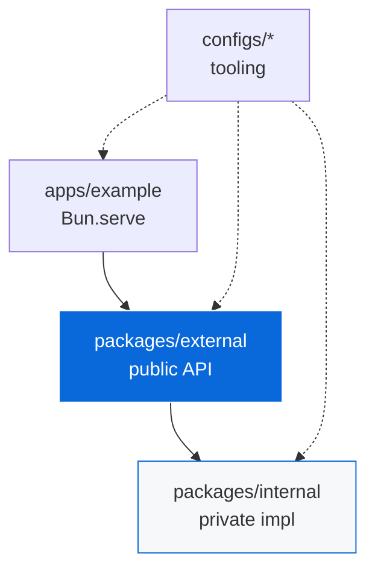

<!-- TEMPLATE-ONLY:START(template) -->
# TypeScript Monorepo Template

[](https://github.com/Archont561/ts-monorepo-template/actions/workflows/ci.yml)
[](https://codecov.io/gh/Archont561/ts-monorepo-template)
[](https://archont561.github.io/ts-monorepo-template/)
[](LICENSE.md)
[](https://bun.sh)

A reusable template for TypeScript monorepos. It makes the whole toolchain — runtime, bundler, linter, tests, task runner, CI — a single `bun create` away, with a scaffolder that rewrites the package scope so the result is yours immediately after cloning.

> [!NOTE]
> Template mode is active. This intro is stripped after scaffolding — the monorepo documentation below is what remains.

## Using this template

> [!IMPORTANT]
> Requires [Bun](https://bun.sh) ≥ 1.4.2 — `curl -fsSL https://bun.sh/install | bash`. Nothing else is needed: there are no root `devDependencies`.

```bash
bun create Archont561/ts-monorepo-template my-app
cd my-app
bun install
bun run dev
```

The example server starts at [http://localhost:3000](http://localhost:3000) (override with the `PORT` env var).

During scaffolding you are prompted for:

- Organization scope (e.g. `@acme`) — replaces `@myorg` everywhere
- Opt-in configs: Playwright E2E (default on), UnoCSS, NAPI-RS native bindings, AI skills, Devcontainer, GitHub Pages, CodeQL (default on), Trivy, Stale

> [!TIP]
> Non-interactive for CI: `bun create Archont561/ts-monorepo-template my-app -- --scope @acme --no-interactive`.

<details>
<summary>What the scaffolder changes</summary>

- Replaces `@myorg` with your scope across manifests, configs, sources and docs
- Strips `TEMPLATE-ONLY` blocks and removes template-only files (`configs/template/`, `docs/`, `template-docs.yml`, the `docs:sync` script)
- Prunes every opt-in config you declined, and regenerates the workflows from the survivors
- Rewrites repository identity in badges and manifest URLs

</details>

📖 **Documentation**: <https://archont561.github.io/ts-monorepo-template/> — guide, config matrix, and a [Status page](https://archont561.github.io/ts-monorepo-template/status) with coverage, CI state and versions.

---

<!-- TEMPLATE-ONLY:END(template) -->
# Monorepo

[](https://github.com/Archont561/ts-monorepo-template/actions/workflows/ci.yml)
[](https://codecov.io/gh/Archont561/ts-monorepo-template)
[](./coverage/html/)
[](LICENSE.md)
[](https://bun.sh)

A TypeScript library monorepo built with Bun workspaces, Turbo, and Bunup. One published package, one private implementation package it inlines, and twenty-seven tool configs that own every generated file in the repo.

> [!TIP]
> After scaffolding, update the badge URLs (`Archont561/ts-monorepo-template` → `YOUR_ORG/YOUR_REPO`) in this README, `packages/*/README.md` and `apps/*/README.md`.

## Quick start

> [!IMPORTANT]
> Requires [Bun](https://bun.sh) ≥ 1.4.2. All tool configs live in `configs/*` and are reached through `m`-prefixed bins (`mbiome`, `mturbo`, `mbunup`, …) — there is no root `turbo.json`, `biome.json` or `bunfig.toml`.

```bash
bun install
bun run dev
```

## Structure

```
.
├── apps/
│   └── example/          Bun.serve HTTP server (private)
├── packages/
│   ├── external/         The published package — the installable artifact
│   ├── internal/         Private implementation, inlined by Bunup
│   └── native/           Optional Rust workspace (crates/* → npm/*)
├── configs/              Every tool config; sources for all generated files
├── .agents/              Vendored agent skills (SKILL.md per skill)
├── AGENTS.md             Behavioral rules for AI coding agents
├── CONTEXT.md            Current repo state — a snapshot, not rules
└── LICENSE.md            MIT
```

> [!NOTE]
> `.github/workflows/*`, `turbo.json`, `lefthook.yml` and `docs/`-adjacent config are generated. Edit their sources in `configs/*` and regenerate — never the output.

## Architecture

| Concern | Choice | Why |
| :--- | :--- | :--- |
| Runtime + tests | Bun | Speed, built-in test runner, native TypeScript |
| Lint + format | Biome | One tool, no config conflicts |
| Bundling | Bunup | Bun-native, dual ESM output |
| Tasks | Turbo | Incremental builds, correct dependency graph |
| Git hooks | Lefthook | Fast, parallel, no Node required |
| Type checking | `mtsc --noEmit` | Emit is Bunup's job, not tsc's |
| Releases | Changesets | Version bumps per package from PR-time intent |



### Dependency rules

| Rule | Meaning |
| :--- | :--- |
| `external → internal` | Allowed — `internal` is a devDependency, inlined at build time |
| `internal → external` | Forbidden — circular |
| `apps → external` | Apps import the public package only, never `internal` |
| `workspace:*` | Every inter-package dependency uses the workspace protocol |

## Commands

### Development

| Command | What it does |
| :--- | :--- |
| `bun install` | Install workspaces and link every `m`-bin |
| `bun run dev` | Start all packages in watch mode (Turbo) |
| `bun --filter @myorg/external run test:watch` | Re-run one package's tests on change |

### Quality

| Command | What it does |
| :--- | :--- |
| `bun run check` / `check:fix` | Biome lint + format (check / auto-fix) |
| `bun run test` | Unit tests in every package (Turbo) |
| `bun run test:template` | Scaffolder tests across all opt-in combinations |
| `bun run test:e2e` | Playwright E2E (auto-skips when browsers are missing) |
| `bun run typecheck` | `mtsc --noEmit` in every package |
| `bun run coverage` | Per-package coverage, then merge → `coverage/lcov.info` |
| `bun run coverage:html` | HTML report at `coverage/html/` |

### Build and release

| Command | What it does |
| :--- | :--- |
| `bun run build` | Build all packages in dependency order |
| `bun run changeset` | Record release intent for changed packages |
| `bun run ci:lint` / `ci:local` | Validate workflows / run CI locally with `act` |

### Security and maintenance

| Command | What it does |
| :--- | :--- |
| `bun run security:check` | gitleaks secrets + Trivy filesystem scan |
| `bun run security:audit` | Rust audit (`cargo audit` via `mnative`) |
| `bun run skills <cmd>` | Agent skills: `list`, `sync`, `add`, `update`, `validate`, `index` |

## Tooling configs

Every config lives in its own `configs/*` package, exposes at most one `m`-prefixed bin, and owns whatever it generates.

<details>
<summary>Always-on (17)</summary>

| Config | Bin | Purpose |
| :--- | :--- | :--- |
| [Badges](configs/badges/README.md) | — | CI, coverage and license badges |
| [Biome](configs/biome/README.md) | `mbiome` | Lint and format |
| [Bun Config](configs/bun-config/README.md) | `mbun` | Runtime, tests, coverage merge |
| [Bunup](configs/bunup/README.md) | `mbunup` | Bundling presets |
| [Changeset](configs/changeset/README.md) | `mchangeset` | Versioning and releases |
| [Citty](configs/citty/README.md) | `mcitty` | CLI builder behind the `m`-bins |
| [Commitlint](configs/commitlint/README.md) | — | Conventional Commits |
| [Community](configs/community/README.md) | — | CODEOWNERS, issue/PR templates |
| [Coverage](configs/coverage/README.md) | `mcoverage` | LCOV merge, HTML, threshold, PR comment |
| [Dependabot](configs/dependabot/README.md) | — | Dependency updates |
| [EditorConfig](configs/editorconfig/README.md) | — | `.editorconfig` |
| [GitAttributes](configs/gitattributes/README.md) | — | `.gitattributes` |
| [GitHub Actions](configs/gh-actions/README.md) | `mci` | Workflow skeletons, lint, `act` |
| [Gitleaks](configs/gitleaks/README.md) | `mgitleaks` | Secret scanning |
| [Lefthook](configs/lefthook/README.md) | `msetup` | Git hooks |
| [TypeScript](configs/ts/README.md) | `mtsc` | Shared tsconfigs |
| [Turbo](configs/turbo/README.md) | `mturbo` | Task orchestration |

</details>

<!-- TEMPLATE-ONLY:START(playwright,skills,unocss,native,devcontainer,pages,codeql,trivy,stale) -->
<details>
<summary>Opt-in — pruned when declined</summary>

| Config | Bin | Default | Purpose |
| :--- | :--- | :--- | :--- |
| [CodeQL](configs/codeql/README.md) | `mcodeql` | on | SAST in CI |
| [Playwright](configs/playwright/README.md) | `me2e` | on | E2E tests |
| [Devcontainer](configs/devcontainer/README.md) | — | off | Codespaces / Dev Containers |
| [Native](configs/native/README.md) | `mnative` | none | Rust + NAPI-RS bindings |
| [Pages](configs/pages/README.md) | `mpages` | off | GitHub Pages deployment |
| [Skills](configs/skills/README.md) | `mskills` | off | AI agent skills |
| [Stale](configs/stale/README.md) | — | off | Auto-close inactive issues/PRs |
| [Trivy](configs/trivy/README.md) | `mtrivy` | off | Container and filesystem scanning |
| [UnoCSS](configs/unocss/README.md) | `munocss` | off | Atomic CSS |

</details>
<!-- TEMPLATE-ONLY:END(playwright,skills,unocss,native,devcontainer,pages,codeql,trivy,stale) -->

## Adding a package or app

1. **Create the directories and manifest.**

```bash
mkdir -p packages/my-lib/src packages/my-lib/tests
```

```json
{
  "name": "@myorg/my-lib",
  "version": "0.1.0",
  "type": "module",
  "exports": {
    ".": { "types": "./dist/index.d.ts", "import": "./dist/index.js" }
  },
  "files": ["dist"],
  "scripts": {
    "build": "mbunup",
    "dev": "mbunup --watch",
    "typecheck": "mtsc --noEmit",
    "test": "mbun test",
    "test:watch": "mbun test --watch",
    "coverage": "mbun test --coverage"
  },
  "devDependencies": {
    "@myorg/ts": "workspace:*",
    "@myorg/bunup": "workspace:*"
  }
}
```

2. **Add a `tsconfig.json`** extending `@myorg/ts/library.json`, with `rootDir`, `outDir` and the `@src/*` / `@tests/*` paths. Never add `baseUrl` — TypeScript 7.0 removed it.

3. **Add a `bunup.config.ts`** — `defineConfig({ ...baseConfig, entry: ["src/index.ts"] })`, or `...cliConfig` when the package ships a bin.

4. **Depend on it** from another workspace package with `"@myorg/my-lib": "workspace:*"`, or `bun add @myorg/my-lib --filter @myorg/example`.

5. **Link and verify.**

```bash
bun install
bun run build
```

> [!NOTE]
> An app follows the same steps but extends `@myorg/ts/app.json`, runs unbundled (`mbun --hot src/index.ts`), and has no `bunup.config.ts` — apps are not published.

> [!TIP]
> Code that must never be published belongs in a `private: true` package and is inlined by Bunup at build time — see `packages/internal`.

## Contributing

PRs target `main`. Before opening one:

> [!IMPORTANT]
> All checks must pass locally before pushing — CI is not a linter.
> Run `bun run check`, `bun run test`, `bun run typecheck`, `bun run build` in that order, and `bun run docs:sync` if anything under `configs/` changed.

The workflow in full:

- **Branch** from `main`; keep the change to one concern.
- **Commit** with [Conventional Commits](https://www.conventionalcommits.org/) — scopes are derived from the workspace names, so `feat(native): …`, `fix(template): …` are valid; run `bun run commitlint`-style subject checks or let the Lefthook hook reject bad subjects.
- **Record release intent** with `bun run changeset` for any change to a published package. Patch for fixes, minor for features, major for breaking changes.
- **Open the PR.** CI runs lint, typecheck, tests, coverage (80% line threshold), package health (`publint` + `arethetypeswrong`) and the scaffolder matrix across opt-in combinations. A changeset bot comment tracks release intent.
- **Review.** CODEOWNERS requests review from the maintainers; squash-merge keeps history linear.

## Security

Report vulnerabilities privately through [GitHub Security Advisories](https://github.com/Archont561/ts-monorepo-template/security/advisories/new) — not through public issues. Expect an acknowledgement within a few days and a fix or a documented decision within two weeks for confirmed issues.

Supported: the latest released version of the template, and the most recent release line of any published package. Automated scanning runs in CI (Gitleaks on every push, CodeQL and Trivy when enabled); `bun run security:check` runs the same checks locally.

## Support

- **Questions and ideas** — GitHub Discussions
- **Bugs** — GitHub Issues with the bug report template
- **This template's own docs** — <https://archont561.github.io/ts-monorepo-template/>

## Conduct

Participation is governed by the [Contributor Covenant](https://www.contributor-covenant.org/version/2/1/code_of_conduct/). Report unacceptable behaviour to the maintainers listed in `.github/CODEOWNERS`.

## License

[MIT](LICENSE.md)
