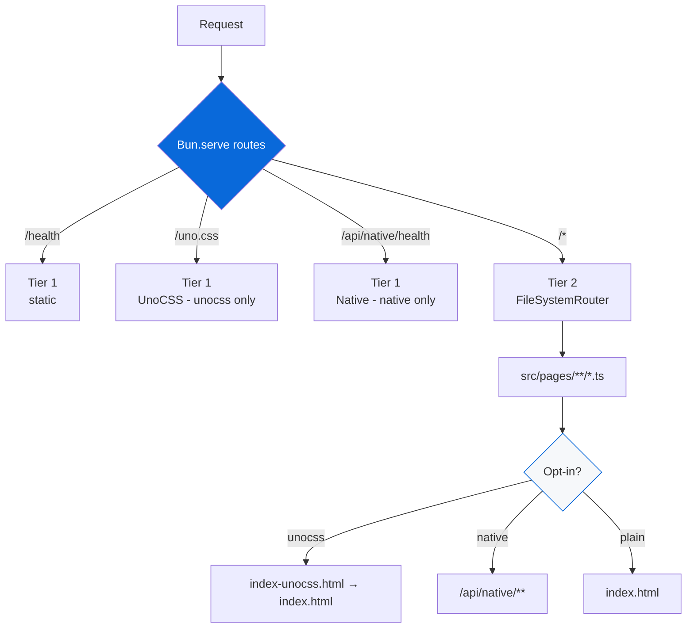

# @myorg/example

[](https://github.com/Archont561/ts-monorepo-template/actions/workflows/ci.yml)
[](https://codecov.io/gh/Archont561/ts-monorepo-template)
[](https://bun.sh)
[](../../LICENSE.md)

Demo HTTP application built with Bun.serve and file-based routing, with optional UnoCSS and native Rust bindings.

> [!TIP]
> Badges: update `Archont561/ts-monorepo-template` → `YOUR_ORG/YOUR_REPO` after scaffolding. Coverage from root `bun run coverage` → `coverage/lcov.info`.

> [!NOTE]
> This app is **private** — not bundled, not published. Bun runs TypeScript directly with `--hot`.

## Endpoints

| Route | Tier | Handler | Description | Opt-in |
| :--- | :--- | :--- | :--- | :--- |
| `GET /health` | 1 (static) | `src/index.ts` | Health probe | always |
| `GET /` | 2 (file-based) | `src/pages/index.ts` | HTML welcome page (plain or UnoCSS) | always, but content varies |
| `GET /uno.css` | 1 (static) | `src/index.ts` | UnoCSS generated CSS | unocss |
| `GET /api` | 2 (file-based) | `src/pages/api/index.ts` | API endpoint list (includes native when enabled) | always |
| `GET /api/greet/:name` | 2 (file-based) | `src/pages/api/greet/[name].ts` | Greeting | always |
| `GET /api/shout/:name` | 2 (file-based) | `src/pages/api/shout/[name].ts` | Uppercased greeting | always |
| `GET /api/native` | 2 (file-based) | `src/pages/api/native/index.ts` | Native bindings info | native |
| `GET /api/native/add?a=&b=` | 2 (file-based) | `src/pages/api/native/add.ts` | Rust add (or JS fallback) | native |
| `GET /api/native/fibonacci/:n` | 2 (file-based) | `src/pages/api/native/fibonacci/[n].ts` | Fibonacci benchmark | native |
| `GET /api/native/primes/:n` | 2 (file-based) | `src/pages/api/native/primes/[n].ts` | Primes sieve | native |
| `GET /api/native/reverse?text=` | 2 (file-based) | `src/pages/api/native/reverse.ts` | Reverse string | native |
| `GET /api/native/status` | 2 (file-based) | `src/pages/api/native/status.ts` | Native availability + benchmark | native |

## Development

```bash
bun run dev              # hot-reloading server on :3000
bun run test             # unit tests (routes + integration)
bun run test:e2e         # Playwright E2E (requires browsers)
bun run build:css        # munocss build → public/uno.css (when unocss enabled)
```

## Docker

Production-ready multi-stage Dockerfile (pinned `oven/bun:1.4.2`, non-root, HEALTHCHECK, OCI labels, BuildKit cache).

```bash
# Build from monorepo root (context = root, Dockerfile = apps/example/Dockerfile)
docker build -f apps/example/Dockerfile -t example:latest .

# Or build from example dir (requires root .dockerignore)
docker build -t example:latest .

# Run
docker run -p 3000:3000 example:latest
# → http://localhost:3000/health
# → http://localhost:3000/api

# With native bindings (when Cargo.toml present, auto-detected)
# The Dockerfile has:
# - deps stage (bun install --frozen-lockfile with --mount=type=cache)
# - builder stage (UnoCSS + cargo check + bun run build:native)
# - rust-builder stage (rust:1.84-bookworm + bun, cargo build --release + napi build)
# - runner stage (oven/bun:1.4.2-alpine, non-root app user, HEALTHCHECK)

# BuildKit secrets (never baked into layers)
docker build --secret id=npmrc,src=.npmrc -f apps/example/Dockerfile -t example:latest .

# Multi-platform
docker build --platform linux/amd64,linux/arm64 -f apps/example/Dockerfile -t example:latest .

# Check image
docker run --rm -it example:latest bun --version
docker run --rm -p 3000:3000 example:latest
```

Dockerfile layers (least→most frequently changing for cache):

1. `base` - `oven/bun:1.4.2` + WORKDIR
2. `deps` - copy package.json/bun.lock + workspace manifests, `bun install` with cache mount
3. `builder` - copy source, build UnoCSS if enabled, `cargo check` + `build:native` if Cargo exists, `bun run build`
4. `rust-builder` - `rust:1.84-bookworm` + bun, builds native `.node` artifacts (for `native=docker` option)
5. `runner` - `oven/bun:1.4.2-alpine`, non-root `app`, OCI labels, copies from builder/rust-builder, `HEALTHCHECK`, `CMD ["bun", "run", "apps/example/src/index.ts"]`

`.dockerignore` excludes `node_modules`, `target`, `*.node`, `.git`, `dist`, etc. for fast context.

### Docker + Cargo

When `native=publish`/`docker` (Cargo workspace present):

```bash
# Cargo-first inside Docker
docker build -f apps/example/Dockerfile -t example:native .
# Inside Dockerfile:
# - cargo check --workspace (fast)
# - cargo clippy -- -D warnings
# - bun run build:native (napi build --platform)
# - rust-builder: cargo build --release + napi artifacts

# Run with native
docker run -p 3000:3000 example:native
# → /api/native/status shows Rust bindings
```

When `native=none`, Dockerfile auto-skips Rust stages (no Cargo.toml).



## Architecture

> [!TIP]
> Two-tier routing + opt-in handling.

- **Tier 1** (`routes:` in `Bun.serve`) — static endpoints, sub-millisecond dispatch. Includes `/uno.css` when unocss enabled, `/api/native/health` when native enabled.
- **Tier 2** (`fetch` + `FileSystemRouter`) — Next.js-style file-based routing. `src/pages/api/native/**` only exists when native enabled.

### Opt-in handling

**UnoCSS:**
- Template has `public/index.html` (plain) + `public/index-unocss.html` (UnoCSS utility classes)
- When `unocss` enabled during scaffolding, `setup.ts` copies `index-unocss.html` → `index.html` (replaces)
- When disabled, `index-unocss.html` + `uno.css` + `uno.config.ts` deleted via `filePatternsToRemove`
- Bundle: `src/index.ts` serves `/uno.css` route that returns generated CSS or fallback note, `src/pages/index.ts` tries unocss version first

**Native:**
- Template has `src/pages/api/native/**` routes (add, fibonacci, primes, reverse, status)
- When `native=none`, those routes deleted via `extraRemovals` + `filePatternsToRemove` + `fileRegexesToRemove` + `appDepsToRemove`
- When `publish`/`docker`, routes kept, `packages/native/` scaffolded via `setup.ts`, `external` wrapper provides JS fallback
- Bundle: `src/index.ts` has native health route, `api/index.ts` lists native endpoints conditionally

<details>
<summary>Adding a new endpoint</summary>

- [ ] Create file in `src/pages/` matching desired URL structure
- [ ] Export default handler:

  ```ts
  // src/pages/api/hello.ts
  export default {
    fetch(req: Request) {
      return Response.json({ message: "Hello" });
    }
  }
  ```

- [ ] Dynamic route: `src/pages/api/greet/[name].ts` → `/api/greet/:name`
- [ ] For opt-in routes, wrap with scoped markers like `// START(unocss)` / `// END(unocss)` (see template scaffolder) or use native/unocss scopes
- [ ] Test: add unit test in `tests/` and e2e in `e2e/` if enabled

File-based routing conventions:

| File | Route |
| :--- | :--- |
| `src/pages/index.ts` | `/` |
| `src/pages/api/index.ts` | `/api` |
| `src/pages/api/greet/[name].ts` | `/api/greet/:name` |
| `src/pages/api/native/add.ts` | `/api/native/add` |
| `src/pages/blog/[...slug].ts` | `/blog/*` |

</details>

## Testing

| Command | Description |
| :--- | :--- |
| `bun run test` | Unit tests (routes + integration, handles optional features) |
| `bun run test:e2e` | Playwright E2E (requires `me2e` + browsers) |

> [!WARNING]
> E2E tests auto-skip if browsers missing. Run `bunx playwright install` to install.
