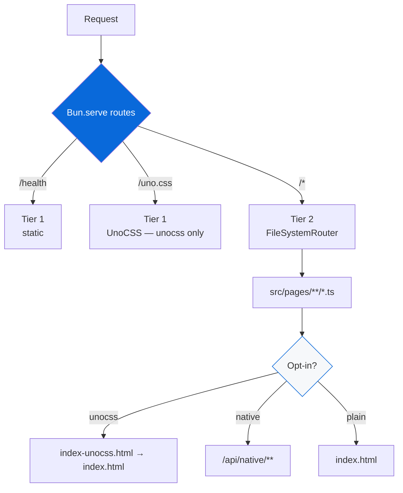

# @myorg/example

[](https://github.com/Archont561/ts-monorepo-template/actions/workflows/ci.yml)
[](https://codecov.io/gh/Archont561/ts-monorepo-template)
[](https://bun.sh)
[](../../LICENSE.md)

Demo HTTP application built with `Bun.serve` and file-based routing, with optional UnoCSS and native Rust bindings.

> [!TIP]
> Badges: update `Archont561/ts-monorepo-template` → `YOUR_ORG/YOUR_REPO` after scaffolding. Coverage comes from root `bun run coverage` → `coverage/lcov.info`.

> [!NOTE]
> This app is **private** — not bundled, not published. Bun runs TypeScript directly with `--hot`.

## Endpoints

| Route | Tier | Description | Opt-in |
| :--- | :--- | :--- | :--- |
| `GET /health` | 1 (static) | Health probe | always |
| `GET /` | 2 (file-based) | HTML welcome page (plain or UnoCSS) | always |
| `GET /uno.css` | 1 (static) | Generated UnoCSS bundle | unocss |
| `GET /api` | 2 (file-based) | Endpoint list | always |
| `GET /api/greet/:name` | 2 (file-based) | Greeting | always |
| `GET /api/shout/:name` | 2 (file-based) | Uppercased greeting | always |
| `GET /api/native` | 2 (file-based) | Native bindings info | native |
| `GET /api/native/add?a=&b=` | 2 (file-based) | Rust add, JS fallback | native |
| `GET /api/native/fibonacci/:n` | 2 (file-based) | Fibonacci benchmark | native |
| `GET /api/native/primes/:n` | 2 (file-based) | Primes sieve | native |
| `GET /api/native/reverse?text=` | 2 (file-based) | Reverse string | native |
| `GET /api/native/status` | 2 (file-based) | Availability + benchmark | native |

## Development

```bash
bun run dev          # hot-reloading server on :3000 (PORT overrides)
bun run test         # unit tests (routes + integration)
bun run test:e2e     # Playwright E2E
bun run build:css    # munocss build → public/uno.css
```

## Architecture

Two-tier routing, with opt-in features handled by runtime file checks rather than build flags.

- **Tier 1** — `routes:` in `Bun.serve` for static endpoints, sub-millisecond dispatch. Gains `/uno.css` when UnoCSS is enabled.
- **Tier 2** — `fetch` with `FileSystemRouter`, Next.js-style. `src/pages/api/native/**` only exists when native is enabled.



| File | Route |
| :--- | :--- |
| `src/pages/index.ts` | `/` |
| `src/pages/api/index.ts` | `/api` |
| `src/pages/api/greet/[name].ts` | `/api/greet/:name` |
| `src/pages/api/native/add.ts` | `/api/native/add` |
| `src/pages/blog/[...slug].ts` | `/blog/*` |

### Opt-in behaviour

**UnoCSS** — the template ships `public/index.html` (plain) and `public/index-unocss.html` (utility classes). When enabled, the setup script replaces the former with the latter; when disabled, the UnoCSS files are pruned. The `/uno.css` route returns the generated CSS or a fallback note, and `src/pages/index.ts` tries the UnoCSS page first.

**Native** — `src/pages/api/native/**` is pruned when native is `none` and kept otherwise, with `@myorg/external` providing the JS fallback.

## Docker

A multi-stage `Dockerfile` (pinned `oven/bun:1.4.2`, non-root, `HEALTHCHECK`, OCI labels, BuildKit cache mounts), ordered least → most frequently changing:

1. `base` — `oven/bun:1.4.2` + workdir
2. `deps` — manifests only, `bun install` with a cache mount
3. `builder` — source, UnoCSS, cargo check + `build:native`
4. `rust-builder` — `rust:1.84-bookworm` + Bun, releases the `.node` artifacts
5. `runner` — `oven/bun:1.4.2-alpine`, non-root `app`

```bash
# from the monorepo root — context is the root, Dockerfile is the app's
docker build -f apps/example/Dockerfile -t example:latest .
docker run -p 3000:3000 example:latest   # → http://localhost:3000/health

# secrets are mounted, never baked into a layer
docker build --secret id=npmrc,src=.npmrc -f apps/example/Dockerfile -t example:latest .
```

The Rust stages are skipped automatically when no Cargo workspace is present.

## Testing

| Command | Description |
| :--- | :--- |
| `bun run test` | Unit tests (routes + integration, tolerant of optional features) |
| `bun run test:e2e` | Playwright E2E |

> [!WARNING]
> E2E auto-skips when browsers are missing. Install them with `bunx playwright install`.
