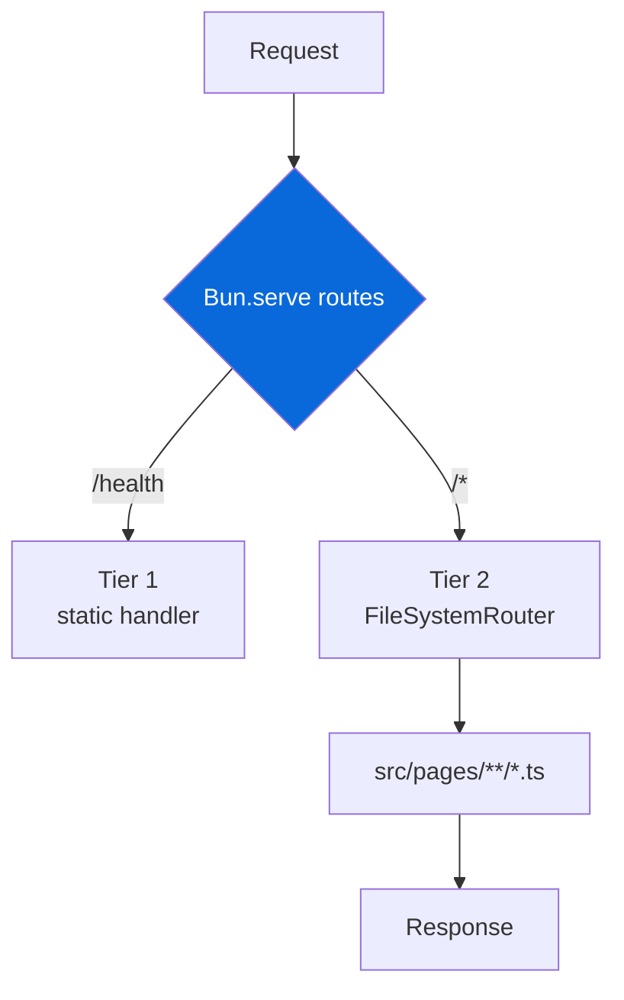

# @myorg/example

Demo HTTP application built with Bun.serve and file-based routing.

> [!NOTE]
> This app is **private** — not bundled, not published. Bun runs TypeScript directly with `--hot`.

## Endpoints

| Route | Tier | Handler | Description |
| :--- | :--- | :--- | :--- |
| `GET /health` | 1 (static) | `src/index.ts` | Health probe |
| `GET /` | 2 (file-based) | `src/pages/index.ts` | HTML welcome page |
| `GET /api` | 2 (file-based) | `src/pages/api/index.ts` | API endpoint list |
| `GET /api/greet/:name` | 2 (file-based) | `src/pages/api/greet/[name].ts` | Greeting |
| `GET /api/shout/:name` | 2 (file-based) | `src/pages/api/shout/[name].ts` | Uppercased greeting |

## Development

```bash
bun run dev              # hot-reloading server on :3000
bun run test             # unit tests (routes + integration)
bun run test:e2e         # Playwright E2E (requires browsers)
```



## Architecture

> [!TIP]
> Two-tier routing for performance and DX.

- **Tier 1** (`routes:` in `Bun.serve`) — static endpoints, sub-millisecond dispatch
- **Tier 2** (`fetch` + `FileSystemRouter`) — Next.js-style file-based routing

<details>
<summary>Adding a new endpoint</summary>

- [ ] Create file in `src/pages/` matching desired URL structure
- [ ] Export default handler:

  ```ts
  // src/pages/api/hello.ts
  export default {
    fetch(req: Request) {
      return Response.json({ message: "Hello" });
    }
  }
  ```

- [ ] Dynamic route: `src/pages/api/greet/[name].ts` → `/api/greet/:name`
- [ ] Test: add unit test in `tests/` and e2e in `e2e/` if enabled

File-based routing conventions:

| File | Route |
| :--- | :--- |
| `src/pages/index.ts` | `/` |
| `src/pages/api/index.ts` | `/api` |
| `src/pages/api/greet/[name].ts` | `/api/greet/:name` |
| `src/pages/blog/[...slug].ts` | `/blog/*` |

</details>

## Testing

| Command | Description |
| :--- | :--- |
| `bun run test` | Unit tests (routes + integration) |
| `bun run test:e2e` | Playwright E2E (requires `me2e` + browsers) |

> [!WARNING]
> E2E tests auto-skip if browsers missing. Run `bunx playwright install` to install.
