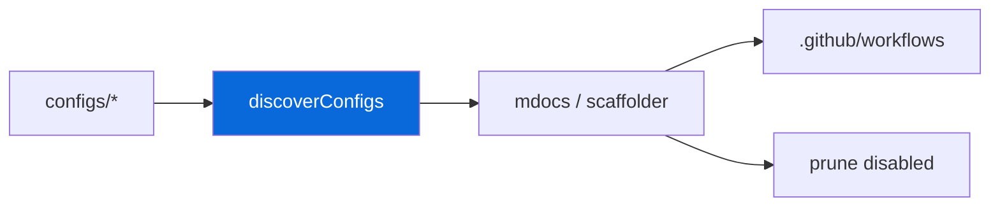

# Configs - Agent Reference

Shared tooling configurations. Each sub-directory owns one tool's config and exposes a single `m`-prefixed CLI bin.

> [!IMPORTANT]
> No root-level `turbo.json`, `biome.json`, `bunfig.toml`, etc. — all config lives in `configs/*` and is referenced by CLI flags.

## Packages

| Package | Bin | File |
| :--- | :--- | :--- |
| Biome | `mbiome` | [AGENT.md](biome/AGENT.md) |
| Bun Config | `mbun` | [AGENT.md](bun-config/AGENT.md) |
| Bunup | `mbunup` | [AGENT.md](bunup/AGENT.md) |
| Changeset | `mchangeset` | [AGENT.md](changeset/AGENT.md) |
| Citty | `mcitty` | [AGENT.md](citty/AGENT.md) |
| Commitlint | — | [AGENT.md](commitlint/AGENT.md) |
| GitHub Actions | `mci` | [AGENT.md](gh-actions/AGENT.md) |
| Lefthook | `msetup` | [AGENT.md](lefthook/AGENT.md) |
| Native | — | [AGENT.md](native/AGENT.md) |
| Playwright | `me2e` | [AGENT.md](playwright/AGENT.md) |
| Skills | `mskills` | [AGENT.md](skills/AGENT.md) |
| Template | `mdocs` | [AGENT.md](template/AGENT.md) |
| TypeScript | `mtsc` | [AGENT.md](ts/AGENT.md) |
| Turbo | `mturbo` | [AGENT.md](turbo/AGENT.md) |
| UnoCSS | — | [AGENT.md](unocss/AGENT.md) |
| Pages | — | [AGENT.md](pages/AGENT.md) |

Root `AGENTS.md` and `README.md` reference these files instead of concatenating them. Workflows are generated via `bun run docs:sync` (`mdocs`).



## Rules

- [ ] No root-level `turbo.json`, `biome.json`, `bunfig.toml`, etc. — all config lives in `configs/*` and is referenced by CLI flags.
- [ ] Adding a config requires only a new `configs/<dir>/` workspace with `package.json`, `AGENT.md`, `README.md`, and optionally `ci.steps.yml`.
- [ ] Each package exposes exactly one `m`-command (with subcommands where needed).

<details>
<summary>Scaffold metadata</summary>

Each `configs/*/package.json` may contain:

```json
{
  "scaffold": {
    "default": "always | enabled | disabled",
    "flag": "--playwright",
    "prompt": { "type": "confirm", "message": "..." },
    "removals": ["apps/example/playwright.config.ts"],
    "scriptsToRemove": ["test:e2e"],
    "selfDestruct": true
  }
}
```

- `discoverConfigs()` reads this — no hardcoded list
- `selfDestruct` packages (template) are always removed

</details>

> [!TIP]
> Run `bun run docs:sync` after editing workflow skeletons, and `bun run ci:lint` after regenerating.
