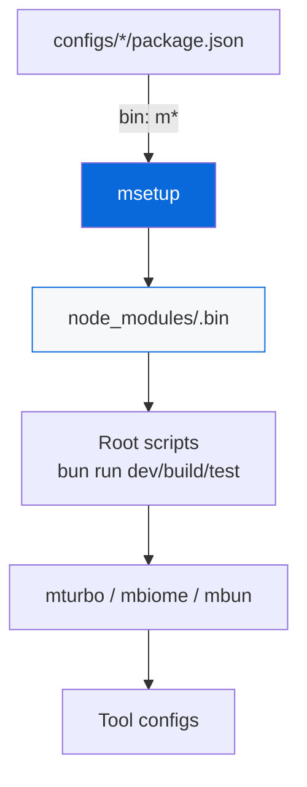
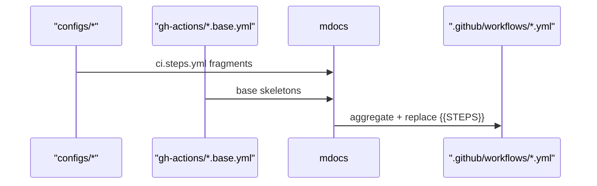

# Configs

Shared tooling configurations for the monorepo. Each sub-directory is a private workspace that owns one tool's config and exposes a single `m`-prefixed CLI bin.

> [!NOTE]
> Root `README.md` and `AGENTS.md` reference these files via links instead of concatenating them. Workflows are generated via `bun run docs:sync`.

## Packages

| Package | Bin | Status | Description |
| :--- | :--- | :---: | :--- |
| [Biome](biome/README.md) | `mbiome` | ✅ Always | Lint and format |
| [Bun Config](bun-config/README.md) | `mbun` | ✅ Always | Bun runtime, test, coverage |
| [Bunup](bunup/README.md) | `mbunup` | ✅ Always | Bundling presets |
| [Changeset](changeset/README.md) | `mchangeset` | ✅ Always | Versioning and releases |
| [Citty](citty/README.md) | `mcitty` | ✅ Always | Elegant CLI builder |
| [Commitlint](commitlint/README.md) | — | ✅ Always | Conventional Commits |
| [GitHub Actions](gh-actions/README.md) | `mci` | ✅ Always | CI workflows, `mci lint` / `mci act` |
| [Lefthook](lefthook/README.md) | `msetup` | ✅ Always | Git hooks |
| [TypeScript](ts/README.md) | `mtsc` | ✅ Always | Shared tsconfigs |
| [Turbo](turbo/README.md) | `mturbo` | ✅ Always | Task orchestration |
| [Native](native/README.md) | — | 🔲 Opt-in | NAPI-RS bindings |
| [Pages](pages/README.md) | — | 🔲 Opt-in | GitHub Pages deployment |
| [Playwright](playwright/README.md) | `me2e` | 🔲 Opt-in | E2E testing |
| [Skills](skills/README.md) | `mskills` | 🔲 Opt-in | AI agent skills |
| [Template](template/README.md) | `mdocs` | 🗑️ Template-only | Scaffolder |
| [UnoCSS](unocss/README.md) | — | 🔲 Opt-in | Atomic CSS |

All bins are linked into `node_modules/.bin` on `bun install`.

## Architecture

How bins work

- Each `configs/*` package declares `bin: { "m*": "./src/cli.ts" }`
- `msetup` (from `configs/lefthook`) scans and symlinks them
- Root `package.json` has zero `devDependencies`
- Tools are invoked via `bun run <script>` which calls `m*` bins

## Workflows

> [!TIP]
> Workflows in `.github/workflows/` are generated from `gh-actions/*.base.yml` skeletons with fragments from `*/ci.steps.yml` via `bun run docs:sync`.

## Adding a new config

- [ ] Create `configs/<name>/` workspace
- [ ] Add `package.json` with `bin`, `scaffold` metadata
- [ ] Add `README.md` + `AGENT.md`
- [ ] Optionally add `ci.steps.yml` for CI fragment
- [ ] Run `bun install` to link bin

See [AGENT.md](./AGENT.md) for agent-facing rules.
