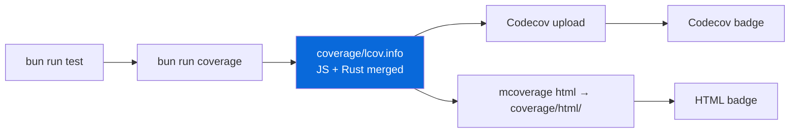

# @myorg/badges

Status badges for every README in the monorepo — CI state, coverage, license and runtime versions, kept consistent across the root and each package.

## What it provides

- **Root `README.md`** — CI, Coverage (Codecov + local HTML), License, Bun (in both the template and monorepo sections)
- **Packages** — CI + Coverage + License + Bun, plus package-specific badges: npm version for `packages/external`, Rust for `packages/native/npm/native`
- **Apps** — CI + Coverage + License + Bun for `apps/example`

### Badge types

| Badge | Source | Purpose |
| :--- | :--- | :--- |
| CI | `github.com/OWNER/REPO/actions/workflows/ci.yml/badge.svg` | Workflow status |
| Coverage | `img.shields.io/codecov/c/github/OWNER/REPO` | Dynamic coverage from Codecov |
| Coverage graph | `codecov.io/gh/OWNER/REPO/graph/badge.svg` | Codecov trend graph |
| Coverage HTML | static shield | Links to `./coverage/html/` locally or `/coverage/` on Pages |
| License | static shield | MIT |
| Bun | static shield | Pinned Bun version |
| npm version | `img.shields.io/npm/v/@SCOPE/external` | Published version |
| Rust | static shield | Rust toolchain |

## Coverage flow behind the badges



`bun run coverage` runs each package's `mbun test --coverage`, then `mcoverage merge` combines the LCOV files (Rust coverage comes from `mnative llvm-cov`). CI uploads to Codecov and renders the HTML report as an artifact.

## After scaffolding

The scaffolder rewrites both the owner/repo in badge URLs and the `@myorg` scope, using `SCAFFOLD_OWNER`, `GITHUB_REPOSITORY` or your git identity — so badges point at your repository the moment the project is created.

> [!NOTE]
> Codecov needs a `CODECOV_TOKEN` secret for **private** repositories. Public ones work without it, and CI is configured with `fail_ci_if_error: false` so a missing token never breaks the build.

## Commands

```bash
bun run coverage          # per-package coverage → merged coverage/lcov.info
bun run coverage:html     # mcoverage html → coverage/html/
bun run coverage:check    # mcoverage check (80% threshold)
bun run coverage:summary  # mcoverage summary
```
