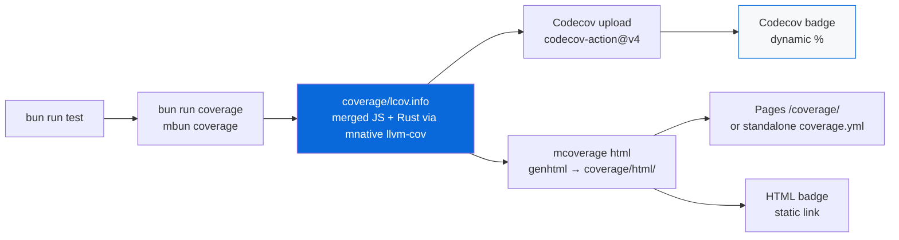

# @myorg/badges

> CI, coverage, and repo health badges for root and all packages/apps READMEs.

## What it provides

- **Root README** (`README.md`): Badges for CI, Coverage (Codecov + HTML), License, Bun, TypeScript — in both template and monorepo sections
- **Packages**: `packages/external/README.md`, `packages/internal/README.md`, `packages/native/README.md` — CI + Coverage + package-specific (npm version, Rust, Bun)
- **Apps**: `apps/example/README.md` — CI + Coverage + Bun

### Badge types

| Badge | URL | Purpose |
| :--- | :--- | :--- |
| CI | `https://github.com/OWNER/REPO/actions/workflows/ci.yml/badge.svg` | Workflow status |
| Coverage (Codecov) | `https://img.shields.io/codecov/c/github/OWNER/REPO?logo=codecov` | Dynamic coverage from Codecov |
| Coverage (graph) | `https://codecov.io/gh/OWNER/REPO/graph/badge.svg` | Codecov graph |
| Coverage HTML | `https://img.shields.io/badge/Coverage-HTML-brightgreen` | Link to local `./coverage/html/` or Pages `/coverage/` |
| License | `https://img.shields.io/badge/License-MIT-yellow.svg` | MIT |
| Bun | `https://img.shields.io/badge/Bun-1.4.2-black?logo=bun` | Bun version |
| npm version | `https://img.shields.io/npm/v/@SCOPE/external` | Published package version |
| Rust | `https://img.shields.io/badge/Rust-stable-orange?logo=rust` | Rust toolchain |

### Coverage flow (for badges)



- `bun run coverage` → `mbun coverage` (Bun LCOV via `bunfig.toml`) + `mnative llvm-cov` (Rust) → `coverage/lcov.info` merged via `lcov --add-tracefile`
- CI uploads to Codecov (`codecov/codecov-action@v4`)
- CI generates HTML via `mcoverage html` (`genhtml`) → artifact 14d + Pages at `/coverage/` when Pages enabled, or standalone `coverage.yml` Pages site
- Badges link to Codecov (dynamic %) and to local HTML / Pages

### After scaffolding

Update badges to your repo:

```markdown
Archont561/ts-monorepo-template → YOUR_ORG/YOUR_REPO
@myorg → @your-scope
```

- Codecov requires `CODECOV_TOKEN` secret for private repos (Settings → Secrets → Actions)
- Coverage HTML badge: `./coverage/html/` locally, `/coverage/` on Pages, or `https://YOUR_ORG.github.io/YOUR_REPO/coverage/` for standalone coverage Pages

### Commands

```bash
bun run coverage          # generate lcov.info
bun run coverage:html     # mcoverage html → coverage/html/
bun run coverage:check    # mcoverage check (80% threshold)
bun run coverage:summary  # mcoverage summary
```

See [AGENT.md](./AGENT.md).
