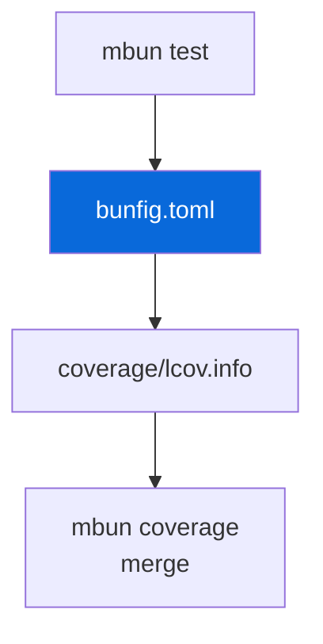

## Bun Config

> [!NOTE]
> Shared `bunfig.toml` — no per-package symlinks.

- `mbun` (from `@myorg/bun-config`) wraps `bun` and injects `--config=<configs/bun-config/bunfig.toml>` for `bun test`; other commands pass through
- `mbun coverage` runs `mturbo coverage` then merges per-package `coverage/lcov.info` into root `coverage/lcov.info` with `lcov-result-merger`
- Config (`bunfig.toml`): LCOV + text reporters, 80% line/function threshold, ignores `*.test.ts`, `dist`, `node_modules`, `configs/*`, `cli.ts`, `e2e`, `aggregate.ts`
- No per-package `bunfig.toml` — always passed explicitly for deterministic output

| Command | Description |
| :--- | :--- |
| `bun run test` | Turbo → per-package `mbun test` |
| `bun run coverage` | `mbun coverage` → merged LCOV |
| `mbun test` | Direct, injects config |

> [!WARNING]
> JSC not V8 — don't use Node coverage APIs.
