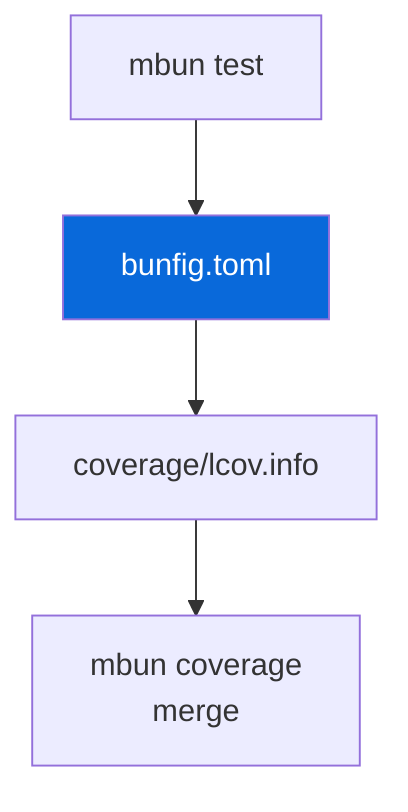

## Bun Config + Coverage Generation

> [!NOTE]
> Shared `bunfig.toml` — no per-package symlinks. Coverage reporting in `@myorg/coverage`.

- `mbun` (from `@myorg/bun-config`) wraps `bun` and injects `--config=<configs/bun-config/bunfig.toml>` for `bun test`; other commands pass through
- `mbun coverage` runs `mturbo coverage` then merges per-package `coverage/lcov.info` into root `coverage/lcov.info` with `lcov-result-merger --prepend-source-files`
- Config (`bunfig.toml`): LCOV + text reporters, 80% line/function threshold, ignores `*.test.ts`, `dist`, `node_modules`, `configs/*`, `cli.ts`, `e2e`, `aggregate.ts`, `*.node`, `target`, `apps/example/src/index.ts`, `pages/index.ts`
- No per-package `bunfig.toml` — always passed explicitly for deterministic output
- Reporting (HTML, artifact, Pages, threshold, PR comment) is in `@myorg/coverage` — see `configs/coverage/AGENT.md`: installs `lcov`+`bc`, `genhtml` → `coverage/html/`, `upload-artifact@v4` retention 14d, threshold check `lcov --summary` + `bc -l < 80`, PR comment via `lcov-reporter-action`, Pages inclusion at `/coverage/` when pages enabled else standalone `coverage.yml` Pages deploy

| Command | Description |
| :--- | :--- |
| `bun run test` | Turbo → per-package `mbun test` |
| `bun run coverage` | `mbun coverage` → merged LCOV |
| `mbun test` | Direct, injects config |

> [!WARNING]
> JSC not V8 — don't use Node coverage APIs.
