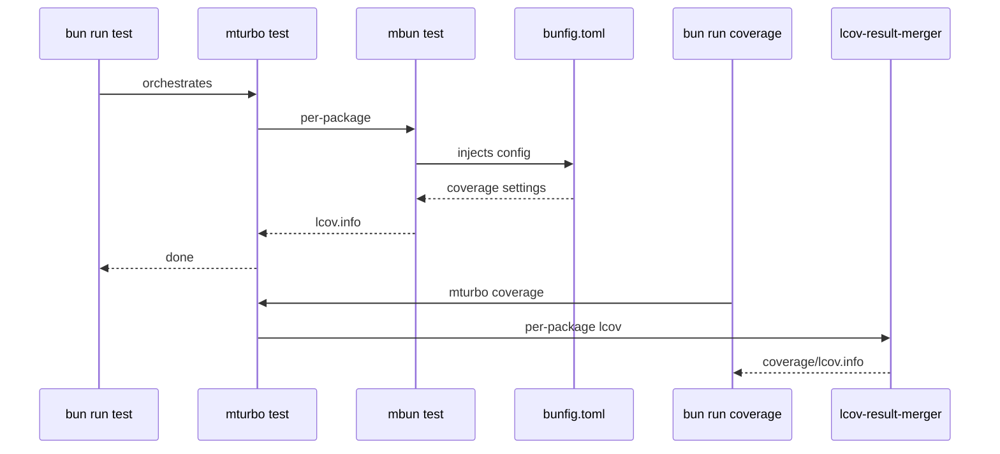

# @myorg/bun-config

> Shared Bun runtime, test, and coverage configuration.

## What it provides

- `bunfig.toml` — the single source of truth for test + coverage settings
- `mbun` — single bin for this package

> [!NOTE]
> No per-package `bunfig.toml` symlinks — the shared config is always passed explicitly.

### Bins

| Bin | Wraps | Description |
| :--- | :--- | :--- |
| `mbun <cmd>` | `bun` | Wraps `bun`; injects `--config=bunfig.toml` for `bun test` |
| `mbun coverage` | `mturbo coverage` | Runs per-package coverage then merges LCOV |

### Config highlights (`bunfig.toml`)

| Setting | Value |
| :--- | :--- |
| Coverage | LCOV + text → `coverage/lcov.info` |
| Threshold | 80% line/function |
| Ignores | `*.test.ts`, `dist`, `node_modules`, `configs/*`, `cli.ts` |

## Usage

```bash
bun run test       # mturbo test   (Turbo runs per-package mbun test)
bun run coverage   # mbun coverage (mturbo coverage + merged root lcov.info)
```



<details>
<summary>Coverage merging</summary>

- Each package outputs `coverage/lcov.info`
- `mbun coverage` runs `mturbo coverage` then merges with `lcov-result-merger --prepend-source-files`
- Result: root `coverage/lcov.info` with all packages

</details>

## Rules

> [!WARNING]
> Bun uses JavaScriptCore (JSC), not V8: never use Node coverage APIs, and don't expect `bun test --coverage` to capture separately spawned processes.

See [AGENT.md](./AGENT.md) for the agent-facing reference.
