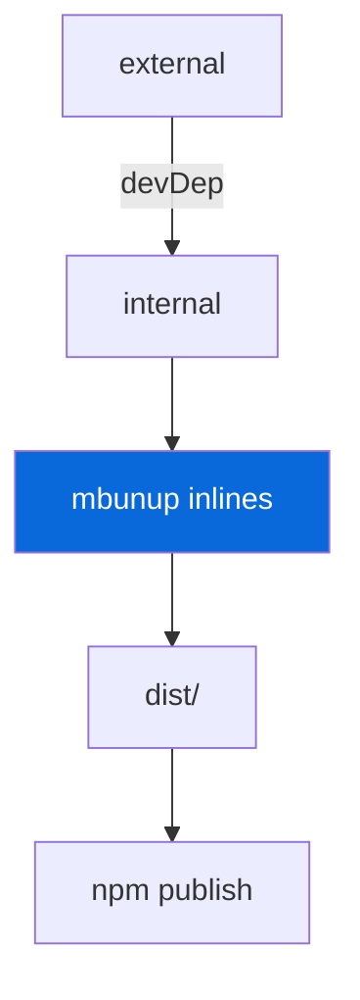

## Bunup

> [!NOTE]
> Bundler for library packages. Apps are not bundled.

- `mbunup` (from `@myorg/bunup`) wraps `bunup` with shared presets
- `baseConfig` — ESM + `.d.ts`, externalizes deps, inlines `@myorg/internal`
- Library `bunup.config.ts` extends `baseConfig` with `entry: ["src/index.ts"]`
- Apps (`apps/*`) use `bun --hot src/index.ts` — no Bunup
- `dist/` is generated — never edit manually

| Package | Build | Output |
| :--- | :--- | :--- |
| `external` | `mbunup` | `dist/*.js + .d.ts` |
| `internal` | `mbunup` | `dist/*.js + .d.ts` |
| `example` | `bun --hot` | No bundle |

> [!CAUTION]
> Never use `export *` in `external` — explicit named re-exports only.
