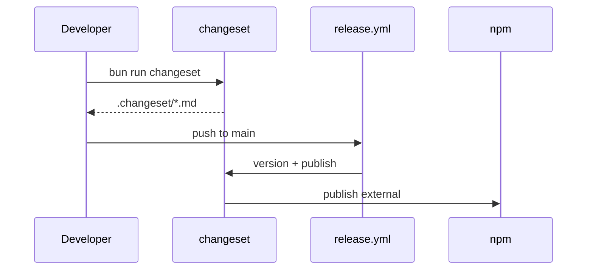

# @myorg/changeset

> Versioning and releases with Changesets.

## What it provides

- `@changesets/cli` as shared devDependency
- `config.json` — shared Changeset config
- `mchangeset` — CLI alias that bakes in config path

> [!NOTE]
> Versioning is handled via Changesets — not manual `package.json` bumps.

### Config highlights

| Setting | Value |
| :--- | :--- |
| `linked` | External packages linked |
| `ignore` | `internal`, `example`, `configs/*` ignored |
| `changelog` | `@changesets/changelog-github` |

## Usage

```bash
bun run changeset        # create a changeset
bun run changeset:version # bump versions
bun run changeset:publish # publish to npm
```



<details>
<summary>Adding a changeset</summary>

```bash
bun run changeset
# Select packages, bump type (patch/minor/major), describe change
```

- Patch: bug fixes
- Minor: new features (new exports, subpaths)
- Major: breaking changes

</details>

## Commands

| Command | Description |
| :--- | :--- |
| `bun run changeset` | Create changeset |
| `mchangeset init` | Ensure config exists (run by `prepare`) |
| `mchangeset version` | Bump versions from changesets |
| `mchangeset publish` | Publish to npm |

See [AGENTS.md](./AGENTS.md) for the agent-facing reference.
