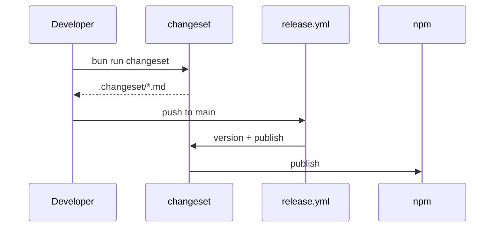

# @myorg/changeset

Versioning and publishing with Changesets — release intent is recorded in the PR, not guessed at release time.

## What it provides

- `@changesets/cli` as a shared workspace dependency
- `config.json` — the shared Changesets config
- `mchangeset` — the bin that bakes in that config path

> [!NOTE]
> Versions come from Changesets, never from manual `package.json` edits.

### Config highlights

| Setting | Value |
| :--- | :--- |
| `access` | `public` |
| `baseBranch` | `main` |
| `changelog` | `@changesets/cli/changelog` |
| `updateInternalDependencies` | `patch` |
| `ignore` | Private and config packages — only published packages are versioned |

## Usage

```bash
bun run changeset   # record intent: pick packages, bump type, describe the change
bun run version     # mchangeset version — apply pending changesets
bun run release     # mchangeset publish — publish to npm
```



### Bump types

| Type | When |
| :--- | :--- |
| patch | Bug fixes |
| minor | New features, new exports or subpaths |
| major | Breaking changes |

`mchangeset init` runs during `bun install` (`prepare`) and copies the shared config into `.changeset/config.json`.
