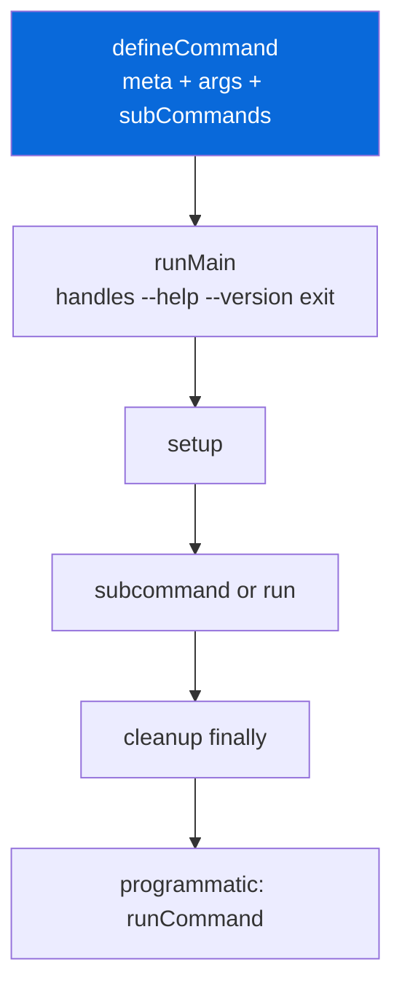

## Citty

> [!NOTE]
> Elegant CLI Builder — zero deps, typed, subcommands, auto-help. Use for complex m-bins.

- `@myorg/citty` (`configs/citty`) provides `citty` as shared dep (zero deps, 3kB gzipped) + `mcitty` info bin + helpers `defineWrapperCommand`, `defineSpawnSubcommand`
- Core API: `defineCommand({ meta, args, run, subCommands, setup, cleanup })`, `runMain(cmd)`, `runCommand(cmd, { rawArgs })`, `createMain`, `parseArgs`, `renderUsage`, `showUsage`
- Benefits for monorepo: typed args with case-agnostic parsing (`--user-name` === `--userName` via `scule`), auto `--help`/`--version` from `meta`, nested subcommands with lazy/async loading (`() => import("./cmd").then(r => r.default)`), lifecycle `setup` → `run` → `cleanup` (finally), programmatic `runCommand` for agent scripts
- Current m-bins: simple wrappers (`mbiome`, `mbunup`, `mtsc`, `mturbo`) — low benefit, keep simple; complex (`mbun` coverage, `mci` lint/act, `mchangeset` init, `msetup` lefthook, `mskills` 8 subcommands, `mdocs`) — high benefit, use citty
- POCs in repo: `configs/skills/src/cli.citty.ts` (8 subcommands), `configs/gh-actions/src/cli.citty.ts` (lint/act), `configs/bun-config/src/cli.citty.ts` (coverage/test) — try `bun <file> --help`
- Installation: `bun add citty --cwd configs/<name>` — zero deps
- Migration: Phase 1 complex (mskills, mci, mbun) → Phase 2 medium (mchangeset, msetup, mdocs) → Phase 3 simple optional
- `mcitty` bin: `mcitty info` shows usage guide
- No root `citty` config — each config owns its CLI

| Bin | Current | With citty |
| :--- | :--- | :--- |
| `mbiome` | spawn + baked config | Same + auto help |
| `mbun` | if coverage else passthrough | `subCommands: { coverage, test }` |
| `mci` | switch lint/act | `subCommands: { lint, act }` |
| `mskills` | switch sync/list/add/... | `subCommands: { sync, list, add, ... }` + typed args |

> [!TIP]
> Use lazy `subCommands: { name: () => import(...) }` for large CLIs to keep startup fast. Use `runCommand` not `child_process` in agent scripts.

- Always include `meta.name`, `version`, `description` for auto help
- Use `setup`/`cleanup` for DB connections, temp files
