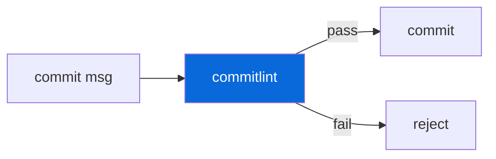

## Commitlint

> [!IMPORTANT]
> Conventional Commits enforced via Lefthook `commit-msg` hook.

- Config (`commitlint.config.js`) extends `@commitlint/config-conventional`
- Hook: `lefthook.yml` `commit-msg` → `commitlint --edit {1}`
- Valid types: `feat`, `fix`, `docs`, `chore`, `refactor`, `test`, `perf`, `build`, `ci`, `revert`
- Subject must be lowercase, no period, max 100 chars
- Body max line 100 chars

| Example | Valid | Bump |
| :--- | :---: | :--- |
| `feat(external): add http subpath` | ✅ | Minor |
| `fix(internal): handle null` | ✅ | Patch |
| `docs: update README` | ✅ | None |
| `Add feature` | ❌ | — |

> [!TIP]
> Use `feat!:` or `BREAKING CHANGE:` footer for major bumps.
