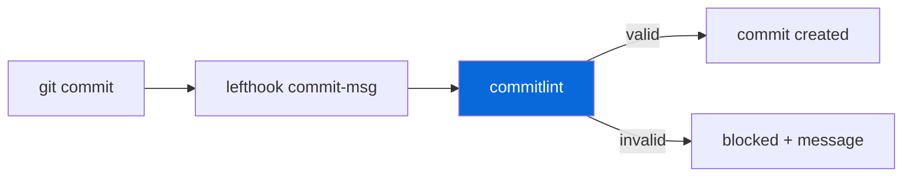

# @myorg/commitlint

> Conventional Commits enforcement.

## What it provides

- `@commitlint/cli` + `@commitlint/config-conventional`
- `commitlint.config.js` — shared config
- Lefthook integration — validates commit messages on `commit-msg` hook

> [!IMPORTANT]
> Commit messages must follow Conventional Commits. The hook blocks invalid messages.

### Config

| Rule | Description |
| :--- | :--- |
| `type` | `feat`, `fix`, `docs`, `chore`, `refactor`, etc. |
| `scope` | Optional, e.g. `feat(external): ...` |
| `subject` | Lowercase, no period |

## Usage

```bash
# Valid
feat(external): add new greet function
fix(internal): handle edge case
docs: update README

# Invalid (blocked by hook)
Add new feature
WIP
```



<details>
<summary>Commit types</summary>

- `feat`: New feature (minor bump)
- `fix`: Bug fix (patch bump)
- `docs`: Documentation only
- `chore`: Maintenance, deps
- `refactor`: Code refactor
- `test`: Tests
- `perf`: Performance improvement
- `BREAKING CHANGE`: Major bump (in footer)

</details>

See [AGENT.md](./AGENT.md) for the agent-facing reference.
