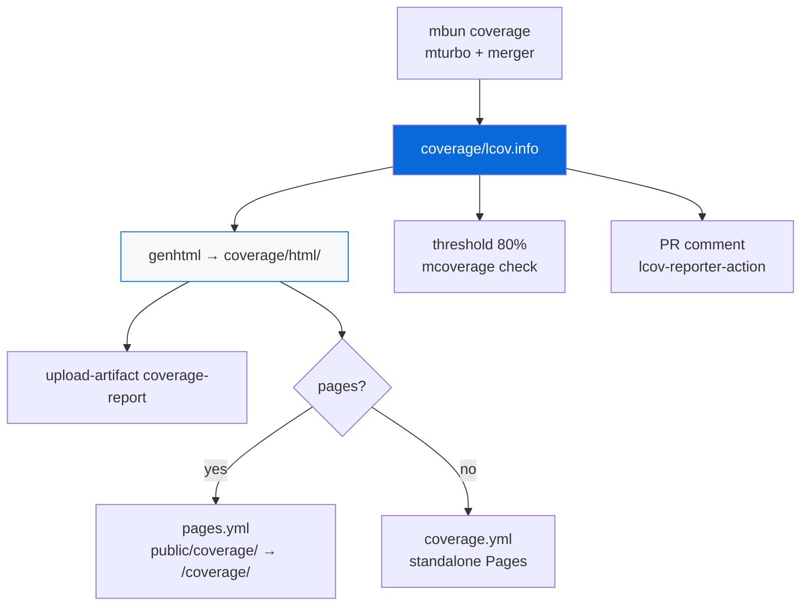

## Coverage (LCOV + HTML + Pages + Threshold)

> Always config — provides coverage reporting via `gh-actions` skeletons. Data-driven via `package.json` `scaffold` metadata. No root Cargo.toml needed.

- `configs/coverage` (`@myorg/coverage`) always enabled — LCOV reporting: HTML via `genhtml`, artifact `coverage-report` (14d), Pages deployment, 80% threshold, PR comment via `lcov-reporter-action`
- `configs/bun-config/bunfig.toml` generates `coverage/lcov.info` per package (text+lcov, threshold 80% lines/functions, ignores *.test.ts, dist, configs, cli.ts, etc), `mbun coverage` runs `mturbo coverage` + `lcov-result-merger --prepend-source-files` → root `coverage/lcov.info`
- Fragments:
  - `ci.steps.yml`: one-liners only — `mcoverage setup` (installs lcov) → `mcoverage html` (genhtml) → `upload-artifact@v4` path `coverage/html/` → `mcoverage check --threshold 80` → `romeovs/lcov-reporter-action@v0.3.1` on PR. All logic lives in `configs/coverage/src/cli.ts`
  - `pages.steps.yml` (TEMPLATE-ONLY pages): when Pages enabled, `mcoverage pages` collects + renders HTML and copies it into `apps/example/public/coverage/` → served at `/coverage/` alongside example app (avoids Pages conflict)
  - `coverage.steps.yml` + `coverage.base.yml` skeleton → `.github/workflows/coverage.yml` standalone coverage Pages site when Pages **disabled** (if Pages enabled, coverage.yml removed, coverage included in pages.yml)
- `configs/gh-actions/coverage.base.yml` skeleton: on push main/PR/workflow_dispatch, permissions contents:read pages:write id-token:write, concurrency group pages cancel-in-progress false, jobs build (checkout, setup-bun, install, {{STEPS}}, configure-pages, upload-pages-artifact path coverage/html) + deploy (needs build, if main, pages:write id-token:write, environment github-pages, deploy-pages)
- Rust coverage optional: `mcoverage collect` runs `mnative llvm-cov` when `packages/native/Cargo.toml` exists and merges `coverage/rust-lcov.info` into the main LCOV
- Monorepo merging: current uses `lcov-result-merger`, alternative `lcov --add-tracefile packages/*/coverage/lcov.info --output-file merged.lcov`
- Threshold enforcement: `mcoverage check --threshold 80` parses the `LF:`/`LH:` records itself — no `lcov`/`bc` binary needed locally, and it emits `::error::` on failure
- Badge: via gist + shields.io endpoint (dynamic-badges-action) or codecov

> [!IMPORTANT]
> Always output LCOV, install lcov+bc, genhtml before upload, set retention-days 14, gate Pages on main, merge via add-tracefile or merger, threshold fail, PR comment on pull_request, avoid Pages conflict by including coverage at /coverage/ when pages enabled else standalone coverage.yml.

See [README.md](./README.md) and [bun-config README](../bun-config/README.md) for full guide.
