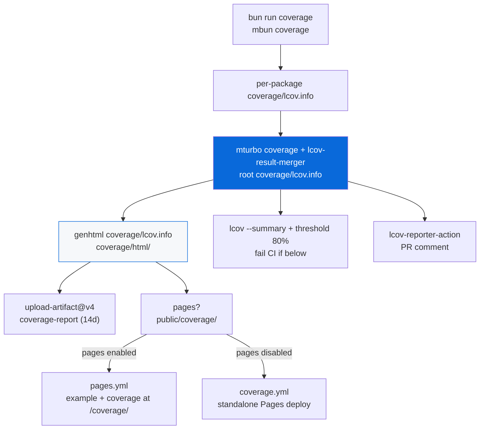

# @myorg/coverage

> LCOV coverage reporting — HTML via `genhtml`, artifact upload, Pages deployment, threshold enforcement, PR comments, and monorepo merging.

## What it provides

- Always-on config (`default: always`) — no opt-in needed
- `ci.steps.yml` fragment: install `lcov` + `bc`, generate HTML via `genhtml`, upload artifact `coverage-report` (14 days), check 80% threshold via `lcov --summary`, PR comment via `romeovs/lcov-reporter-action`
- `pages.steps.yml` fragment: when Pages is enabled, generates coverage HTML into `apps/example/public/coverage/` so coverage is served at `https://user.github.io/repo/coverage/` alongside example app
- `coverage.steps.yml` fragment + `coverage.base.yml` skeleton in `configs/gh-actions/`: standalone `coverage.yml` workflow that deploys coverage HTML to Pages when Pages app is **disabled** (avoids conflict — if Pages app exists, coverage is included in `pages.yml` instead)
- Handles Bun coverage (`bun test --coverage` → `coverage/lcov.info`) merged via `mbun coverage` (`mturbo coverage` + `lcov-result-merger`)
- Optional Rust coverage via `cargo-llvm-cov` when `packages/native/Cargo.toml` exists (merges Rust LCOV into main)

> [!NOTE]
> Workflows in `.github/workflows/` are generated — don't edit directly. Edit skeletons and fragments, then run `bun run docs:sync`.

## Architecture



### Workflow generation

| Skeleton | Fragments | Output | When |
| :--- | :--- | :--- | :--- |
| `ci.base.yml` | `*/ci.steps.yml` (includes coverage) | `.github/workflows/ci.yml` | Always |
| `pages.base.yml` | `*/pages.steps.yml` (includes coverage) | `.github/workflows/pages.yml` | Pages enabled |
| `coverage.base.yml` | `*/coverage.steps.yml` | `.github/workflows/coverage.yml` | Pages **disabled** (standalone coverage site) |

When Pages is enabled, `coverage.yml` is removed to avoid Pages conflict — coverage is served at `/coverage/` via `pages.yml`.

## LCOV Basics

LCOV is standard coverage format (`.info` / `.lcov`) and CLI tools (`lcov`, `genhtml`) for line/function/branch coverage. Standard for:
- Bun: `bun test --coverage` → `coverage/lcov.info`
- Rust: `cargo-llvm-cov` / `cargo-tarpaulin`
- Vitest: `@vitest/coverage-v8`

`genhtml` converts LCOV → self-contained HTML.

## Generate LCOV (Bun)

```bash
bun run test --coverage --coverage-reporter=lcov
# or per monorepo:
bun run coverage   # mbun coverage → mturbo coverage + merge → coverage/lcov.info
```

`bunfig.toml` already configures:
```toml
[test]
coverage = true
coverageReporter = ["text", "lcov"]
coverageDir = "./coverage"
coverageThreshold = { lines = 0.80, functions = 0.80 }
```

## Generate HTML via genhtml

```bash
sudo apt-get install -y lcov
genhtml coverage/lcov.info \
  --output-directory coverage/html \
  --title "Coverage Report" \
  --show-details \
  --highlight \
  --legend
# → coverage/html/index.html
```

## Option A — Upload as artifact (implemented in ci.yml)

```yaml
- name: Upload coverage HTML artifact
  uses: actions/upload-artifact@v4
  with:
    name: coverage-report
    path: coverage/html/
    retention-days: 14
```

Downloadable from **Actions → run → Artifacts → coverage-report**.

## Option B — PR comment (implemented)

```yaml
- name: Report coverage to PR
  if: github.event_name == 'pull_request'
  uses: romeovs/lcov-reporter-action@v0.3.1
  with:
    lcov-file: ./coverage/lcov.info
    github-token: ${{ secrets.GITHUB_TOKEN }}
    delete-old-comments: true
```

Posts per-file coverage diff as PR comment.

## Option C — Deploy to GitHub Pages (implemented)

When Pages app is **disabled**, `coverage.yml` deploys coverage HTML to Pages:

```yaml
# coverage.base.yml
- uses: actions/configure-pages@v5
- uses: actions/upload-pages-artifact@v3
  with:
    path: coverage/html/
- uses: actions/deploy-pages@v4
```

When Pages app is **enabled**, coverage is included at `/coverage/` via `pages.steps.yml`:

```bash
genhtml coverage/lcov.info --output-directory coverage/html
mkdir -p apps/example/public/coverage
cp -r coverage/html/* apps/example/public/coverage/
# Then pages.yml uploads apps/example/public (includes /coverage/)
```

So coverage available at `https://user.github.io/repo/coverage/`.

## Option D — Artifacts + Pages together (implemented)

- CI always uploads artifact (every branch/PR)
- On `main`, Pages deployment includes coverage:
  - If pages enabled: via `pages.yml` (example + coverage)
  - If pages disabled: via `coverage.yml` (standalone coverage site)

## Threshold enforcement (implemented)

```bash
COVERAGE=$(lcov --summary coverage/lcov.info 2>&1 | grep "lines" | awk '{print $2}' | tr -d '%')
if (( $(echo "$COVERAGE < 80" | bc -l) )); then
  echo "::error::Coverage ${COVERAGE}% is below 80% threshold"
  exit 1
fi
```

Fail CI if coverage drops below 80% (matches `bunfig.toml` threshold).

## Combine multiple LCOV (monorepo)

Current: `mbun coverage` uses `lcov-result-merger --prepend-source-files` to merge `{packages,apps}/*/coverage/lcov.info` → `coverage/lcov.info`.

Alternative via `lcov`:

```bash
lcov \
  --add-tracefile packages/api/coverage/lcov.info \
  --add-tracefile packages/web/coverage/lcov.info \
  --output-file coverage/merged.lcov
genhtml coverage/merged.lcov --output-directory coverage/html
```

Rust merging (when native enabled):

```bash
cargo install cargo-llvm-cov
cargo llvm-cov --manifest-path packages/native/Cargo.toml --lcov --output-path coverage/rust-lcov.info
lcov --add-tracefile coverage/lcov.info --add-tracefile coverage/rust-lcov.info --output-file coverage/merged.lcov
```

Implemented in `coverage.steps.yml` as optional step.

## Coverage badge

```yaml
- name: Extract coverage percent
  id: cov
  run: |
    PCT=$(lcov --summary coverage/lcov.info 2>&1 | grep lines | awk '{print $2}' | tr -d '%')
    echo "percent=$PCT" >> $GITHUB_OUTPUT

- name: Create badge via gist
  uses: schneegans/dynamic-badges-action@v1.7.0
  with:
    auth: ${{ secrets.GIST_TOKEN }}
    gistID: <gist-id>
    filename: coverage.json
    label: Coverage
    message: "${{ steps.cov.outputs.percent }}%"
    color: green
```

Then README: ``

## Usage

```bash
bun run coverage   # generate + merge LCOV
# HTML locally:
sudo apt-get install -y lcov
genhtml coverage/lcov.info --output-directory coverage/html --title "Coverage" --show-details --highlight --legend
open coverage/html/index.html

# In CI: bun run docs:sync → generates ci.yml (artifact + threshold + PR comment) + pages.yml (includes /coverage/) or coverage.yml (standalone)
```

## Agent Checklist

- ✅ Configure test runner to output LCOV (`coverage/lcov.info`) — done via `bunfig.toml`
- ✅ Install `lcov` + `bc` in workflow (`sudo apt-get install -y lcov bc`)
- ✅ Use `genhtml` to convert `.info` → HTML before uploading
- ✅ Use `actions/upload-artifact@v4` for per-PR downloadable reports (retention 14d)
- ✅ Gate `upload-pages-artifact` + `deploy-pages` on `main` only
- ✅ Use `lcov --add-tracefile` to merge multiple LCOV in monorepos (or `lcov-result-merger`)
- ✅ Add threshold check with `lcov --summary` to fail CI on regression
- ✅ Use `romeovs/lcov-reporter-action` for PR comments
- ✅ When Pages app enabled, include coverage at `/coverage/` to avoid Pages conflict; when disabled, deploy standalone coverage site
- ✅ Handle Rust coverage via `cargo-llvm-cov` when native enabled

## References

- [LCOV](https://github.com/linux-test-project/lcov)
- [cargo-llvm-cov](https://github.com/taiki-e/cargo-llvm-cov)
- [AGENT.md](./AGENT.md)
- [bun-config README](../bun-config/README.md)
- [gh-actions README](../gh-actions/README.md)
