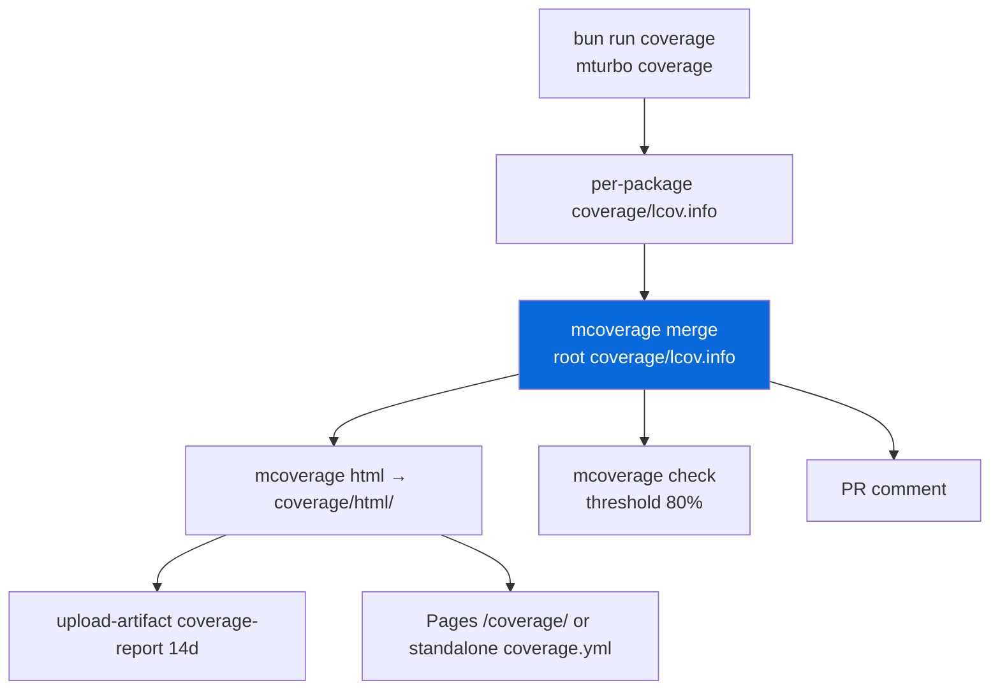

# @myorg/coverage

Coverage collection, merging, reporting and the CI gate — one CLI behind all of it.

## What it provides

`mcoverage` owns every coverage step; the workflow fragments are one-liners that call it.

| Subcommand | What it does |
| :--- | :--- |
| `setup` | Installs `lcov`/`genhtml` if missing (apt-get on Linux, brew on macOS) |
| `collect` | Runs JS coverage (`bun run coverage`) and, when a Cargo workspace exists, Rust coverage (`mnative llvm-cov`), then merges |
| `merge` | Merges per-package LCOV files into `coverage/lcov.info` |
| `html` | Renders the HTML report with `genhtml` |
| `check` | Fails CI below the threshold — parses `LF:`/`LH:` itself, no `lcov` binary needed |
| `summary` | Prints the line/function totals |
| `pages` | Puts the rendered report into the Pages artifact so it is served at `/coverage/` |

### Flow



## Usage

```bash
bun run coverage        # per-package reports, then merge → coverage/lcov.info
bun run coverage:html   # coverage/html/
bun run coverage:check  # CI gate (80%)
bun run coverage:summary
```

## Where the report is published

| Repo | Publisher | URL |
| :--- | :--- | :--- |
| With Pages enabled | `mcoverage pages` + `mpages build` | `/coverage/` on the Pages site |
| Without Pages | standalone `coverage.yml` workflow | its own Pages site |
| This template repo | `mdocs site` | `/coverage/` on the docs site (`apps/template-docs/dist/coverage`) |

> [!NOTE]
> Exactly one workflow may deploy to Pages. In the template repo that is `template-docs.yml`, so `docs:sync` skips `pages.yml` and `coverage.yml` while the docs app exists.
