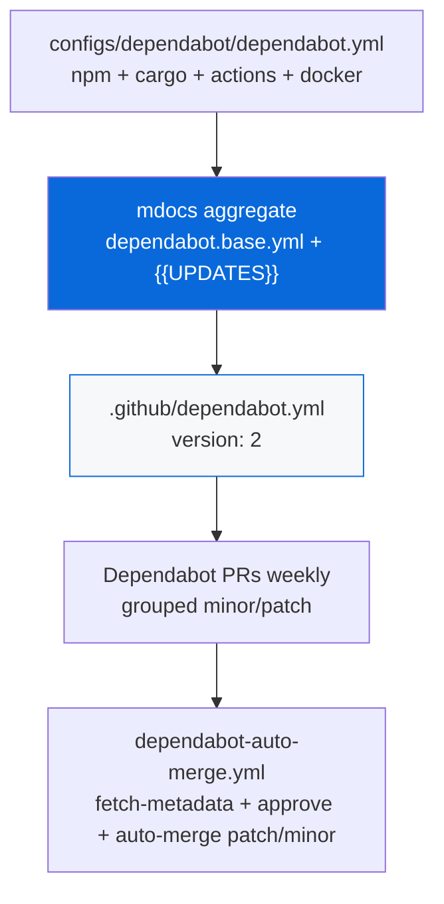

## Dependabot

> Always config — provides `.github/dependabot.yml` + auto-merge workflow via `gh-actions` skeletons. Data-driven via `package.json` `scaffold` metadata.

- `configs/dependabot` (`@myorg/dependabot`) provides Dependabot version updates, always enabled
- `configs/gh-actions/dependabot.base.yml` skeleton with `{{UPDATES}}` placeholder → generates `.github/dependabot.yml` (version: 2) via `bun run docs:sync` (mdocs)
- Fragments: `configs/*/dependabot.yml` aggregated sorted, concatenated — main fragment in `configs/dependabot/dependabot.yml` provides 4 ecosystems: `npm` `/` (bun.lock), `cargo` `/` (Cargo.toml), `github-actions` `/` (workflows), `docker` `/apps/example` (Dockerfile)
- Each ecosystem: `schedule: weekly monday 09:00 UTC`, `open-pull-requests-limit: 10` (docker 5), `labels: dependencies + ecosystem`, `groups` batch minor/patch (production-dependencies vs dev-tooling for npm, cargo-deps, actions, docker-deps), `ignore: * semver-major` gates majors behind manual review, `commit-message: prefix chore + include scope`
- `configs/gh-actions/dependabot-auto-merge.base.yml` skeleton + `configs/dependabot/dependabot-auto-merge.steps.yml` fragments → `.github/workflows/dependabot-auto-merge.yml` — uses `dependabot/fetch-metadata@v2`, approves + auto-merges patch/minor only, majors manual
- `reviewers` removed May 2025 — use `CODEOWNERS` instead
- Private registries: store tokens as encrypted secrets under `registries` in dependabot.yml
- Enable one-time: Settings → Code security and analysis → enable Dependabot alerts, security updates, version updates — dependency graph auto-enabled
- Monorepo: one updates block per manifest dir (e.g. `/packages/api`, `/crates/core`)
- PR commands: `@dependabot rebase`, `recreate`, `merge`, `squash and merge`, `ignore this major/minor/dependency`

> [!IMPORTANT]
> Always include github-actions ecosystem, use groups to reduce noise, ignore semver-major, do not use reviewers (use CODEOWNERS), set open-pull-requests-limit, gate auto-merge behind CI, manually review majors.

See [README.md](./README.md) and [gh-actions README](../gh-actions/README.md) for full guide.
