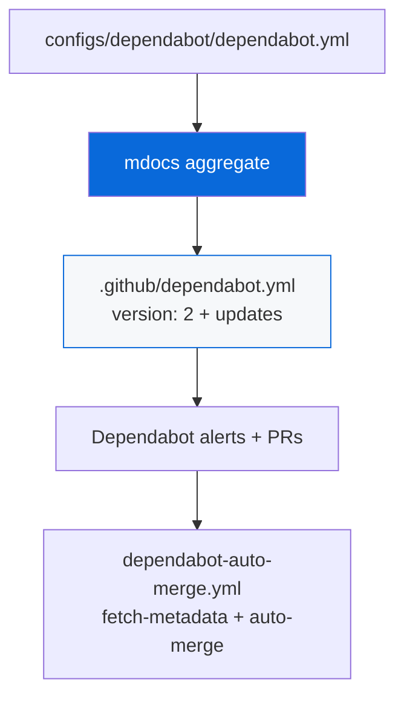

# @myorg/dependabot

> Automated dependency updates via Dependabot — alerts, security updates, and version updates for npm, Cargo, GitHub Actions, and Docker.

## What it provides

- `dependabot.base.yml` skeleton in `configs/gh-actions/` with `{{UPDATES}}` placeholder → generates `.github/dependabot.yml`
- `dependabot.yml` fragments aggregated from `configs/*/dependabot.yml` via `mdocs` (`bun run docs:sync`)
- `dependabot-auto-merge.base.yml` + `dependabot-auto-merge.steps.yml` → `.github/workflows/dependabot-auto-merge.yml` for auto-merging patch/minor updates
- Supports 4 ecosystems: `npm` (bun.lock), `cargo` (Cargo.toml), `github-actions` (.github/workflows), `docker` (apps/example/Dockerfile)
- Grouping, labels, ignore major, commit-message prefix, open-pull-requests-limit per guide

> [!NOTE]
> Workflows in `.github/` are generated — don't edit directly. Edit skeletons and fragments, then run `bun run docs:sync`.

## Architecture



### Workflow generation

| Skeleton | Fragments | Output |
| :--- | :--- | :--- |
| `dependabot.base.yml` | `*/dependabot.yml` | `.github/dependabot.yml` |
| `dependabot-auto-merge.base.yml` | `*/dependabot-auto-merge.steps.yml` | `.github/workflows/dependabot-auto-merge.yml` |

## Enable Dependabot (One-Time)

Navigate to:

```
Settings → Code security and analysis → Enable:
  - Dependabot alerts
  - Dependabot security updates
  - Dependabot version updates
```

If dependency graph not enabled, GitHub enables it automatically when you enable Dependabot.

## Where the File Lives

```
.github/
  dependabot.yml
```

Requires `version: 2` and `updates`. Minimal unit is `package-ecosystem × directory × schedule.interval`.

## Supported Ecosystems

| Value | What it tracks |
| :--- | :--- |
| `npm` | `package.json` / `bun.lock` |
| `cargo` | `Cargo.toml` |
| `github-actions` | `.github/workflows/*.yml` |
| `docker` | `Dockerfile` |
| `pip` | `requirements.txt` |
| `composer` | `composer.json` |
| `maven` | `pom.xml` |

Baseline in template: `npm`, `cargo`, `github-actions`, `docker`.

## Minimal `dependabot.yml`

```yaml
version: 2
updates:
  - package-ecosystem: "npm"
    directory: "/"
    schedule:
      interval: "weekly"
  - package-ecosystem: "github-actions"
    directory: "/"
    schedule:
      interval: "weekly"
  - package-ecosystem: "cargo"
    directory: "/"
    schedule:
      interval: "weekly"
```

## Full `dependabot.yml` (Used in Template) — Grouping, Labels, Ignore

```yaml
version: 2
updates:
  - package-ecosystem: "npm"
    directory: "/"
    schedule:
      interval: "weekly"
      day: "monday"
      time: "09:00"
      timezone: "UTC"
    open-pull-requests-limit: 10
    labels: ["dependencies", "npm"]
    groups:
      production-dependencies:
        patterns: ["*"]
        exclude-patterns: ["@types/*", "biome*", "turbo"]
        update-types: ["minor", "patch"]
      dev-tooling:
        patterns: ["@types/*", "biome*", "turbo", "typescript"]
        update-types: ["minor", "patch"]
    ignore:
      - dependency-name: "*"
        update-types: ["version-update:semver-major"]
    commit-message:
      prefix: "chore"
      include: "scope"

  - package-ecosystem: "cargo"
    directory: "/"
    schedule: { interval: "weekly" }
    groups:
      cargo-deps:
        patterns: ["*"]
        update-types: ["minor", "patch"]
    ignore:
      - dependency-name: "*"
        update-types: ["version-update:semver-major"]

  - package-ecosystem: "github-actions"
    directory: "/"
    schedule: { interval: "weekly" }
    groups:
      actions:
        patterns: ["*"]

  - package-ecosystem: "docker"
    directory: "/apps/example"
    schedule: { interval: "weekly" }
```

- `groups`: batches minor/patch into one PR per ecosystem (reduces noise)
- `ignore`: gates all `semver-major` behind manual review (ignore wins over allow)
- `open-pull-requests-limit`: caps open PRs, `0` pauses version updates but keeps security updates
- `commit-message`: `prefix: chore` + `include: scope` → `chore(deps): bump ...`
- `reviewers` removed by GitHub May 2025 — use `CODEOWNERS` instead

## Auto-Merge with GitHub Actions

```yaml
# .github/workflows/dependabot-auto-merge.yml
name: Dependabot auto-merge
on: { pull_request: }
permissions:
  contents: write
  pull-requests: write
jobs:
  dependabot:
    if: github.actor == 'dependabot[bot]'
    steps:
      - uses: dependabot/fetch-metadata@v2
        id: metadata
      - name: Approve patch/minor
        if: metadata.outputs.update-type == 'semver-patch' || 'semver-minor'
        run: gh pr review --approve "$PR_URL"
      - name: Auto-merge patch/minor
        if: same
        run: gh pr merge --auto --squash "$PR_URL"
```

- Major bumps need manual merging
- Gate behind passing CI — only safe with good test coverage

## Monorepo (Multiple Directories)

```yaml
version: 2
updates:
  - package-ecosystem: "npm"
    directory: "/packages/api"
    schedule: { interval: "weekly" }
  - package-ecosystem: "cargo"
    directory: "/crates/core"
    schedule: { interval: "weekly" }
```

## Dependabot PR Behaviour

| Comment | Action |
|---|---|
| `@dependabot rebase` | Rebase PR |
| `@dependabot recreate` | Recreate PR, overwriting edits |
| `@dependabot merge` | Merge once CI passes |
| `@dependabot squash and merge` | Squash and merge |
| `@dependabot ignore this major version` | Add ignore rule |
| `@dependabot ignore this dependency` | Stop updating |

## Private Registries

```yaml
version: 2
registries:
  npm-github:
    type: npm-registry
    url: https://npm.pkg.github.com
    token: ${{ secrets.GITHUB_TOKEN }}
updates:
  - package-ecosystem: "npm"
    directory: "/"
    registries: [npm-github]
    schedule: { interval: "weekly" }
```

Store tokens as encrypted secrets.

## Usage

```bash
bun run docs:sync   # regenerate .github/dependabot.yml + auto-merge workflow
bun run ci:lint     # validate workflows (actionlint)
```

After first push, go to `Settings → Code security and analysis` and enable Dependabot. The `dependabot.yml` will be picked up and PRs created weekly on Monday 09:00 UTC.

## Agent Checklist

- ✅ Place config at `.github/dependabot.yml` with `version: 2`
- ✅ Always include `github-actions` ecosystem — keep action pins updated
- ✅ Use `groups` to batch minor/patch into one PR per ecosystem — reduces noise
- ✅ Use `ignore` to gate all `semver-major` behind manual review
- ✅ Do not use `reviewers` — removed May 2025; use `CODEOWNERS`
- ✅ Set `open-pull-requests-limit` to avoid PR floods
- ✅ Use `dependabot/fetch-metadata` to gate auto-merge on patch/minor only
- ✅ Gate auto-merge behind passing CI
- ✅ Manually review major bumps — never auto-merge
- ✅ For monorepos, one `updates` block per manifest dir
- ✅ Store private registry tokens as encrypted secrets under `registries`

## References

- [Dependabot Docs](https://docs.github.com/en/code-security/dependabot)
- [AGENT.md](./AGENT.md)
- [gh-actions README](../gh-actions/README.md)
