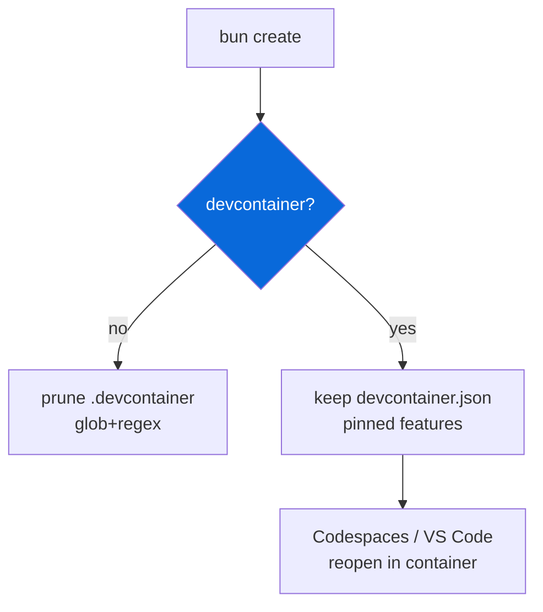

## Devcontainer

> Opt-in — confirm prompt `Include devcontainer config for Codespaces / Dev Containers?` during scaffolding. Data-driven via `package.json` `scaffold` metadata.

- `configs/devcontainer` (`@myorg/devcontainer`) provides `.devcontainer/devcontainer.json` at repo root
- When `false` (default), `.devcontainer/` removed via `extraRemovals` + `filePatternsToRemove` (`**/.devcontainer/**`, `**/devcontainer.json`) + `fileRegexesToRemove` (`devcontainer`)
- When `true`, keeps `.devcontainer/devcontainer.json` with pinned base image `mcr.microsoft.com/devcontainers/base:1.2.1-ubuntu-22.04` + pinned features
- Features: Node 22.13.1, Bun 1.4.2, Rust stable, github-cli 2.74.2, docker-in-docker 2.12.0 — no `latest`, reproducible
- Lifecycle: `postCreateCommand: bun install` (+ optional `rustup target add wasm32-wasip1-threads`), `forwardPorts: [3000]`, `remoteUser: vscode`
- `customizations.vscode.extensions`: `oven.bun-vscode`, `biomejs.biome`
- Location spec: preferred `.devcontainer/devcontainer.json`, alternatives `.devcontainer/SUBDIR/devcontainer.json` with co-located Dockerfile/scripts, no inheritance between files
- For multi-service, `dockerComposeFile` property

| Option | Result |
| :--- | :--- |
| `false` | No .devcontainer dir (default) |
| `true` | Keep .devcontainer/devcontainer.json |

> [!IMPORTANT]
> Pin versions explicitly — never `latest`. Use `features` to layer tools rather than custom Dockerfile where possible. Put VS Code extensions under `customizations.vscode`.

See [README.md](./README.md) for full guide.
