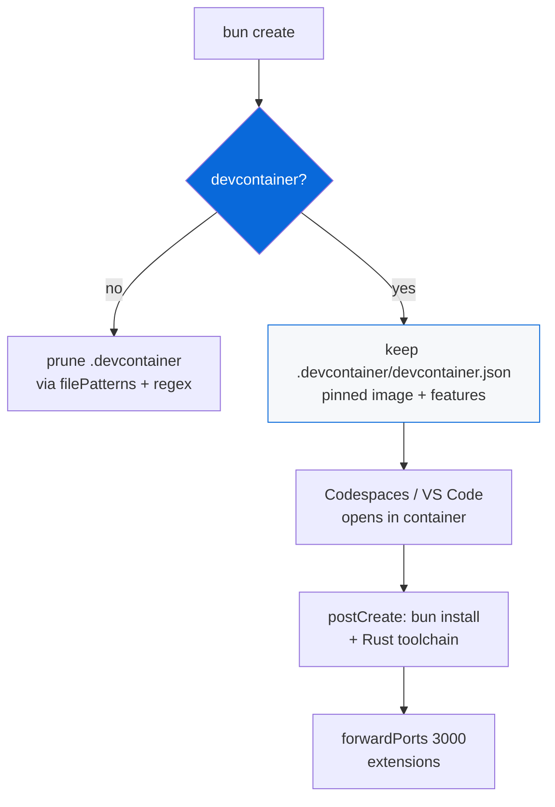

# @myorg/devcontainer

> Opt-in Dev Container config for GitHub Codespaces, VS Code Dev Containers, and compatible tools — reproducible Bun + Rust + Node environment.

## What it provides

- `.devcontainer/devcontainer.json` at repo root (pinned base image, pinned feature versions)
- Features: Node 22, Bun 1.3.11, Rust stable, GitHub CLI, Docker-in-Docker
- `postCreateCommand` for one-time `bun install`, `postStartCommand` optional
- `forwardPorts` for dev server (3000)
- `customizations.vscode` extensions for Bun, Biome, etc.

> [!IMPORTANT]
> Opt-in — choose `Include devcontainer config for Codespaces / Dev Containers?` during `bun create Archont561/ts-monorepo-template`.

## Architecture



### Scaffold options

| Option | Description | Result |
| :--- | :--- | :--- |
| `false` | No devcontainer (default) | Removes `.devcontainer/` via glob + regex |
| `true` | Include devcontainer | Keeps `.devcontainer/devcontainer.json` |

### Data-driven removals

When `false` selected:

| Field | Patterns | Purpose |
| :--- | :--- | :--- |
| `extraRemovals` | `.devcontainer` | Exact path removal |
| `filePatternsToRemove` | `**/.devcontainer/**`, `.devcontainer/**`, `**/devcontainer.json` | Glob via `Bun.Glob` |
| `fileRegexesToRemove` | `devcontainer`, `\.devcontainer` | Regex removal |

## Usage

```bash
bun create Archont561/ts-monorepo-template my-app   # choose "Include devcontainer config?"
cd my-app

# Open in VS Code with Dev Containers extension:
# Command Palette → "Dev Containers: Reopen in Container"

# Or push to GitHub and create Codespace:
# Code dropdown → Codespaces → Create codespace

# Inside container:
bun install
bun run dev   # → http://localhost:3000 forwarded
```

<details>
<summary>After enabling — file structure</summary>

```
.devcontainer/
  devcontainer.json   # pinned base image + features + lifecycle scripts
```

</details>

<details>
<summary>Core fields explained</summary>

| Field | Purpose | Value in template |
| :--- | :--- | :--- |
| `name` | Display name | `my-bun-monorepo` (replaced with scope) |
| `image` | Base Docker image | `mcr.microsoft.com/devcontainers/base:1.2.1-ubuntu-22.04` pinned |
| `features` | Runtimes/tools | Node 22, Bun 1.3.11, Rust stable, gh-cli, docker-in-docker — all pinned |
| `postCreateCommand` | Once after create | `bun install` + Rust target add |
| `forwardPorts` | Auto-forward | `[3000]` for example app |
| `remoteUser` | User inside container | `vscode` |
| `customizations.vscode` | Editor config | Extensions + settings |

</details>

## Minimal example (adapted for this monorepo)

```jsonc
// .devcontainer/devcontainer.json
{
  "name": "my-bun-monorepo",
  "image": "mcr.microsoft.com/devcontainers/base:1.2.1-ubuntu-22.04",
  "features": {
    "ghcr.io/devcontainers/features/node:1": { "version": "22.13.1" },
    "ghcr.io/devcontainers/features/bun:1": { "version": "1.3.11" },
    "ghcr.io/devcontainers/features/rust:1": { "version": "stable" },
    "ghcr.io/devcontainers/features/github-cli:1": { "version": "2.74.2" },
    "ghcr.io/devcontainers/features/docker-in-docker:2": { "version": "2.12.0" }
  },
  "postCreateCommand": "bun install",
  "forwardPorts": [3000],
  "remoteUser": "vscode",
  "customizations": {
    "vscode": {
      "extensions": ["oven.bun-vscode", "biomejs.biome"]
    }
  }
}
```

> [!TIP]
> Pin versions explicitly (e.g. `"22.13.1"`) rather than `"latest"` for reproducible builds. Official feature index: `containers.dev/features`.

## Multi-service (optional)

If you need DB/cache, add `dockerComposeFile`:

```jsonc
{
  "name": "my-app",
  "dockerComposeFile": "docker-compose.yml",
  "service": "app",
  "workspaceFolder": "/workspace"
}
```

Co-locate Dockerfile/scripts in same `.devcontainer/` subdirectory.

## References

- [containers.dev](https://containers.dev) — spec
- [Features index](https://containers.dev/features)
- [GitHub Codespaces docs](https://docs.github.com/en/codespaces/setting-up-your-project-for-codespaces/adding-a-dev-container-configuration/introduction-to-dev-containers)
- [AGENT.md](./AGENT.md) — agent reference
