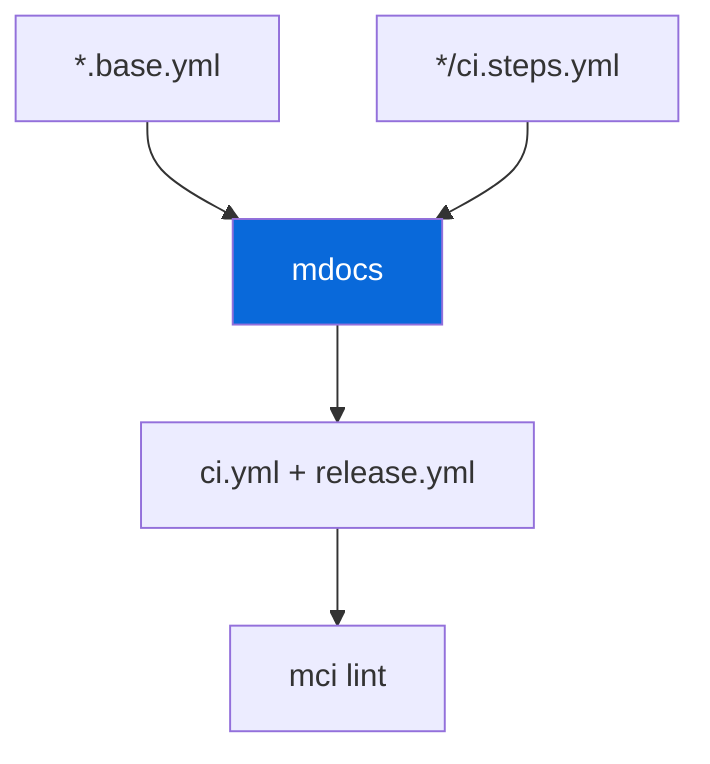

## GitHub Actions

> [!IMPORTANT]
> Workflows in `.github/workflows/` are generated — don't edit directly.

- Skeletons: `configs/gh-actions/*.base.yml` contain `{{STEPS}}` placeholder
- Fragments: `configs/*/ci.steps.yml` — each config contributes CI steps
- Aggregation: `bun run docs:sync` (`mdocs` from `@myorg/template`) runs `discoverConfigs()` to collect fragments and generates `ci.yml` + `release.yml`
- Validation: `mci lint` (`actionlint`) + `mci act` (`act`) for local runs
- `mci` bin from `@myorg/gh-actions` wraps `actionlint` + `act` with config

| Command | Description |
| :--- | :--- |
| `bun run docs:sync` | Regenerate workflows |
| `bun run ci:lint` | `mci lint` — validate |
| `bun run ci:list` | `mci act -l` — list jobs |
| `bun run ci:dry` | `mci act push -n` — dry-run |
| `bun run ci:local` | `mci act push` — Docker |

> [!TIP]
> After editing skeletons or fragments, run `docs:sync` then `ci:lint`.

- Adding a config with CI steps: create `configs/<name>/ci.steps.yml`
- No root `.actrc` — config lives in `configs/gh-actions`
