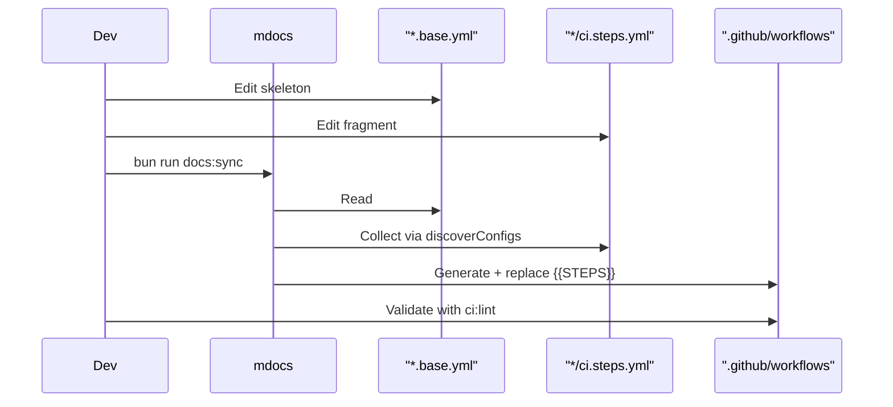

# @myorg/gh-actions

> GitHub Actions CI + local `act` runner.

## What it provides

- `actionlint` + `act` as shared devDependencies
- `ci.base.yml` + `release.base.yml` + `pages.base.yml` — workflow skeletons with `{{STEPS}}` placeholder
- `mci` — CLI with subcommands `mci lint` and `mci act`
- Per-config `ci.steps.yml`, `release.steps.yml`, `pages.steps.yml` fragments aggregated by `mdocs`

> [!NOTE]
> Workflows in `.github/workflows/` are generated — don't edit them directly. Edit skeletons and fragments, then run `bun run docs:sync`.

### Workflow generation

| Skeleton | Fragments | Output |
| :--- | :--- | :--- |
| `ci.base.yml` | `*/ci.steps.yml` | `.github/workflows/ci.yml` |
| `release.base.yml` | `*/release.steps.yml` | `.github/workflows/release.yml` |
| `pages.base.yml` | `*/pages.steps.yml` | `.github/workflows/pages.yml` |

## Usage

```bash
bun run docs:sync   # mdocs → regenerate workflows
bun run ci:lint     # mci lint → validate workflows
bun run ci:list     # mci act -l → list jobs
bun run ci:dry      # mci act push -n → dry-run
bun run ci:local    # mci act push → run in Docker
```



<details>
<summary>Fragment format</summary>

```yaml
# configs/biome/ci.steps.yml
- name: Lint & Format
  run: bun run check
```

Fragments are concatenated in discovery order and injected into `{{STEPS}}`.

</details>

## Commands

| Command | Description |
| :--- | :--- |
| `bun run docs:sync` | Regenerate workflows |
| `bun run ci:lint` | Validate with actionlint |
| `bun run ci:list` | List act jobs |
| `bun run ci:dry` | Dry-run locally |
| `bun run ci:local` | Run in Docker |

See [AGENT.md](./AGENT.md) for the agent-facing reference.
