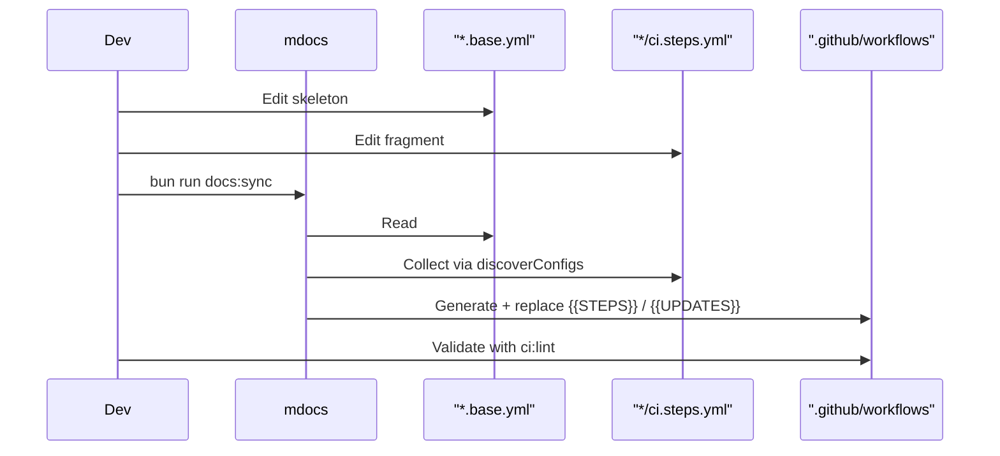

# @myorg/gh-actions

> GitHub Actions CI + local `act` runner + Dependabot skeletons.

## What it provides

- `actionlint` + `act` as shared devDependencies
- `ci.base.yml` + `release.base.yml` + `pages.base.yml` + `dependabot.base.yml` + `dependabot-auto-merge.base.yml` — workflow skeletons with `{{STEPS}}` / `{{UPDATES}}` placeholders
- `mci` — CLI with subcommands `mci lint` and `mci act`
- Per-config `ci.steps.yml`, `release.steps.yml`, `pages.steps.yml`, `dependabot.yml`, `dependabot-auto-merge.steps.yml` fragments aggregated by `mdocs`

> [!NOTE]
> Workflows in `.github/` are generated — don't edit them directly. Edit skeletons and fragments, then run `bun run docs:sync`.

### Workflow generation

| Skeleton | Fragments | Output | When |
| :--- | :--- | :--- | :--- |
| `ci.base.yml` | `*/ci.steps.yml` | `.github/workflows/ci.yml` | Always |
| `release.base.yml` | `*/release.steps.yml` | `.github/workflows/release.yml` | Always |
| `pages.base.yml` | `*/pages.steps.yml` | `.github/workflows/pages.yml` | Pages enabled |
| `coverage.base.yml` | `*/coverage.steps.yml` | `.github/workflows/coverage.yml` | Pages **disabled** (standalone coverage site) |
| `dependabot.base.yml` | `*/dependabot.yml` | `.github/dependabot.yml` | Always |
| `dependabot-auto-merge.base.yml` | `*/dependabot-auto-merge.steps.yml` | `.github/workflows/dependabot-auto-merge.yml` | Always |

Coverage reporting: when Pages enabled, coverage HTML is included at `/coverage/` via `pages.steps.yml` in `pages.yml`; when Pages disabled, standalone `coverage.yml` deploys coverage HTML to Pages.

## Usage

```bash
bun run docs:sync   # mdocs → regenerate workflows + dependabot
bun run ci:lint     # mci lint → validate workflows
bun run ci:list     # mci act -l → list jobs
bun run ci:dry      # mci act push -n → dry-run
bun run ci:local    # mci act push → run in Docker
```



<details>
<summary>Fragment format</summary>

```yaml
# configs/biome/ci.steps.yml
- name: Lint & Format
  run: bun run check
```

Fragments are concatenated in discovery order and injected into `{{STEPS}}` or `{{UPDATES}}`.

</details>

## Commands

| Command | Description |
| :--- | :--- |
| `bun run docs:sync` | Regenerate workflows + dependabot.yml |
| `bun run ci:lint` | Validate with actionlint |
| `bun run ci:list` | List act jobs |
| `bun run ci:dry` | Dry-run locally |
| `bun run ci:local` | Run in Docker |

See [AGENT.md](./AGENT.md) for the agent-facing reference.
