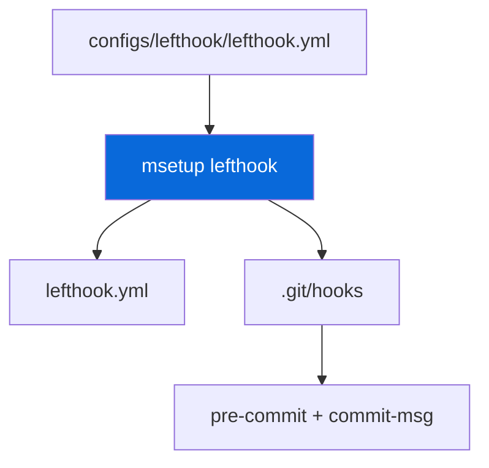

## Lefthook

> [!NOTE]
> Git hooks — wrapper generated, source in `configs/lefthook/lefthook.yml`.

- `msetup` (from `@myorg/lefthook`) does: link m-bins (`node_modules/.bin/m*`), regenerate root `lefthook.yml` wrapper from `configs/lefthook/lefthook.yml`, `lefthook install` hooks to `.git/hooks/`, `mchangeset init` ensures `.changeset/config.json`
- Root `lefthook.yml` is generated — never edit manually; edit `configs/lefthook/lefthook.yml`
- Hooks: `pre-commit` → `mbiome check --write {staged_files}`, `commit-msg` → `commitlint --edit {1}`
- Root `prepare` script runs `msetup lefthook && mchangeset init` on `bun install`

| Hook | Command |
| :--- | :--- |
| `pre-commit` | `mbiome check --write {staged_files}` |
| `commit-msg` | `commitlint --edit {1}` |

> [!TIP]
> After editing `configs/lefthook/lefthook.yml`, run `msetup lefthook`.
