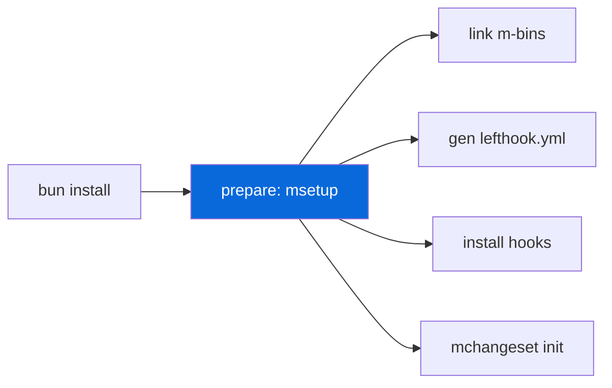

# @myorg/lefthook

> Git hooks management.

## What it provides

- `lefthook` as shared devDependency
- `lefthook.yml` — shared hooks config (source)
- `msetup` — CLI that links m-bins, regenerates root `lefthook.yml` wrapper, installs hooks, ensures Changeset config

> [!NOTE]
> Root `lefthook.yml` is generated — don't edit manually. Edit `configs/lefthook/lefthook.yml`.

### Hooks

| Hook | Command | Description |
| :--- | :--- | :--- |
| `pre-commit` | `mbiome check --write {staged_files}` | Auto-format staged |
| `commit-msg` | `commitlint --edit {1}` | Validate commit message |

## Usage

```bash
bun run prepare     # msetup lefthook + mchangeset init (auto on bun install)
msetup lefthook     # Regenerate lefthook.yml + install hooks
```



<details>
<summary>Wrapper generation</summary>

- Source: `configs/lefthook/lefthook.yml`
- Wrapper: root `lefthook.yml` generated by `msetup lefthook`
- Wrapper points to `configs/lefthook/lefthook.yml` via `extends`
- Hooks installed to `.git/hooks/` via `lefthook install`

</details>

## Commands

| Command | Description |
| :--- | :--- |
| `msetup` | Full setup: bins + lefthook + changeset |
| `msetup lefthook` | Only lefthook |
| `msetup bins` | Only bin linking |

See [AGENT.md](./AGENT.md) for the agent-facing reference.
