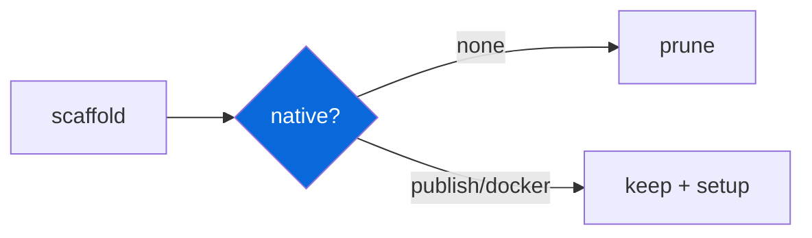

## Native (NAPI-RS)

> [!NOTE]
> Opt-in — select prompt `none` / `publish` / `docker` during scaffolding.

- `@myorg/native` (`configs/native`) provides scaffold prompt for native bindings, `@napi-rs/cli` as shared devDep when enabled
- Options: `none` (default, removes config entirely), `publish` (ships native bindings with prebuilt binaries), `docker` (Docker-based builds)
- When `none` selected, `configs/native` directory and its artifacts are pruned from generated project
- When enabled, adds `packages/native` or similar with NAPI-RS setup, build scripts, and platform targets
- `bun create Archont561/ts-monorepo-template my-app` → choose native bindings

| Option | Result |
| :--- | :--- |
| `none` | No native dir, config removed |
| `publish` | Native package + prebuilds |
| `docker` | Native + Docker |

> [!WARNING]
> Native bindings require Rust toolchain + `@napi-rs/cli`.
