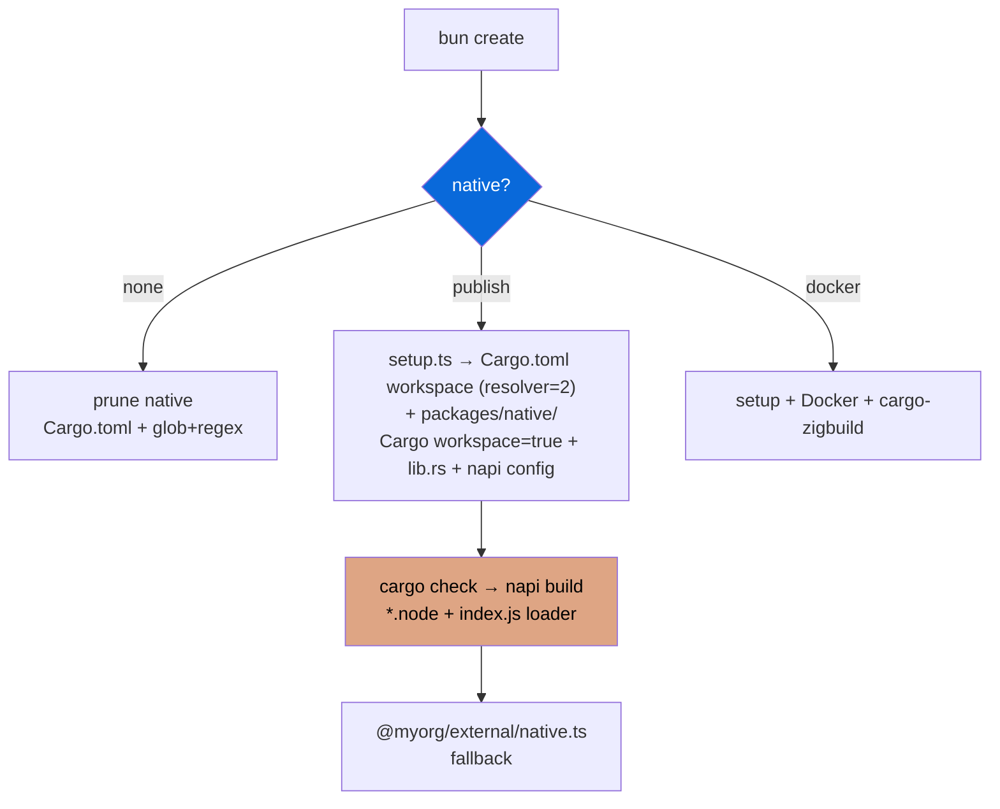

## Native (Cargo + NAPI-RS)

> Opt-in — select prompt `none` / `publish` / `docker` during scaffolding. Data-driven via `package.json` `scaffold` metadata. Cargo-first handling.

- `configs/native` (`@myorg/native-config`) provides scaffold prompt for Rust + NAPI-RS bindings, `@napi-rs/cli` as shared devDep, Cargo workspace handling
- `setup: configs/native/src/setup.ts` scaffolds root `Cargo.toml` workspace (`resolver="2"`, `workspace.dependencies`, profiles) + `packages/native/` when enabled (publish/docker)
- When `none` selected, `Cargo.toml`, `Cargo.lock`, `rust-toolchain.toml`, `.cargo`, `packages/native/`, `*.node`, `apps/example/src/pages/api/native/**` are pruned via `extraRemovals` + `filePatternsToRemove` + `fileRegexesToRemove` (glob + regex)
- When enabled, adds root `Cargo.toml` workspace + `packages/native/` with Rust crate (`Cargo.toml` with `edition="2021"`, `workspace=true` deps, `cdylib`, `src/lib.rs` #[napi], `build.rs`, `package.json` napi config + `cargo:*` scripts)
- Cargo guide: `cargo check --workspace` (fast inner loop), `cargo clippy -- -D warnings`, `cargo fmt --check`, `cargo test --workspace`, `cargo build --release` (lto, codegen-units=1, strip), `profile.ci`
- External wrapper `packages/external/src/native.ts` provides JS fallback + dynamic import `@myorg/native`
- Build: `bun run build:native` → `cargo check && napi build --release --platform`, `cargo:build` → `cargo build --workspace`, `build:wasm` → `wasm32-wasip1-threads`
- CI: `dtolnay/rust-toolchain@stable` (clippy, rustfmt, wasm32-wasip1-threads) + `Swatinem/rust-cache@v2` + `cargo fmt --check` + `cargo clippy -- -D warnings` + `cargo check` + `cargo test --workspace`
- WASM fallback portable but Bun caveat napi-rs#2965
- Publish: `create-npm-dirs` → CI matrix per target → `artifacts` → `pre-publish` → npm publish (scope required)

| Option | Result |
| :--- | :--- |
| `none` | No native dir, Cargo.toml workspace removed (default) |
| `publish` | Root Cargo.toml workspace + native package + prebuilds + setup.ts scaffold |
| `docker` | Native + Docker cross-compilation + cargo-zigbuild |

> [!WARNING]
> Native bindings require Rust toolchain + `@napi-rs/cli` + Cargo. Never call `.node` from browser. Use `cargo check` for fast inner loop.

> [!IMPORTANT]
> Scaffold metadata includes `setup` field — `scaffolder.ts` runs it only when enabled. Disabled via `filePatternsToRemove`/`fileRegexesToRemove` uses `Bun.Glob` + RegExp. Cargo.lock gitignored for library (cdylib), commit for binaries per guide.

See [README.md](./README.md) and [PLAN.md](./PLAN.md) for full integration plan. Cargo guide in README.md.
