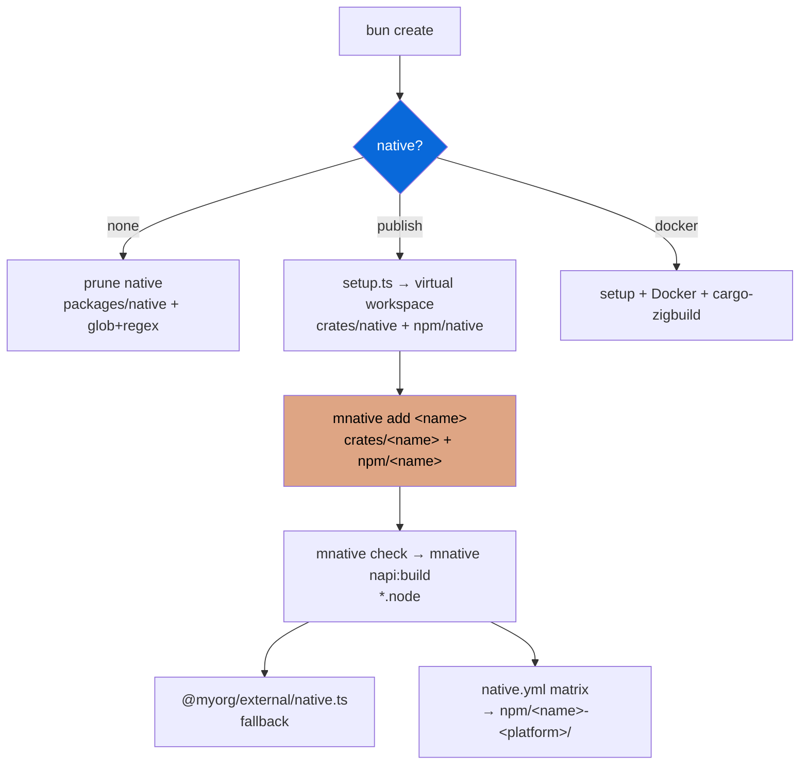

## Native (Cargo + NAPI-RS) — virtual workspace in packages/native

> Opt-in — select prompt `none` / `publish` / `docker` during scaffolding. Data-driven via `package.json` `scaffold` metadata. Cargo-first, `mnative` CLI. **No root `Cargo.toml`**: `packages/native/Cargo.toml` is the workspace root.

- `configs/native` (`@myorg/native-config`) provides the scaffold prompt, `@napi-rs/cli` + the `mnative` CLI (`src/cli.ts`), and the file templates in `src/templates.ts`
- `setup: configs/native/src/setup.ts` scaffolds `packages/native/` as a virtual workspace — `crates/native` (cdylib) + `npm/native` — and migrates the old single-crate layout (`src/`, `build.rs`, `package.json` at the workspace root) into it
- Layout: `packages/native/Cargo.toml` (virtual, `resolver = "3"`, `members = ["crates/native"]`) → `crates/<name>/` (one crate per Rust unit) → `npm/<name>/` (one npm package per binding crate). Per-platform packages (`npm/*-<platform>/`) are generated in CI by `napi create-npm-dirs` and gitignored
- Discovery, not configuration: `src/discover.ts` reads the crates and packages from disk, so `mnative` needs no manifest of its own. `mnative list` prints the mapping; `mnative add <name>` creates a binding crate **and** its npm package (or `--pure` for a Rust-only crate), syncs `members`, and wires turbo
- Cargo runs workspace-wide (`mnative check|clippy|fmt:check|test|build|build:release|build:ci`); napi runs once per package with explicit `--manifest-path` / `--package-json-path` / `--output-dir`, so each package builds only its own crate (`--only <pkg>`, `--target <triple>`, `--cross`)
- Lints live in `[workspace.lints]` (`unsafe_code = "forbid"`, `clippy.all`) and are inherited by every crate with `[lints] workspace = true`; `clippy -D warnings` is a CI flag only — never `#![deny(warnings)]` in source
- CLI surface: `list`, `matrix [--gha]`, `add <name> [--pure] [--uses …] [--scope …]`, `typecheck`, the cargo set, `napi:build[:debug|:wasm]`, `create-npm-dirs`, `artifacts`, `napi` passthrough; unknown subcommands fall through to cargo
- Root scripts: `build:native` → `mnative napi:build`, `build:wasm` → `mnative napi:build:wasm`, `test:native` → `mnative test`. `mnative` no-ops when `packages/native` is absent, so the root needs no `test -f` guards
- CI: `ci.steps.yml` (rust-toolchain + rust-cache + fmt/clippy/check/test/napi:build/typecheck) and `native.steps.yml` + `native.base.yml` — a `matrix` job fed by `mnative matrix --gha`, one `build` job per target (containers for Linux, WASI SDK 24 for wasm32-wasip1-threads), and an `assemble` job that runs `create-npm-dirs` + `artifacts`. The workflow is generated with this config and deleted with it
- WASM fallback portable but with a Bun caveat (napi-rs#2965). Native code runs server-side in this template, so browser WASM (and COOP/COEP) does not apply
- External wrapper `packages/external/src/native.ts` provides a JS fallback + dynamic import of `@myorg/native`

| Option | Result |
| :--- | :--- |
| `none` | No native dir (default) — `packages/native` removed wholesale |
| `publish` | Workspace + npm packages + prebuilds + setup.ts scaffold + mnative CLI |
| `docker` | Native + Docker cross-compilation |

> [!WARNING]
> Native bindings require a Rust toolchain + `@napi-rs/cli` + Cargo. Never call `.node` from the browser. Use `mnative check` for the fast inner loop. Adding a crate means `mnative add` — never hand-edit `members`.

> [!IMPORTANT]
> Scaffold metadata includes the `setup` field — `scaffolder.ts` runs it only when enabled. Disabled configs are pruned via `extraRemovals` + `filePatternsToRemove` (`Bun.Glob`) + `fileRegexesToRemove`. `Cargo.lock` is gitignored (cdylib libraries). `mnative` runs from `src/cli.ts` (Bun executes TypeScript directly).

See [README.md](./README.md) and [PLAN.md](./PLAN.md) for the full integration plan; the Cargo guide is in README.md.
