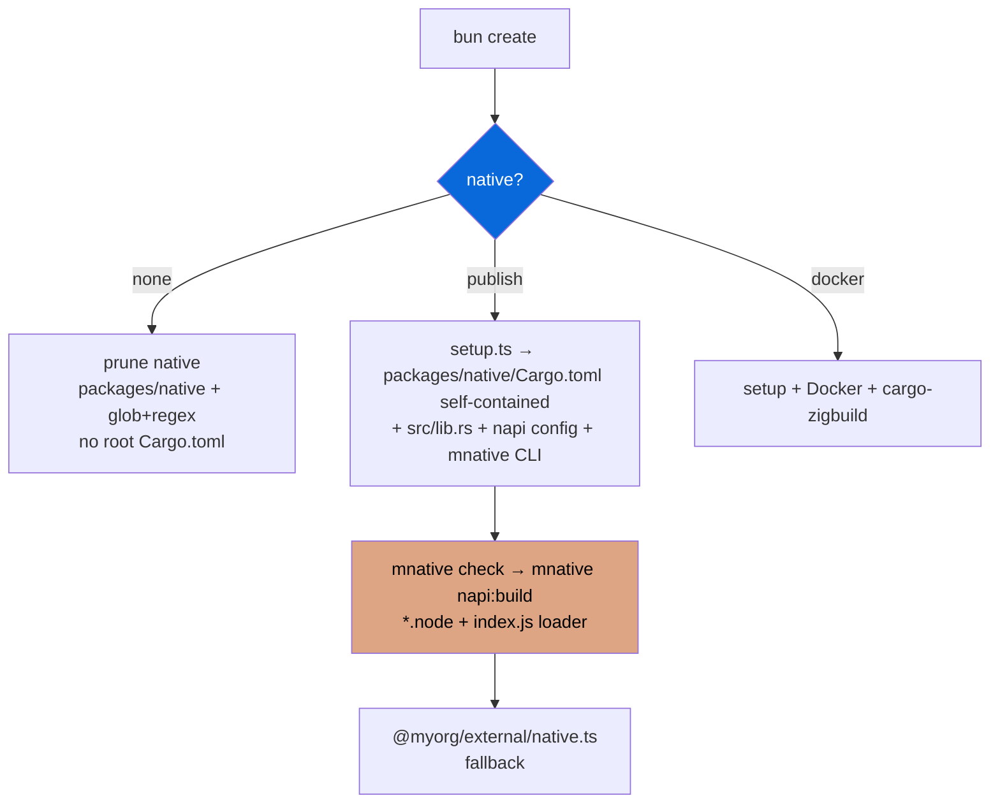

## Native (Cargo + NAPI-RS) — self-contained, no root Cargo.toml

> Opt-in — select prompt `none` / `publish` / `docker` during scaffolding. Data-driven via `package.json` `scaffold` metadata. Cargo-first, mnative CLI.

- `configs/native` (`@myorg/native-config`) provides scaffold prompt for Rust + NAPI-RS, `@napi-rs/cli` + `mnative` CLI (`src/cli.ts` wrapping cargo + napi), self-contained Cargo handling
- `setup: configs/native/src/setup.ts` scaffolds `packages/native/` with self-contained `Cargo.toml` (edition 2021, direct deps, profiles dev/release/ci) — **no root Cargo.toml** — when enabled (publish/docker)
- When `none` selected, `packages/native/` (self-contained: `Cargo.toml`, `rust-toolchain.toml`, `.cargo/`, `Cargo.lock`, `*.node`) + `apps/example/src/pages/api/native/**` pruned via `extraRemovals` + `filePatternsToRemove` + `fileRegexesToRemove` (glob + regex) — no root Cargo.toml or root rust-toolchain.toml to remove
- When enabled, adds `packages/native/` with Rust crate (`Cargo.toml` standalone, `cdylib`, `src/lib.rs` #[napi], `build.rs`, `package.json` napi config + `cargo:*` scripts via `mnative`)
- CLI `mnative` (bin → dist/cli.js via bunup): `check` (cargo check), `clippy` (clippy -D warnings), `fmt`, `fmt:check`, `test`, `build`, `build:release` (lto, strip), `build:ci`, `napi:build` (check + napi build --platform), `napi:build:wasm`, passthrough `napi` + cargo passthrough
- Root package.json scripts: `cargo:*` → `mnative <cmd>`, `build:native` → `bun --filter @myorg/native run build`, `build:wasm`, `test:native`
- Cargo guide: `mnative check` (fast inner loop), `mnative clippy`, `mnative fmt:check`, `mnative test`, `mnative build:release` — all run in `packages/native` dir, self-contained manifest
- External wrapper `packages/external/src/native.ts` provides JS fallback + dynamic import `@myorg/native`
- CI: `dtolnay/rust-toolchain@stable` (clippy, rustfmt, wasm32-wasip1-threads) + `Swatinem/rust-cache@v2` (workspaces: packages/native) + `mnative fmt:check` + `mnative clippy` + `mnative check` + `mnative test`
- WASM fallback portable but Bun caveat napi-rs#2965
- Publish: `create-npm-dirs` → CI matrix per target → `artifacts` → `pre-publish` → npm publish (scope required)

| Option | Result |
| :--- | :--- |
| `none` | No native dir, no Cargo.toml at root (self-contained removed) (default) |
| `publish` | packages/native/ self-contained Cargo.toml + native package + prebuilds + setup.ts scaffold + mnative CLI |
| `docker` | Native + Docker cross-compilation + cargo-zigbuild |

> [!WARNING]
> Native bindings require Rust toolchain + `@napi-rs/cli` + Cargo. Never call `.node` from browser. Use `mnative check` for fast inner loop. No root Cargo.toml — all cargo via `packages/native/Cargo.toml` + `mnative`.

> [!IMPORTANT]
> Scaffold metadata includes `setup` field — `scaffolder.ts` runs it only when enabled. Disabled via `filePatternsToRemove`/`fileRegexesToRemove` uses `Bun.Glob` + RegExp. Cargo.lock gitignored for library (cdylib). mnative CLI built via bunup (cliConfig).

See [README.md](./README.md) and [PLAN.md](./PLAN.md) for full integration plan. Cargo guide in README.md.
