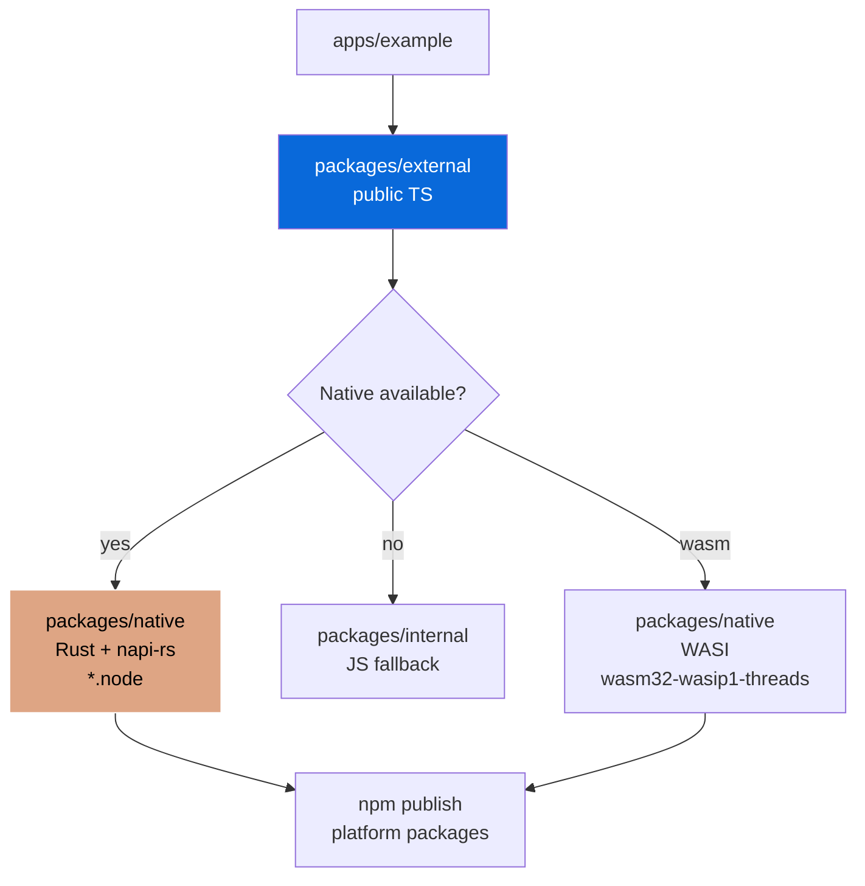
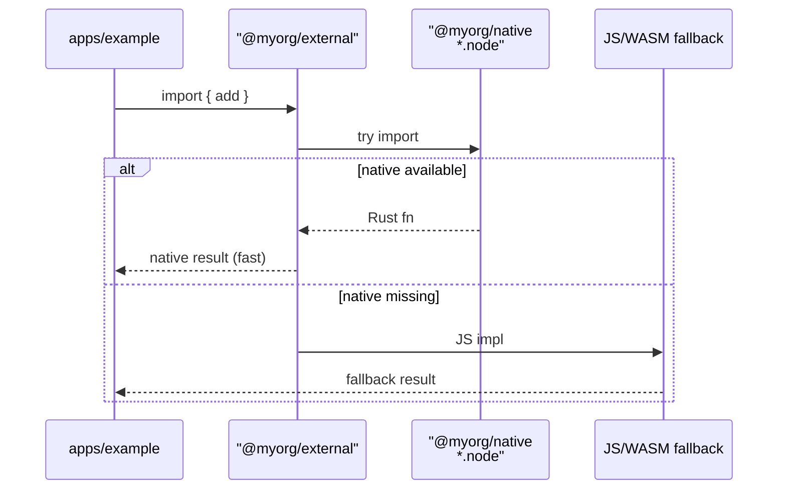

# Rust + napi-rs Integration Plan for Bun Monorepo

> How to integrate native Rust speed into TypeScript packages with WASM fallback and platform-specific binaries.

## 1. What napi-rs is

- **napi-rs** is a framework for building compiled Node.js (and Bun-compatible) addons in Rust via Node-API
- `@napi-rs/cli` is the modern approach — write Rust, compile to N-API binaries with automated cross-compilation
- Used by Rspack, Hugging Face, Rollup, Microsoft, Clerk, etc.
- **Bun is best-effort** in upstream CI — not in blocking native-addon matrix, validate specific use case

## 2. Prerequisites

- Rust toolchain (`rustup`)
- Node.js 22.13+ or 24+ for build CLI (but we use Bun)
- `@napi-rs/cli` installed (provided by `@myorg/native` config)

```bash
rustup --version
bun --version
```

## 3. Monorepo Structure (Proposed)

```
my-monorepo/
  packages/
    external/         # Public TS lib, may import from native with fallback
      src/
        index.ts      # Re-exports, optionally imports from @myorg/native
        native.ts     # Native import with fallback
    internal/         # Private TS impl
    native/           # Rust + napi-rs (opt-in, only when selected)
      Cargo.toml      # Rust crate (cdylib)
      build.rs        # napi-build
      src/
        lib.rs        # Rust code with #[napi] macros
      package.json    # napi config + scripts (targets, binaryName)
      npm/            # per-platform optional packages (generated)
      index.js        # generated JS loader (auto picks .node)
      index.d.ts      # generated TS types
      index.wasi.cjs  # WASM loader (if wasm target)
      *.node          # native binaries (per-platform, gitignored)
  configs/
    native/           # Opt-in config, provides @napi-rs/cli + scaffolding
      package.json    # scaffold metadata (none/publish/docker)
      src/
        setup.ts      # Setup script that scaffolds packages/native when enabled
      templates/      # Template files for native package
        Cargo.toml.tpl
        lib.rs.tpl
        package.json.tpl
  apps/
    example/          # Demo app, can import from external which may use native
```

### Dependency Rules

| Rule | Description |
| :--- | :--- |
| `external → native` | Optional, with fallback to WASM or JS impl |
| `native` | Private, never inlined by Bunup (native) |
| `external` | Published, may have `optionalDependencies` for platform packages |
| `apps → external` | Only public import, never direct native |



## 4. Scaffold Metadata (Data-Driven)

Current `configs/native/package.json` scaffold:

```json
{
  "scaffold": {
    "default": "none",
    "flag": "native",
    "prompt": "Set up native Node-API (NAPI-RS) bindings?",
    "type": "select",
    "options": [
      { "value": "none", "label": "None - skip native bindings" },
      { "value": "publish", "label": "Publish a native npm package" },
      { "value": "docker", "label": "Build native bindings in Docker" }
    ],
    "removals": {
      "none": {
        "filePatternsToRemove": ["**/*.node", "**/native/**", "**/*.napi.*"],
        "fileRegexesToRemove": ["native", "\\.node$", "napi"]
      },
      "publish": {},
      "docker": {}
    },
    "setup": "configs/native/src/setup.ts"
  }
}
```

- `none`: Removes all native artifacts (default)
- `publish`: Keeps `packages/native` + adds CI jobs + platform packages
- `docker`: Keeps + adds Docker-based cross-compilation

### Setup Script

`configs/native/src/setup.ts` should:

1. Create `packages/native/` if not exists
2. Copy templates: `Cargo.toml`, `src/lib.rs`, `package.json` (napi config)
3. Replace `@myorg` scope with user's scope
4. Run `napi create-npm-dirs` to create `npm/` per-platform dirs
5. Add scripts to root `package.json`: `build:native`, `build:wasm`, `test:native`

## 5. Write Rust with #[napi]

```rust
// packages/native/src/lib.rs
use napi_derive::napi;

#[napi]
pub fn add(a: i32, b: i32) -> i32 {
  a + b
}

#[napi]
pub fn fibonacci(n: u32) -> u32 {
  match n {
    0 => 0,
    1 => 1,
    _ => fibonacci(n - 1) + fibonacci(n - 2),
  }
}

#[napi]
pub async fn fetch_data(url: String) -> napi::Result<String> {
  Ok(format!("fetched: {}", url))
}

#[napi]
pub struct Counter {
  count: i32,
}

#[napi]
impl Counter {
  #[napi(constructor)]
  pub fn new(initial: Option<i32>) -> Self {
    Self { count: initial.unwrap_or(0) }
  }

  #[napi]
  pub fn increment(&mut self) -> i32 {
    self.count += 1;
    self.count
  }

  #[napi]
  pub fn get_count(&self) -> i32 {
    self.count
  }
}
```

- `#[napi]` handles JS↔Rust conversion and async bridging (async → Promise)
- Structs with `#[napi]` become JS classes

## 6. package.json napi Config (Monorepo-Adapted)

```json
{
  "name": "@myorg/native",
  "version": "0.0.0",
  "private": true,
  "type": "module",
  "main": "index.js",
  "types": "index.d.ts",
  "files": ["index.js", "index.d.ts", "*.node", "*.wasi.cjs"],
  "napi": {
    "binaryName": "native",
    "packageName": "@myorg/native",
    "targets": [
      "x86_64-apple-darwin",
      "aarch64-apple-darwin",
      "x86_64-pc-windows-msvc",
      "x86_64-unknown-linux-gnu",
      "aarch64-unknown-linux-gnu",
      "x86_64-unknown-linux-musl",
      "wasm32-wasip1-threads"
    ],
    "wasm": {
      "initialMemory": 16,
      "maximumMemory": 65536,
      "browser": { "fs": false, "asyncInit": true, "errorEvent": true }
    }
  },
  "scripts": {
    "build": "napi build --release --platform",
    "build:debug": "napi build",
    "build:wasm": "napi build --release --target wasm32-wasip1-threads",
    "create-npm-dirs": "napi create-npm-dirs",
    "artifacts": "napi artifacts",
    "prepublish": "napi pre-publish",
    "test": "bun test"
  },
  "devDependencies": {
    "@napi-rs/cli": "^3.9.1"
  }
}
```

- `binaryName`: base name for `.node` files (e.g. `native.darwin-arm64.node`)
- `targets`: what to package (not what one `napi build` compiles — need CI matrix)
- `wasm`: WASI memory settings (64 KiB per page), browser options
- `files`: include `.node` + `.wasi.cjs` in npm publish

## 7. Build Locally

```bash
# Native for current host
bun run build:native        # napi build --release --platform
# or
bun --filter @myorg/native run build

# Debug (faster)
bun --filter @myorg/native run build:debug

# WASM fallback
rustup target add wasm32-wasip1-threads
bun run build:wasm          # napi build --release --target wasm32-wasip1-threads
```

Output: `.node` file (e.g. `native.darwin-arm64.node`) + `index.js` loader picks it up.

## 8. Using in Bun (with Fallback)

```ts
// packages/external/src/native.ts
let native: { add: (a: number, b: number) => number } | null = null;

try {
  // Try native first (server only)
  native = await import("@myorg/native");
} catch {
  // Fallback to JS or WASM
  console.warn("Native bindings not available, using JS fallback");
}

export function add(a: number, b: number): number {
  if (native) {
    return native.add(a, b); // Rust speed
  }
  // JS fallback
  return a + b;
}

// For WASM
import { add as wasmAdd } from "@myorg/native/wasm" // if built

export async function addWasm(a: number, b: number): Promise<number> {
  try {
    const { add } = await import("@myorg/native");
    return add(a, b);
  } catch {
    // WASM fallback
    return wasmAdd(a, b);
  }
}
```

> [!WARNING]
> Import addon only from server modules — browser bundle cannot load `.node`.



## 9. WASM Target

```bash
rustup target add wasm32-wasip1-threads
bun run build:wasm
```

Generates `<binaryName>.wasi.cjs` + browser/worker files.

> [!CAUTION]
> Bun + WASM has open incompatibility (napi-rs#2965). Mark runtime unsupported or provide separately tested loader until resolved.

### When to use WASM

- Portable fallback when no prebuilt native matches host
- Browser, StackBlitz, WebContainer demo of same Rust API

## 10. Platform-Specific Packages (Publish Model)

Published cross-platform package uses separate optional npm package per target. Each has `os`, `cpu`, `libc` fields so package manager installs only right binary.

Root `package.json` has `optionalDependencies` for each platform.

### Publish Flow

```bash
# 1. Create per-target npm/ directories
napi create-npm-dirs

# 2. (In CI) Build per-target, collect artifacts
napi artifacts

# 3. Publish platform packages + root
napi pre-publish
# Updates package metadata, publishes platform packages, creates GitHub release
# Then
npm publish --access public
```

> [!IMPORTANT]
> Publishing is not atomic. Run ordinary CI path successfully before release. Never publish locally-built binary as multi-platform — always use `napi artifacts` + `pre-publish` from CI.

### Scope Recommendation

Use npm scope (`@your-scope/pkg`) — required for per-target model. Non-scoped triggers npm spam detection for platform packages (`snappy-darwin-x64` etc.). Publish platform packages under scope to avoid.

## 11. Cross-Compilation

NAPI-RS v3: `napi build --use-napi-cross` flag

- `--use-napi-cross`: Linux glibc targets on Linux x64/arm64 host
- `--cross-compile` (`-x`): Windows MSVC from non-Windows, musl targets

Integrates `cargo-zigbuild` and `cargo-xwin` for many targets on single machine.

## 12. CI Matrix (GitHub Actions)

Add to `configs/gh-actions/ci.base.yml` + `release.base.yml` fragments:

```yaml
# configs/native/ci.steps.yml
- name: Build native bindings
  run: bun run build:native

# For release matrix — one job per target
strategy:
  matrix:
    include:
      - host: ubuntu-latest
        target: x86_64-unknown-linux-gnu
        build: napi build --release --target x86_64-unknown-linux-gnu --use-napi-cross
      - host: macos-latest
        target: aarch64-apple-darwin
        build: napi build --release --target aarch64-apple-darwin
      - host: windows-latest
        target: x86_64-pc-windows-msvc
        build: napi build --release --target x86_64-pc-windows-msvc
      - host: ubuntu-latest
        target: wasm32-wasip1-threads
        build: napi build --release --target wasm32-wasip1-threads

steps:
  - uses: actions/checkout@v4
  - uses: oven-sh/setup-bun@v1
  - run: bun install
  - run: ${{ matrix.build }}
  - uses: actions/upload-artifact@v4
    with:
      name: bindings-${{ matrix.target }}
      path: "*.node"

# Publish job
- uses: actions/download-artifact@v4
  with: { path: artifacts }
- run: napi artifacts
- run: napi pre-publish --skip-optional-publish
- run: npm publish --access public
```

> [!WARNING]
> Do not publish binary built on dev machine as if it supported other OS.

### Turbo Integration

```json
// configs/turbo/turbo.base.json
{
  "tasks": {
    "build:native": { "dependsOn": ["^build"], "outputs": ["*.node", "index.js"] },
    "build:wasm": { "dependsOn": ["build:native"], "outputs": ["*.wasi.cjs"] }
  }
}
```

## 13. Debugging

```bash
DEBUG="napi:*" napi build
```

Common missing binary causes:

- Install used `--no-optional` or omitted optional deps
- Lockfile generated on another platform didn't include current target
- Deployment copied only JS and discarded `.node` files

```bash
NAPI_RS_ENFORCE_VERSION_CHECK=1 bun run build
```

## 14. Bun Monorepo Integration Checklist

- [ ] Add `configs/native` as always-on or opt-in (currently opt-in `none` default)
- [ ] Create `packages/native/` with Cargo.toml, src/lib.rs, package.json (napi config)
- [ ] Add `rust-toolchain.toml` for pinned Rust version
- [ ] Add `.cargo/config.toml` for cross-compilation helpers
- [ ] Update root `package.json` scripts: `build:native`, `build:wasm`, `test:native`
- [ ] Update `configs/turbo/turbo.base.json`: `build:native`, `build:wasm` tasks
- [ ] Update `configs/bun-config/bunfig.toml`: ignore `**/*.node`, `**/target/**`
- [ ] Update `packages/external/src/native.ts`: import with fallback
- [ ] Update `apps/example`: demo native vs fallback
- [ ] Update CI: matrix for native targets + WASM
- [ ] Update `configs/native/src/setup.ts`: scaffold `packages/native` when enabled
- [ ] Add `napi` to `bunfig.toml` coverage ignores
- [ ] Document in `configs/native/README.md` and `AGENT.md`
- [ ] Test locally: `bun run build:native` + `bun run test`
- [ ] Test WASM separately (Bun WASI caveat)

## 15. Example Implementation (This Repo)

We have:

- `packages/native/` — example native package (opt-in, removed when `none`)
  - `Cargo.toml` — cdylib crate with napi-derive
  - `src/lib.rs` — `add`, `fibonacci`, `Counter` struct
  - `package.json` — napi targets + wasm config + scripts
  - `index.js`/`index.d.ts` — generated loaders (gitignored, built)
  - `npm/` — per-platform dirs (generated via `create-npm-dirs`)

- `configs/native/` — config package
  - `package.json` scaffold with `none`/`publish`/`docker` + `filePatternsToRemove` + `setup`
  - `src/setup.ts` — scaffolds `packages/native` when enabled
  - `README.md`/`AGENT.md` — docs

- Integration with `external`:
  - `packages/external/src/native.ts` — tries native, falls back to JS
  - `packages/external/src/index.ts` — re-exports `add` from native wrapper

## 16. Agent Checklist (from guide)

- [x] Use `@napi-rs/cli` (v3+) — scaffold with `napi new`
- [x] Use npm scope (`@myorg/native`) — required for per-target publish
- [x] Declare all targets in `napi.targets` — but add real CI job for each
- [x] Build native `.node` locally with `napi build --release --platform`
- [x] Add `wasm32-wasip1-threads` for WASM fallback — but test separately
- [x] Use `--use-napi-cross` for Linux cross-compilation from CI
- [x] Never publish locally-built binary as multi-platform — use `artifacts` + `pre-publish` from CI
- [x] Keep addon packages external to Bun/Vite/bundler server bundles
- [x] Confirm Bun WASI compatibility against napi-rs#2965 before shipping WASM to Bun users

## 17. References

- [napi-rs](https://napi.rs)
- [@napi-rs/cli](https://www.npmjs.com/package/@napi-rs/cli)
- [napi-rs GitHub](https://github.com/napi-rs/napi-rs)
- [Bun + napi-rs issue #2965](https://github.com/napi-rs/napi-rs/issues/2965)
- [This repo's native README](./README.md)
- [This repo's native AGENT](./AGENT.md)
