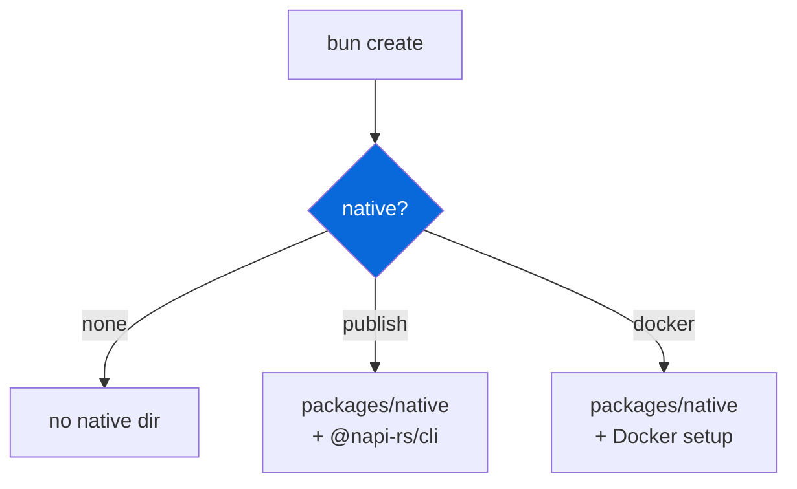

# @myorg/native

> Opt-in NAPI-RS native bindings, selected at scaffold time.

## What it provides

- A `select` scaffold prompt (`none` / `publish` / `docker`) that decides whether a generated project ships native bindings
- `@napi-rs/cli` as a shared devDependency for projects that opt in

> [!IMPORTANT]
> Opt-in — choose `Set up native Node-API bindings?` during `bun create Archont561/ts-monorepo-template`.

### Scaffold options

| Option | Description |
| :--- | :--- |
| `none` | No native bindings (default) |
| `publish` | Publish with prebuilt binaries |
| `docker` | Build in Docker |

## Usage

```bash
bun create Archont561/ts-monorepo-template my-app   # choose "Set up native Node-API bindings?"
```



<details>
<summary>After enabling</summary>

```bash
bun run build:native   # Build native bindings
bun run test:native    # Test bindings
```

- Native package lives in `packages/native` or similar
- Built with `@napi-rs/cli`
- Published with prebuilt binaries for target platforms

</details>

Selecting `none` removes the config (and its artifacts) from the generated project entirely.

See [AGENT.md](./AGENT.md) for the agent-facing reference.
