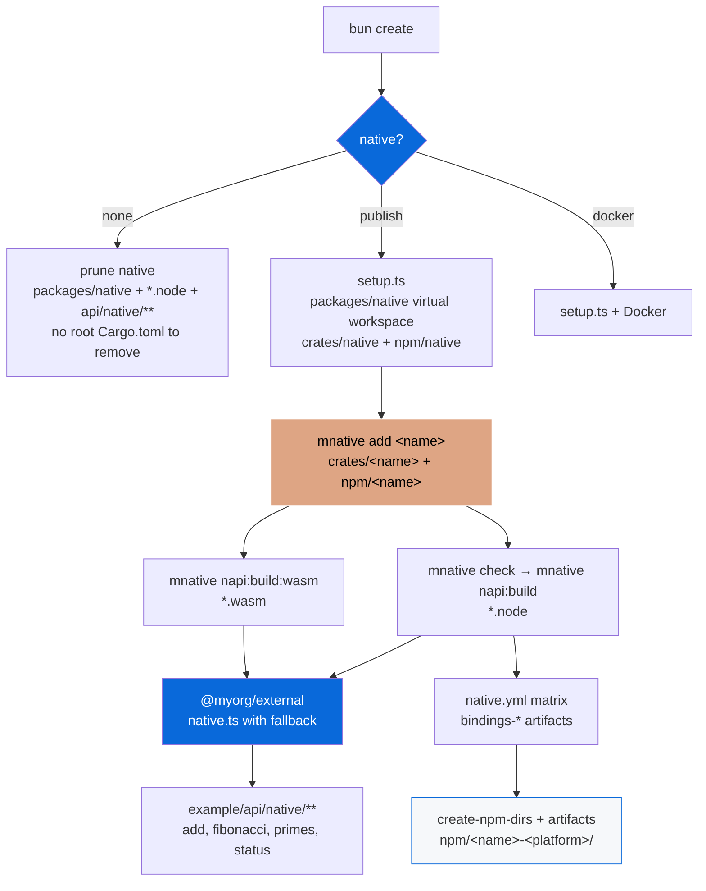

# @myorg/native-config

> Opt-in Cargo + NAPI-RS native bindings with Rust — native speed, WASM fallback, platform-specific binaries + conditional example routes. **No root `Cargo.toml`**: `packages/native/` is a virtual Cargo workspace with a crate per Rust unit and an npm package per binding.

## What it provides

- A `select` scaffold prompt (`none` / `publish` / `docker`) that decides whether a generated project ships native bindings
- **A Cargo workspace that stays out of the repo root** — `packages/native/Cargo.toml` is the virtual workspace root (`crates/*` are its members)
- `@napi-rs/cli` as shared devDependency + the `mnative` CLI (`configs/native/src/cli.ts`) wrapping cargo (workspace-wide) and napi (once per package)
- Setup script `src/setup.ts` that scaffolds the workspace, migrates the old single-crate layout, adds `packages/native/npm/*` to the root workspaces, and ensures the example's native routes exist
- Template files for crates (`Cargo.toml`, `src/lib.rs`, `build.rs`) and npm packages (`package.json` with the napi config, `tsconfig.json`, `turbo.json`, `README.md`, tests)
- Integration with `packages/external` via `native.ts` wrapper with JS fallback
- Example app `apps/example/src/pages/api/native/**` — conditional routes deleted when native is disabled
- CI: `rust-toolchain` + `rust-cache` + `mnative fmt:check` / `clippy` / `check` / `test` / `napi:build` in `ci.yml`, plus a dedicated `native.yml` build matrix

> [!IMPORTANT]
> Opt-in — choose `Set up native Node-API bindings?` during `bun create Archont561/ts-monorepo-template`.

## Layout

```
packages/native/
├── Cargo.toml              # virtual workspace: resolver 3, members = crates/*
├── rust-toolchain.toml     # stable + rustfmt/clippy + wasm32-wasip1-threads
├── .cargo/config.toml      # linker/target config (WASI)
├── .gitignore              # generated loaders, binaries, npm per-platform dirs
├── crates/
│   └── native/             # one crate per Rust unit
│       ├── Cargo.toml      # crate-type = ["cdylib"] — the napi binding
│       ├── build.rs        # napi_build::setup()
│       └── src/lib.rs      # #[napi] add, fibonacci, Counter, primes_up_to
└── npm/
    └── native/             # one npm package per binding crate
        ├── package.json    # napi config (targets incl. wasm32-wasip1-threads)
        ├── tsconfig.json
        └── turbo.json
```

Rules the layout enforces:

| Rule | Why |
| :--- | :--- |
| No `[package]` at the workspace root | The root manifest only lists members — adding a crate never edits it by hand (`mnative add` re-syncs and sorts `members`) |
| `crate-type = ["cdylib"]` only on binding crates | Pure-Rust crates (`mnative add shared --pure`) stay ordinary `rlib`s with no Node-API surface |
| One npm package per cdylib | Each package owns its own `napi.binaryName`, targets and build script |
| Per-platform packages are generated, never committed | `napi create-npm-dirs` writes `npm/*-<platform>/`; they are gitignored and rebuilt in CI |
| `unsafe_code = "forbid"` in `[workspace.lints]` | Inherited by every crate via `[lints] workspace = true` |

## Why a workspace and not one crate?

`packages/native` used to be a single crate that was also its own npm package, so a second binding meant copying the whole directory by hand. As a workspace you can:

- split Rust that multiple bindings share into a pure crate (`mnative add shared --pure`) and have the binding crates depend on it
- add a second binding with `mnative add parser` — crate, npm package, workspace member and turbo wiring in one command
- run one `cargo` invocation over everything (`mnative check`, `mnative clippy`, `mnative test`) while still building each npm package separately

The template's original invariant is kept: the **repo root** still has no `Cargo.toml`, so `none` deletes exactly one directory.

## Cargo Guide (Agent-Ready)

### Key files

| File | Purpose |
|---|---|
| `packages/native/Cargo.toml` | Virtual workspace: members, `[workspace.package]`, `[workspace.dependencies]`, `[workspace.lints]`, profiles |
| `packages/native/crates/*/Cargo.toml` | Crate manifest — inherits version/edition/license/repository, declares `[lib] crate-type` |
| `Cargo.lock` | Gitignored — these are libraries (cdylib), not binaries |
| `crates/*/src/lib.rs` | Crate entry; `#[napi]` exports in binding crates |
| `crates/*/build.rs` | `napi_build::setup()` |
| `rust-toolchain.toml` | Toolchain, components (rustfmt, clippy), targets (wasm32-wasip1-threads) |
| `.cargo/config.toml` | Optional build config (WASI linker) |

### Workspace manifest

```toml
[workspace]
resolver = "3"
members = [
  "crates/native",
]

[workspace.package]
edition    = "2024"
version    = "0.1.0"
license    = "MIT"
repository = "https://github.com/<owner>/<repo>"

[workspace.dependencies]
napi         = { version = "3", features = ["napi4"] }
napi-derive  = "3"
napi-build   = "2"

[workspace.lints.rust]
unsafe_code = "forbid"

[workspace.lints.clippy]
all = "warn"
```

`clippy` pedantic is left off on purpose: `#[napi]` generates code that trips it. CI runs `clippy` with `-D warnings` instead — never `#![deny(warnings)]` in source, which would break on every new compiler lint.

### Commands

```bash
mnative list                # crates -> npm packages, targets per package
mnative add parser          # new binding crate + npm package
mnative add shared --pure   # pure-Rust crate, no npm package
mnative matrix              # the CI build matrix this repo would run
mnative matrix --gha        # ...as `key=value` lines for $GITHUB_OUTPUT

mnative check               # cargo check --workspace
mnative clippy              # cargo clippy --workspace --all-targets -- -D warnings
mnative fmt / fmt:check     # cargo fmt --all (+ --check)
mnative test                # cargo test --workspace
mnative build               # cargo build --workspace
mnative build:release       # cargo build --workspace --release  (lto, strip)
mnative build:ci            # cargo build --workspace --profile ci
mnative tree / update / doc / nextest / llvm-cov / audit / deny

mnative napi:build          # napi build --platform --release, once per package
mnative napi:build:debug    # same, debug
mnative napi:build:wasm     # --target wasm32-wasip1-threads
mnative typecheck           # tsc --noEmit inside every npm package
mnative create-npm-dirs     # generate npm/*-<platform>/ (CI)
mnative artifacts --dir DIR # copy downloaded CI binaries into those dirs (CI)
mnative napi <args>         # passthrough to @napi-rs/cli
```

`--only <package>` narrows the napi commands to one package (turbo builds each one separately), `--target <triple>` builds one CI target, `--cross` asks napi to cross-compile.

Root scripts:

```bash
bun run build:native   # → mnative napi:build
bun run build:wasm     # → mnative napi:build:wasm
bun run test:native    # → mnative test
```

All of them no-op when `packages/native` is absent, so the root needs no `test -f` guards.

### Build profiles

```toml
[profile.release]
opt-level = 3
lto = true
codegen-units = 1
strip = "symbols"

[profile.ci]
inherits = "dev"
opt-level = 1
```

## CI

### `ci.yml` — verify on every push/PR

```yaml
- uses: dtolnay/rust-toolchain@stable
  with:
    components: clippy, rustfmt
    targets: wasm32-wasip1-threads
- uses: Swatinem/rust-cache@v2
  with:
    workspaces: "packages/native"
- run: mnative fmt:check
- run: mnative clippy
- run: mnative check
- run: mnative test
- run: mnative napi:build      # host target, every package
- run: mnative typecheck
```

### `native.yml` — build matrix

Generated with `configs/native` and removed with it. Three jobs:

1. **`matrix`** — `mnative matrix --gha` prints the matrix, so the runner/container mapping lives in `configs/native/index.ts` next to the `napi.targets` each package declares. Add a target to a package and the matrix grows; remove one and it shrinks.
2. **`build`** — one job per target: install the toolchain, build with `mnative napi:build --target <triple>`, upload `bindings-<target>`. Linux builds run in `ghcr.io/napi-rs/napi-rs/nodejs-rust:*` containers; the WASI job installs the WASI SDK pinned by `{{NATIVE_WASI_SDK_VERSION}}` (24, matching `NATIVE_WASI_SDK_VERSION` in `configs/native/index.ts`) and exports `WASI_SDK_PATH`.
3. **`assemble`** — merges every `bindings-*` artifact, then `mnative create-npm-dirs` + `mnative artifacts --dir packages/native/npm/.artifacts` sort each binary into its generated per-platform package. The result is uploaded as `native-npm-packages`.

| Target | Runner | Container |
| :--- | :--- | :--- |
| `aarch64-apple-darwin` | macos-latest | — |
| `x86_64-apple-darwin` | macos-13 | — |
| `x86_64-pc-windows-msvc` | windows-latest | — |
| `x86_64-unknown-linux-gnu` | ubuntu-latest | `nodejs-rust:lts-debian` |
| `aarch64-unknown-linux-gnu` | ubuntu-latest | `nodejs-rust:lts-debian-aarch64` |
| `x86_64-unknown-linux-musl` | ubuntu-latest | `nodejs-rust:lts-alpine` |
| `wasm32-wasip1-threads` | ubuntu-latest | — (WASI SDK) |

## Architecture



### Scaffold options

| Option | Description | Result |
| :--- | :--- | :--- |
| `none` | No native bindings (default) | Removes `packages/native/` (workspace, crates, npm packages, `*.node`) + `apps/example/src/pages/api/native/**` |
| `publish` | Publish with prebuilt binaries | Keeps + runs `setup.ts` → workspace + example routes + CI matrix + `mnative` CLI |
| `docker` | Build in Docker | Keeps + Docker cross-compilation |

### Data-driven removals

When `none` selected:

| Field | Patterns | Purpose |
| :--- | :--- | :--- |
| `extraRemovals` | `packages/native`, `apps/example/src/pages/api/native` | Exact paths — one directory takes the whole workspace with it |
| `filePatternsToRemove` | `**/*.node`, `**/*.napi.*`, `**/*.wasi.cjs`, `**/rust-toolchain.toml`, `Cargo.lock`, `.cargo/**`, `**/native/**`, `**/api/native/**` | Glob via `Bun.Glob` |
| `fileRegexesToRemove` | `\.node$`, `napi`, `rust-toolchain`, `api/native` | Regex |
| `scriptsToRemove` | `build:native`, `build:wasm`, `test:native` | Root scripts |
| `appDepsToRemove` | `@myorg/native` | Remove from the example app |

## Usage

```bash
bun create Archont561/ts-monorepo-template my-app   # choose "Set up native Node-API bindings?"
cd my-app

mnative list           # crates + npm packages
mnative check          # fast type-check over the workspace
mnative test

# Build for the current host
bun run build:native   # → mnative napi:build → one `napi build` per package

# Add another binding
mnative add parser     # crates/parser + npm/parser, workspace member + turbo wiring

# WASM fallback
rustup target add wasm32-wasip1-threads
bun run build:wasm

# Example app with native routes
bun run dev
# → http://localhost:3000/api/native/add?a=5&b=7
# → http://localhost:3000/api/native/status
```

<details>
<summary>After enabling — package structure</summary>

```
packages/native/
  Cargo.toml            # virtual workspace (resolver 3, members: crates/*)
  rust-toolchain.toml
  .cargo/config.toml
  .gitignore
  crates/native/
    Cargo.toml          # inherits from the workspace, crate-type = ["cdylib"]
    build.rs
    src/lib.rs          # #[napi] add, fibonacci, Counter, primes_up_to
  npm/
    native/
      package.json      # napi config + per-package mnative scripts
      tsconfig.json
      turbo.json
      tests/
      index.js          # generated loader (gitignored)
      index.d.ts        # generated types (gitignored)
      *.node            # per-platform binaries (gitignored)
      native-*/         # generated platform packages (gitignored)

apps/example/src/pages/api/native/
  index.ts, add.ts, status.ts

configs/native/
  src/cli.ts            # mnative CLI
  src/discover.ts       # crates/packages discovery
  src/templates.ts      # generated file bodies
  src/setup.ts          # scaffolds the workspace
  native.base.yml       # native.yml skeleton
  native.steps.yml      # matrix build steps
  ci.steps.yml          # verify steps
  package.json          # bin: mnative → src/cli.ts
```

</details>

## NAPI Config

```json
{
  "napi": {
    "binaryName": "native",
    "packageName": "@myorg/native",
    "targets": [
      "x86_64-apple-darwin",
      "aarch64-apple-darwin",
      "x86_64-pc-windows-msvc",
      "x86_64-unknown-linux-gnu",
      "aarch64-unknown-linux-gnu",
      "x86_64-unknown-linux-musl",
      "wasm32-wasip1-threads"
    ],
    "wasm": {
      "initialMemory": 16,
      "maximumMemory": 65536,
      "browser": { "fs": false, "asyncInit": true }
    }
  }
}
```

`targets` is what the CI matrix is filtered against: `mnative matrix` only emits targets that at least one package declares.

## WASM Fallback

> [!CAUTION]
> Bun + WASM has an open incompatibility (napi-rs#2965). Test separately before shipping to Bun users.

```bash
rustup target add wasm32-wasip1-threads
bun run build:wasm
```

The WASI build is a fallback for platforms with no prebuilt binary, so its generated package is the one npm installs when nothing else matches (`napi create-npm-dirs` deliberately leaves WASI packages without a `cpu` field). This template runs native code server-side (API routes), so the browser WASM path — and the COOP/COEP headers it needs for threads — does not apply.

## Platform Packages (Publish)

Generated in CI, never committed:

```bash
mnative create-npm-dirs                       # npm/*-<platform>/
mnative artifacts --dir packages/native/npm/.artifacts
# then, per platform package:
napi pre-publish
npm publish --access public
```

Publishing order is handled by changesets for the workspace packages; wiring the platform packages into the release flow is a separate step.

## Cross-Compilation

- `--use-napi-cross`: Linux glibc/musl from a Linux host (`mnative napi:build --target <triple> --cross`)
- `--cross-compile` (`-x`): Windows MSVC from non-Windows
- `cargo-zigbuild` for cross-compilation via the Zig linker

```bash
cargo install cargo-zigbuild
cargo zigbuild --target aarch64-unknown-linux-gnu --release --manifest-path packages/native/Cargo.toml
```

## References

- [napi.rs — manual setup (workspace + npm packages)](https://napi.rs/docs/introduction/manual-setup)
- [napi.rs — prepare for distribution](https://napi.rs/docs/introduction/manual-setup#prepare-for-distribution)
- [Cargo Book — workspaces](https://doc.rust-lang.org/cargo/reference/workspaces.html)
- [AGENTS.md](./AGENTS.md)
- [packages/native/npm/native/README.md](../../packages/native/npm/native/README.md)
- [Example README](../../apps/example/README.md)
