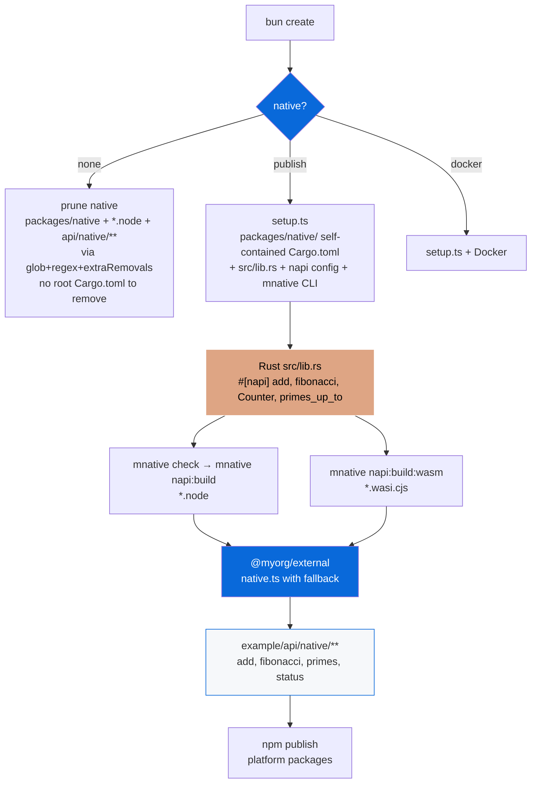

# @myorg/native-config

> Opt-in Cargo + NAPI-RS native bindings with Rust — native speed, WASM fallback, platform-specific binaries + conditional example routes. **No root Cargo.toml** — self-contained `packages/native/Cargo.toml` + `mnative` CLI.

## What it provides

- A `select` scaffold prompt (`none` / `publish` / `docker`) that decides whether a generated project ships native bindings
- **Self-contained Cargo**: `packages/native/Cargo.toml` only — edition 2021, direct deps (`napi`, `napi-derive`, `napi-build`), profiles `dev` / `release` (lto, codegen-units=1, strip) / `ci` — no root workspace
- `@napi-rs/cli` as shared devDependency + `mnative` CLI (`configs/native/src/cli.ts`) wrapping cargo + napi
- Setup script `src/setup.ts` that scaffolds `packages/native/` (self-contained) + ensures example native routes
- Template files for Rust crate (`Cargo.toml` standalone, `src/lib.rs`, `build.rs`, `package.json` napi config + `cargo:*` scripts via `mnative`)
- Integration with `packages/external` via `native.ts` wrapper with JS fallback
- Example app `apps/example/src/pages/api/native/**` — conditional routes deleted when native disabled
- CI: `rust-toolchain` + `rust-cache` (workspaces: packages/native) + `mnative fmt:check` + `mnative clippy` + `mnative check` + `mnative test`

> [!IMPORTANT]
> Opt-in — choose `Set up native Node-API bindings?` during `bun create Archont561/ts-monorepo-template`.

## Why no root Cargo.toml?

Previously root `Cargo.toml` defined `[workspace]` with `members = ["packages/native"]` and `workspace.dependencies`. This added an extra file that needed removal when native disabled and required `--workspace` flags.

Refactored:
- `packages/native/Cargo.toml` is standalone — all deps versions directly, profiles inside
- All cargo operations via `mnative` CLI (or `bun --filter @myorg/native run cargo:*`) which runs in `packages/native` dir
- Root `Cargo.toml` deleted — simpler template, no workspace indirection
- If you later add more Rust crates, you can re-introduce a workspace root, but for single crate self-contained is simpler

## Cargo Guide (Agent-Ready)

### What Cargo is

Cargo is official Rust package manager, build system, test runner, doc generator, publish tool — all in one. Manages crates, drives `rustc`, runs tests.

### Key files

| File | Purpose |
|---|---|
| `packages/native/Cargo.toml` | Manifest: metadata, dependencies, features, profiles (self-contained) |
| `Cargo.lock` | Pinned versions (commit for binaries, gitignore for libraries) — gitignored for cdylib |
| `packages/native/src/lib.rs` | Library crate entry (cdylib for napi) |
| `packages/native/build.rs` | Build script (napi_build::setup) |
| `packages/native/rust-toolchain.toml` | Toolchain, components (rustfmt, clippy), targets (wasm32-wasip1-threads) — self-contained, no root file needed |
| `packages/native/.cargo/config.toml` | Optional build config — self-contained |

### Self-contained Cargo.toml

```toml
[package]
name = "native"
version = "0.1.0"
edition = "2021"

[lib]
crate-type = ["cdylib"]

[dependencies]
napi = { version = "3.0.0", features = ["napi4"] }
napi-derive = "3.0.0"

[build-dependencies]
napi-build = "2"

[profile.release]
opt-level = 3
lto = true
codegen-units = 1
strip = "symbols"

[profile.ci]
inherits = "dev"
opt-level = 1
```

No `workspace = true`, no root workspace — simpler.

### Core Cargo Commands via mnative CLI

```bash
mnative check          # cargo check (fast type-check, no codegen) — inner loop
mnative clippy         # cargo clippy -- -D warnings
mnative fmt --all -- --check   # via mnative fmt:check
mnative fmt            # cargo fmt --all
mnative test           # cargo test
mnative build          # cargo build
mnative build:release  # cargo build --release (lto, strip)
mnative build:ci       # cargo build --profile ci
mnative tree           # cargo tree
mnative napi:build     # cargo check && napi build --release --platform
mnative typecheck      # tsc --noEmit inside packages/native (skips if absent)
```

Root package.json also exposes:

```bash
bun run cargo:check    # → mnative check
bun run cargo:clippy   # → mnative clippy
bun run build:native   # → bun --filter @myorg/native run build
```

### Build Profiles

```toml
[profile.release]
opt-level = 3
lto = true
codegen-units = 1
strip = "symbols"

[profile.ci]
inherits = "dev"
opt-level = 1
```

### CI Checklist (GitHub Actions)

```yaml
- uses: dtolnay/rust-toolchain@stable
  with:
    components: clippy, rustfmt
    targets: wasm32-wasip1-threads
- uses: Swatinem/rust-cache@v2
  with:
    workspaces: "packages/native"
- run: mnative fmt:check
- run: mnative clippy
- run: mnative check
- run: mnative test
- run: mnative build:release
```

## Architecture



### Scaffold options

| Option | Description | Result |
| :--- | :--- | :--- |
| `none` | No native bindings (default) | Removes `packages/native/` (including `rust-toolchain.toml`, `.cargo/`, `Cargo.lock`, `*.node`) + `apps/example/src/pages/api/native/**` via glob+regex+extraRemovals — no root Cargo.toml or root rust-toolchain.toml exists |
| `publish` | Publish with prebuilt binaries | Keeps + runs `setup.ts` → `packages/native/` self-contained + example routes + CI matrix + `mnative` CLI |
| `docker` | Build in Docker | Keeps + Docker cross-compilation |

### Data-driven removals

When `none` selected:

| Field | Patterns | Purpose |
| :--- | :--- | :--- |
| `extraRemovals` | `packages/native`, `apps/example/src/pages/api/native` | Exact paths — self-contained native dir includes `rust-toolchain.toml`, `.cargo/`, `Cargo.lock`, `*.node` — no root Cargo.toml or root rust-toolchain.toml |
| `filePatternsToRemove` | `**/*.node`, `**/*.napi.*`, `**/*.wasi.cjs`, `**/rust-toolchain.toml`, `Cargo.lock`, `.cargo/**`, `**/native/**`, `**/api/native/**` | Glob via `Bun.Glob` — covers `packages/native/rust-toolchain.toml` |
| `fileRegexesToRemove` | `\.node$`, `napi`, `rust-toolchain`, `api/native` | Regex |
| `appDepsToRemove` | `@myorg/native` | Remove from example |

When `publish`/`docker` selected, `setup: configs/native/src/setup.ts` runs to scaffold `packages/native/` self-contained + ensure example routes exist + set root scripts to `mnative`.

## Usage

```bash
bun create Archont561/ts-monorepo-template my-app   # choose "Set up native Node-API bindings?"
cd my-app

# mnative CLI (Cargo wrapper, no root Cargo.toml)
mnative check          # fast type-check
mnative clippy
mnative fmt:check
mnative test

# Build native for current host
bun run build:native          # → bun --filter @myorg/native run build → cargo check && napi build --platform
# or directly:
mnative napi:build
# or cargo directly in package dir:
cargo check --manifest-path packages/native/Cargo.toml
cargo build --manifest-path packages/native/Cargo.toml --release

# WASM fallback
rustup target add wasm32-wasip1-threads
bun run build:wasm            # → mnative napi:build:wasm

# Test
bun run test:native
mnative test

# Example app with native routes
bun run dev
# → http://localhost:3000/api/native/add?a=5&b=7
# → http://localhost:3000/api/native/fibonacci/35
# → http://localhost:3000/api/native/status
```

<details>
<summary>After enabling — package structure (no root Cargo.toml)</summary>

```
packages/native/
  Cargo.toml          # Self-contained Rust crate (edition 2021, direct deps, cdylib, profiles)
  rust-toolchain.toml # stable + rustfmt, clippy, wasm32-wasip1-threads (self-contained, no root file)
  .cargo/config.toml  # optional build config (self-contained)
  build.rs            # napi-build setup
  src/
    lib.rs            # Rust with #[napi] — add, fibonacci, Counter, primes_up_to
  package.json        # napi config + cargo:* scripts via mnative / cargo
  tsconfig.json       # extends @myorg/ts/library.json
  README.md           # docs
  index.js            # generated loader (auto picks .node)
  index.d.ts          # generated types
  *.node              # native binaries (gitignored, per-platform)
  npm/                # per-platform optional packages (generated via create-npm-dirs)

apps/example/src/pages/api/native/
  index.ts, add.ts, status.ts, fibonacci/[n].ts, primes/[n].ts, reverse.ts

configs/native/
  src/cli.ts          # mnative CLI (cargo wrapper)
  src/setup.ts        # scaffolds self-contained Cargo.toml
  package.json        # bin: mnative → dist/cli.js
```

</details>

## NAPI Config

```json
{
  "napi": {
    "binaryName": "native",
    "packageName": "@myorg/native",
    "targets": [
      "x86_64-apple-darwin",
      "aarch64-apple-darwin",
      "x86_64-pc-windows-msvc",
      "x86_64-unknown-linux-gnu",
      "aarch64-unknown-linux-gnu",
      "x86_64-unknown-linux-musl",
      "wasm32-wasip1-threads"
    ],
    "wasm": {
      "initialMemory": 16,
      "maximumMemory": 65536,
      "browser": { "fs": false, "asyncInit": true }
    }
  }
}
```

## WASM Fallback

> [!CAUTION]
> Bun + WASM has open incompatibility (napi-rs#2965). Test separately before shipping to Bun users.

```bash
rustup target add wasm32-wasip1-threads
bun run build:wasm
```

## Platform Packages (Publish)

```bash
napi create-npm-dirs   # npm/ per-target
# In CI per target:
napi build --release --target <target>
napi artifacts
napi pre-publish
npm publish --access public
```

## Cross-Compilation

- `--use-napi-cross`: Linux glibc on Linux x64/arm64
- `--cross-compile` (`-x`): Windows MSVC from non-Windows, musl
- `cargo-zigbuild` for easy cross-compilation via Zig linker

```bash
cargo install cargo-zigbuild
cargo zigbuild --target aarch64-unknown-linux-gnu --release --manifest-path packages/native/Cargo.toml
```

## CI Matrix

```yaml
strategy:
  matrix:
    include:
      - host: ubuntu-latest
        target: x86_64-unknown-linux-gnu
        build: napi build --release --target x86_64-unknown-linux-gnu --use-napi-cross
      - host: macos-latest
        target: aarch64-apple-darwin
        build: napi build --release --target aarch64-apple-darwin
```

Full CI checklist (no root Cargo.toml):

```yaml
- uses: dtolnay/rust-toolchain@stable
  with:
    components: clippy, rustfmt
- uses: Swatinem/rust-cache@v2
  with:
    workspaces: "packages/native"
- run: mnative fmt:check
- run: mnative clippy
- run: mnative check
- run: mnative test
- run: mnative build:release
```

See [PLAN.md](./PLAN.md) for full integration plan.

## References

- [napi-rs](https://napi.rs)
- [Cargo Book](https://doc.rust-lang.org/cargo/)
- [PLAN.md](./PLAN.md)
- [AGENT.md](./AGENT.md)
- [packages/native/README.md](../../packages/native/README.md)
- [Example README](../../apps/example/README.md)
