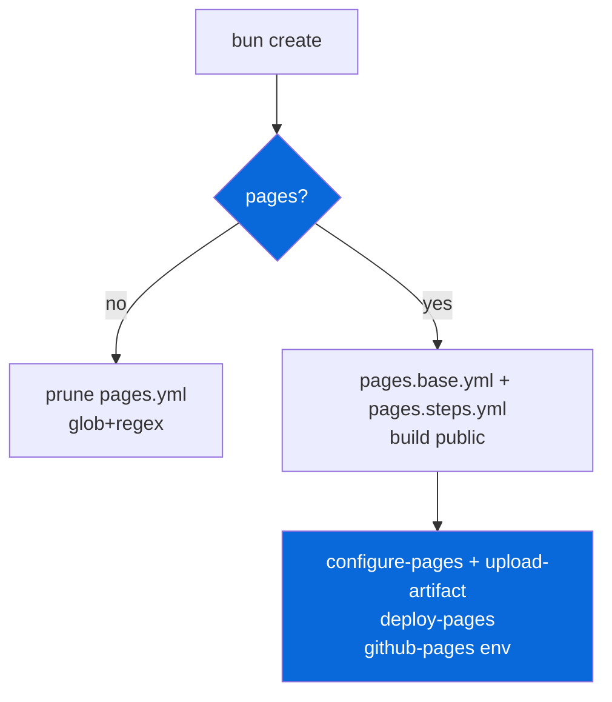

## Pages (GitHub Pages)

> Opt-in — confirm prompt `Set up GitHub Pages deployment?` during scaffolding. Data-driven via `package.json` `scaffold` metadata.

- `configs/pages` (`@myorg/pages`) provides GitHub Pages deployment via Actions, opt-in confirm
- When `false` (default), `.github/workflows/pages.yml` + `pages.base.yml`/`pages.steps.yml` removed via `extraRemovals` + `filePatternsToRemove` (`**/pages.yml`) + `fileRegexesToRemove` (`pages\.yml`, `github-pages`)
- When `true`, keeps `configs/gh-actions/pages.base.yml` skeleton + `configs/pages/pages.steps.yml` fragment → generates `.github/workflows/pages.yml` via `bun run docs:sync` (`mdocs`)
- `pages.base.yml` skeleton: `name: Deploy to GitHub Pages`, `on: push main + workflow_dispatch`, `permissions: contents read, pages write, id-token write`, `concurrency: group pages, cancel-in-progress false`, jobs `build` (checkout, setup-bun, install, {{STEPS}}, configure-pages, upload-pages-artifact path `./apps/example/public`) + `deploy` (needs build, environment github-pages, if main, deploy-pages)
- `pages.steps.yml` fragment: `mpages build` (runs `bun run build`, verifies `apps/example/public`) + `mpages base` (repo name + Pages URL, `--inject` rewrites absolute `href`/`src`) — all logic lives in `configs/pages/src/cli.ts`; no UnoCSS step (CSS is built by the app that owns it)
- Official actions: `configure-pages@v5`, `upload-pages-artifact@v3`, `deploy-pages@v4` — deploy targets `github-pages` environment
- Other configs can contribute `pages.steps.yml` fragments (e.g. coverage publishes its HTML report into `apps/example/public/coverage`)
- Repo settings one-time: Settings → Pages → Source → GitHub Actions, environment `github-pages` auto-created, add protection rule only main can deploy
- URL patterns: user site `username.github.io` → `https://username.github.io`, other repo → `https://username.github.io/repo-name`, custom domain → `https://yourdomain.com` — set base path to `/repo-name` for non-root

| Option | Result |
| :--- | :--- |
| `false` | No pages.yml (default) |
| `true` | Keep pages workflow + fragments, generates pages.yml |

> [!IMPORTANT]
> Always declare `pages: write` + `id-token: write`, use `concurrency` group pages + `cancel-in-progress false`, split build/deploy, gate deploy with `if: main`, include `workflow_dispatch`.

See [README.md](./README.md) and [gh-actions README](../gh-actions/README.md) for full guide.
