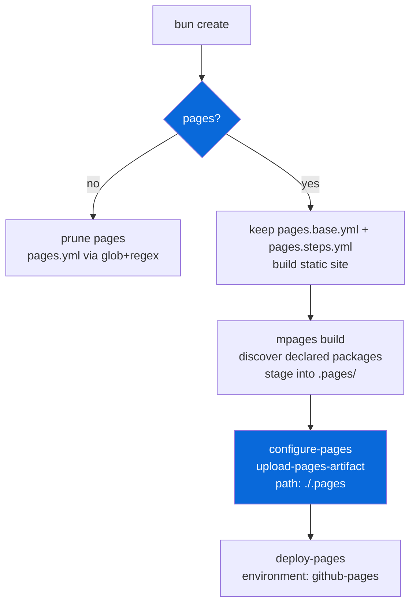

# @myorg/pages

> Opt-in GitHub Pages deployment via GitHub Actions. **What gets deployed is discovered**: any workspace package that declares a `pages` field in its own `package.json` is published, so nothing is hardcoded to `apps/example`.

## What it provides

- A `confirm` scaffold prompt (`Set up GitHub Pages deployment?`) that decides whether a generated project ships Pages deployment
- `pages.steps.yml` fragment aggregated into `.github/workflows/pages.yml` via `mdocs`
- `pages.base.yml` skeleton in `configs/gh-actions/` with required permissions (`pages: write`, `id-token: write`), concurrency (`group: pages`, `cancel-in-progress: false`), environment `github-pages`
- Build + deploy workflow using official Pages actions: `configure-pages`, `upload-pages-artifact`, `deploy-pages`
- `mpages` CLI (`configs/pages/src/cli.ts`) — `mpages build` builds and stages the artifact from every package that declares one, `mpages base` prints the repo name + Pages URL and can inject the `/repo-name` base path, `mpages list` shows what was discovered
- CSS is **not** built here — the app that owns the UnoCSS config does it in its own `build` script (see `configs/unocss`)

> [!IMPORTANT]
> Opt-in — choose `Set up GitHub Pages deployment?` during `bun create Archont561/ts-monorepo-template`.

> [!NOTE]
> **This repository** is the exception: its template-only docs site owns Pages
> (`template-docs.yml` → `mdocs site`), so `bun run docs:sync` does not generate
> `pages.yml` here — two workflows cannot deploy to one site. Generated
> monorepos have no `docs/`, so they get `pages.yml` whenever Pages is enabled.

## Architecture



### Scaffold options

| Option | Description | Result |
| :--- | :--- | :--- |
| `false` | No Pages deployment (default) | Removes `.github/workflows/pages.yml` via glob+regex |
| `true` | Include Pages deployment | Keeps `pages.base.yml` + `pages.steps.yml` + generates `pages.yml` |

### Data-driven removals

When `false` selected:

| Field | Patterns | Purpose |
| :--- | :--- | :--- |
| `extraRemovals` | `.github/workflows/pages.yml` | Exact path |
| `filePatternsToRemove` | `**/pages.yml`, `**/pages.base.yml`, `**/pages.steps.yml` | Glob via `Bun.Glob` |
| `fileRegexesToRemove` | `pages\.yml`, `github-pages` | Regex |

## Repo Settings (One-Time)

Navigate to:

```
Settings → Pages → Build and deployment → Source → GitHub Actions
```

- Select **GitHub Actions** as source (not Deploy from a branch)
- The workflow uses environment `github-pages` — created automatically if missing
- Add deployment protection rule: only `main` branch can deploy to `github-pages` (recommended)

## Declaring what gets deployed

A package opts into being published by declaring where its built site lives:

```jsonc
// apps/example/package.json
{
  "pages": { "dir": "public" }   // explicit (recommended)
  // "pages": "public"           // shorthand
  // "pages": true               // convention: public/
}
```

`mpages` scans `apps/*` and `packages/*` for that field — no registry, no config
file to keep in sync:

```bash
mpages list     # @myorg/example   apps/example/public   → /
```

| Declared packages | Result |
| :--- | :--- |
| one | published at the site root (`/`) |
| two or more | each under its unscoped name (`/example/`, `/docs/`) |

`mpages build` runs the workspace build (so every package produces its own
assets) and copies each declared directory into **`.pages/`**. That staging dir
is what the workflow uploads, which keeps `upload-pages-artifact` on a constant
path no matter which packages exist. `.pages/` is generated — gitignored, and
wiped on every build.

Coverage rides along the same way: `mcoverage pages` renders the report into
`coverage/html`, and `mpages build` folds it in as `/coverage/`.

## Workflow Details

### Required Permissions

Every Pages workflow must declare:

```yaml
permissions:
  contents: read
  pages: write
  id-token: write
```

Without `pages: write` + `id-token: write`, deployment fails with permission error.

### Official Actions

| Action | Purpose |
|---|---|
| `actions/configure-pages@v5` | Reads Pages config, sets output vars |
| `actions/upload-pages-artifact@v3` | Packages dir as Pages artifact |
| `actions/deploy-pages@v4` | Deploys artifact to Pages |

### Minimal Workflow (Static)

```yaml
name: Deploy static site to Pages
on:
  push:
    branches: ["main"]
  workflow_dispatch:
permissions:
  contents: read
  pages: write
  id-token: write
concurrency:
  group: "pages"
  cancel-in-progress: false
jobs:
  deploy:
    environment:
      name: github-pages
      url: ${{ steps.deployment.outputs.page_url }}
    runs-on: ubuntu-latest
    steps:
      - uses: actions/checkout@v4
      - uses: actions/configure-pages@v5
      - uses: actions/upload-pages-artifact@v3
        with:
          path: "./public"
      - uses: actions/deploy-pages@v4
        id: deployment
```

### Build + Deploy (Bun Example) — Used in Template

```yaml
name: Deploy to GitHub Pages
on:
  push:
    branches: ["main"]
  workflow_dispatch:
permissions:
  contents: read
  pages: write
  id-token: write
concurrency:
  group: "pages"
  cancel-in-progress: false
jobs:
  build:
    runs-on: ubuntu-latest
    steps:
      - uses: actions/checkout@v4
      - uses: oven-sh/setup-bun@v2
        with:
          bun-version: latest
      - run: bun install --frozen-lockfile
      - run: bun run build
      - uses: actions/configure-pages@v5
      - uses: actions/upload-pages-artifact@v3
        with:
          path: "./apps/example/public"
  deploy:
    needs: build
    runs-on: ubuntu-latest
    environment:
      name: github-pages
      url: ${{ steps.deployment.outputs.page_url }}
    if: github.ref == 'refs/heads/main'
    steps:
      - uses: actions/deploy-pages@v4
        id: deployment
```

### Concurrency

```yaml
concurrency:
  group: "pages"
  cancel-in-progress: false
```

`cancel-in-progress: false` prevents killing in-flight deploys — only queued runs cancelled.

## Usage

```bash
bun create Archont561/ts-monorepo-template my-app   # choose "Set up GitHub Pages deployment?"
cd my-app

# Local static preview
munocss build        # if unocss enabled (via the app's own build script)
ls apps/example/public/

# Deploy happens automatically on push to main via GitHub Actions
# Manual trigger: Actions tab → Deploy to GitHub Pages → Run workflow
```

### Custom Domain

- Verify domain in GitHub first (Settings → Pages → Custom domain) to prevent takeover
- When using `actions/deploy-pages`, configure domain in **Settings → Pages UI**, not via `CNAME` file
- `CNAME` file behavior differs: branch deploy creates commit with `CNAME`, Actions deploy ignores `CNAME` file

### URL Patterns

| Repo Type | Default URL |
| :--- | :--- |
| `username.github.io` (user site) | `https://username.github.io` |
| Any other repo | `https://username.github.io/repo-name` |
| Custom domain | `https://yourdomain.com` |

For `username.github.io/repo-name`, configure static generator base path to `/repo-name/` (e.g. `base: "/repo-name/"` in Vite, or adjust `href="/"` → `href="/repo-name/"`).

## Adding Build Steps (Other Configs)

Other configs can contribute `pages.steps.yml` fragments:

```yaml
# configs/unocss/pages.steps.yml
- name: Build UnoCSS for Pages
  run: munocss build
```

Fragments are sorted and injected into `{{STEPS}}` in `pages.base.yml` via `bun run docs:sync`.

## Agent Checklist

- ✅ Set **Source → GitHub Actions** in **Settings → Pages** before first run
- ✅ Always declare `pages: write` + `id-token: write` permissions
- ✅ Use `concurrency` `group: pages` + `cancel-in-progress: false`
- ✅ Split `build` + `deploy` jobs, gate `deploy` with `needs: build` + `if: github.ref == 'refs/heads/main'`
- ✅ Use `upload-pages-artifact` to pass built dir between jobs
- ✅ Include `workflow_dispatch` for manual re-deploys
- ✅ Set base path to `/repo-name` for non-root deploys
- ✅ For custom domains: configure in Settings → Pages UI, not CNAME file, when using `deploy-pages`

## References

- [GitHub Pages Docs](https://docs.github.com/en/pages)
- [AGENTS.md](./AGENTS.md)
- [gh-actions README](../gh-actions/README.md)
- [Example README](../../apps/example/README.md)
