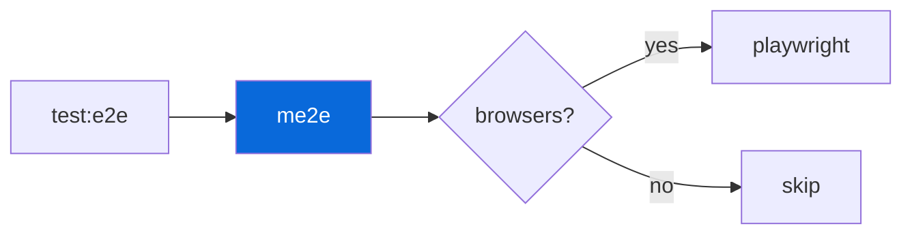

## E2E Testing

> [!NOTE]
> Opt-in — `me2e` wraps Playwright with browser detection.

- `@myorg/playwright` (`configs/playwright`) provides `@playwright/test`, `playwright.config.ts`, and `me2e` bin
- `me2e` (from `@myorg/playwright`) wraps `playwright test` — detects if browsers installed, auto-skips gracefully if missing (so `bun run test:e2e` doesn't fail in envs without browsers)
- Config (`playwright.config.ts` in `apps/example`): `testDir: e2e/`, `baseURL: http://localhost:3000`, projects Chromium/Firefox/WebKit
- E2E specs live in `apps/example/e2e/`, not in `tests/` — unit tests use `bun:test`, e2e uses `@playwright/test`, never mix imports
- `bun run test:e2e` → `me2e` → `playwright test`

| Command | Description |
| :--- | :--- |
| `bun run test:e2e` | E2E with auto-skip |
| `me2e` | Direct |
| `me2e --ui` | UI mode |

> [!WARNING]
> Don't import `bun:test` in Playwright specs, and don't import `@playwright/test` in unit tests.
