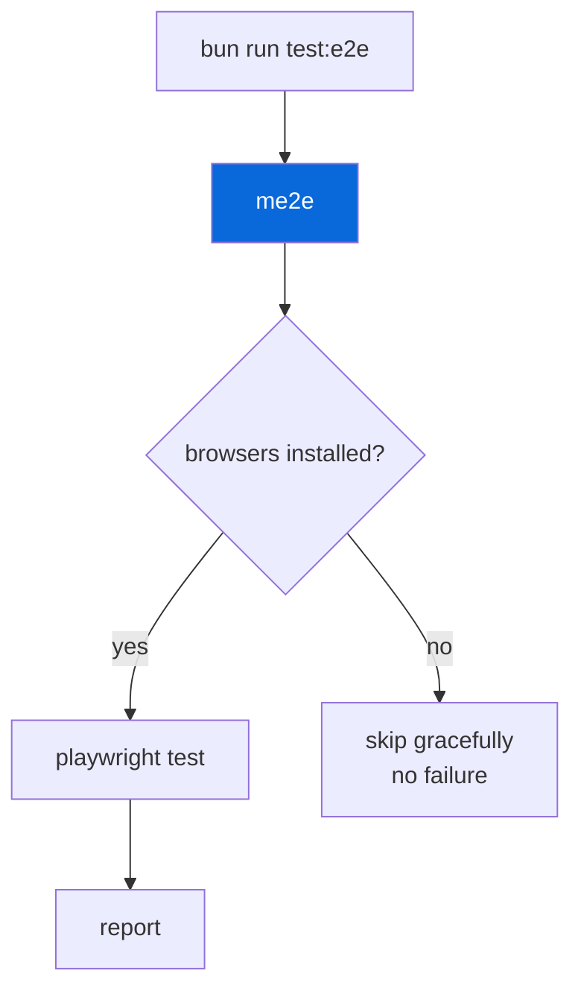

# @myorg/playwright

> E2E testing with Playwright, opt-in.

## What it provides

- `@playwright/test` as shared devDependency
- `playwright.config.ts` — shared config for `apps/example`
- `me2e` — CLI alias that wraps `playwright test` with browser detection and auto-skip

> [!NOTE]
> Opt-in — selected during scaffolding via `Set up E2E testing?` prompt. Disabled by default in template? No, enabled by default.

### Config highlights

| Setting | Value |
| :--- | :--- |
| `testDir` | `e2e/` |
| `browsers` | Chromium, Firefox, WebKit (auto-detected) |
| `auto-skip` | Skips if browsers missing (CI installs) |
| `baseURL` | `http://localhost:3000` |

## Usage

```bash
bun run test:e2e      # me2e → playwright with auto-skip
me2e                  # Direct
me2e --ui             # UI mode
```



<details>
<summary>Writing E2E tests</summary>

```typescript
// apps/example/e2e/example.spec.ts
import { test, expect } from "@playwright/test";

test("homepage", async ({ page }) => {
  await page.goto("/");
  await expect(page.locator("h1")).toBeVisible();
});
```

- Place specs in `apps/example/e2e/`
- Uses `baseURL` from `playwright.config.ts`
- Don't import `bun:test` in Playwright specs

</details>

## Commands

| Command | Description |
| :--- | :--- |
| `bun run test:e2e` | Run E2E with auto-skip |
| `me2e` | Direct Playwright wrapper |
| `me2e --ui` | UI mode |
| `bunx playwright install` | Install browsers |

See [AGENTS.md](./AGENTS.md) for the agent-facing reference.
