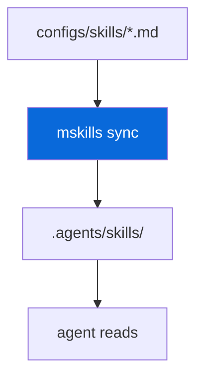

## AI Agent Skills

> [!NOTE]
> Opt-in — `mskills` manages AI agent skills.

- `@myorg/skills` (`configs/skills`) provides skill definitions (Markdown with frontmatter) and `mskills` bin
- `mskills list` / `bun run skills:list` — list available skills
- `mskills sync` / `bun run skills:sync` — sync skills into `.agents/skills/` (generated, not committed, gitignored)
- Skills are used by AI coding agents (Claude, Cursor) — they read `.agents/skills/` for instructions
- Opt-in via scaffold prompt `Set up AI agent skills?` — when disabled, `configs/skills` is pruned

| Command | Description |
| :--- | :--- |
| `bun run skills:list` | List skills |
| `bun run skills:sync` | Sync to `.agents/skills/` |
| `mskills list` | Direct |
| `mskills sync` | Direct |

> [!TIP]
> After adding a new skill in `configs/skills/`, run `skills:sync`.
