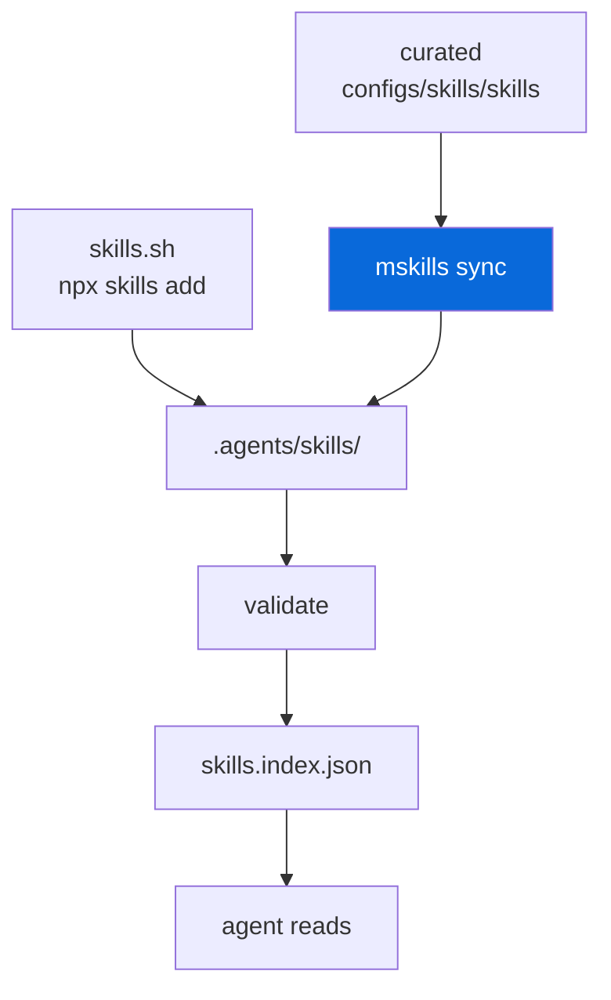

## AI Agent Skills (skills.sh)

> [!NOTE]
> Opt-in — `mskills` manages AI agent skills via skills.sh + curated skills.

- `@myorg/skills` (`configs/skills`) provides:
  - Curated skills: `configs/skills/skills/<name>/SKILL.md` (committed, with frontmatter `name`, `description`)
  - `mskills` bin: wraps `skills` CLI (skills.sh) + local sync/validate/index
  - Vendored: `.agents/skills/<name>/SKILL.md` (committed for reproducibility)
  - Index: `.agents/skills.index.json` (generated)

- **Source of truth**: `.agents/skills/` — committed so CI/devs get identical behavior. Treat as stable path for agent runtime.

- **Commands**:

| Command | Description |
| :--- | :--- |
| `bun run skills sync` | Sync curated → vendored + validate + index |
| `bun run skills list` | List installed (curated + vendored + skills.sh) |
| `bun run skills add <pkg>` | Add via skills.sh (`vercel-labs/agent-skills` or `https://skills.sh/p/<id>`) |
| `bun run skills update` | Update all via skills.sh |
| `bun run skills validate` | Validate all `SKILL.md` frontmatter |
| `bun run skills index` | Build `skills.index.json` |

One root script (`skills` → `mskills`) — skills are monorepo-wide, so there is
no per-package variant and no need for six near-identical root scripts.
| `mskills add <pkg>` | Direct |
| `mskills update` | Direct |

- **skills.sh flow**:

```bash
# Add from GitHub
npx skills add vercel-labs/agent-skills -p --agent * -y
# Add from pack
npx skills add https://skills.sh/p/<pack-id> -p --agent * -y
# Update
npx skills update -p -y
# List project skills
npx skills list -p
```

- **Skill format**: Folder containing `SKILL.md` with YAML frontmatter:

```markdown
---
name: biome
description: Lint and format with Biome
---

# Biome
...
```

- **Loader** (Bun-friendly):

```typescript
const index = await file(".agents/skills.index.json").json();
// or
const glob = new Glob(".agents/skills/**/SKILL.md");
for await (const path of glob.scan({ cwd: process.cwd() })) { /* load */ }
```

- **Security**:

> [!CAUTION]
> skills.sh audits but cannot guarantee safety. Review before installing.

  - Pin/curate: fixed GitHub ref or pack you own
  - Review diffs: changes show in PRs (since `.agents/skills/` committed)
  - No secrets: packs unlisted, not access-controlled

- Opt-in via scaffold prompt `Set up AI agent skills?` — when disabled, `configs/skills` + `.agents/skills/` are pruned via `filePatternsToRemove` + `fileRegexesToRemove`.



> [!TIP]
> After adding new skill in `configs/skills/skills/<name>/SKILL.md`, run `bun run skills sync` to validate and index.
