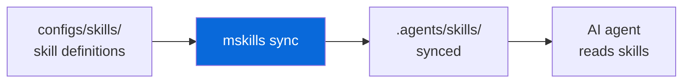

# @myorg/skills

> AI agent skills, opt-in.

## What it provides

- Skill definitions for AI coding agents (Claude, Cursor, etc.)
- `mskills` — CLI for listing and syncing skills
- `.agents/skills/` — synced skills directory (generated, not committed)

> [!NOTE]
> Opt-in — selected during scaffolding via `Set up AI agent skills?` prompt.

### Skills

| Skill | Description |
| :--- | :--- |
| `commit` | Conventional Commits helper |
| `review` | Code review checklist |
| `test` | Test generation |

## Usage

```bash
bun run skills:list   # mskills list → list available skills
bun run skills:sync   # mskills sync → sync to .agents/skills/
mskills list          # Direct
mskills sync          # Direct
```



<details>
<summary>Skill format</summary>

```markdown
# Skill: commit

> Helps create Conventional Commits

## When to use

- Creating commit messages
- Validating commit format

## Instructions

...
```

Skills are Markdown files with frontmatter and instructions.

</details>

See [AGENT.md](./AGENT.md) for the agent-facing reference.
