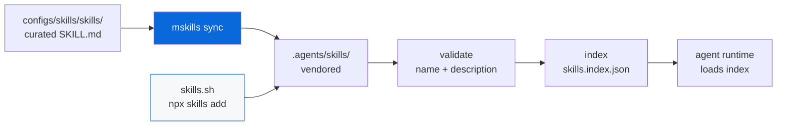

# @myorg/skills

> AI agent skills via [skills.sh](https://skills.sh) + curated skills — opt-in.

## What it provides

- Curated skill definitions in `skills/<name>/SKILL.md` (committed, with YAML frontmatter `name`, `description`)
- `mskills` — CLI that wraps `skills` (skills.sh) + local sync/validate/index
- `.agents/skills/` — vendored skills directory (committed for reproducibility)
- `.agents/skills.index.json` — generated index for fast agent loading

> [!NOTE]
> Opt-in — selected during scaffolding via `Set up AI agent skills?` prompt.

## Skills.sh Integration

We use the [skills.sh](https://skills.sh) ecosystem to vendor skills into this repo.

> [!IMPORTANT]
> Treat `.agents/skills/` as source of truth for agent runtime. Commit it so CI/devs get identical behavior.

### Curated vs Vendored

| Location | Purpose | Committed |
| :--- | :--- | :---: |
| `configs/skills/skills/<name>/SKILL.md` | Curated, template source of truth | ✅ |
| `.agents/skills/<name>/SKILL.md` | Vendored, includes skills.sh installs | ✅ |
| `.agents/skills.index.json` | Generated index | ✅ |

### Skills

| Skill | Description |
| :--- | :--- |
| `biome` | Lint and format with Biome |
| `bun` | Bun runtime, test, coverage |
| `turbo` | Task orchestration |
| `playwright` | E2E testing |
| `changeset` | Versioning and releases |
| `commit` | Conventional Commits helper |
| `review` | Code review checklist |
| `test` | Test generation |

## Usage

One root script, `mskills` subcommands:

```bash
# Sync curated → vendored + validate + index
bun run skills sync        # mskills sync (also the default with no subcommand)

# List installed
bun run skills list        # mskills list

# Add via skills.sh (GitHub or pack)
bun run skills add vercel-labs/agent-skills
bun run skills add https://skills.sh/p/<pack-id>

# Update via skills.sh
bun run skills update

# Validate frontmatter
bun run skills:validate    # mskills validate

# Build index
bun run skills:index       # mskills index
```



<details>
<summary>Skill format (SKILL.md)</summary>

Each skill is a folder containing `SKILL.md` with YAML frontmatter:

```markdown
---
name: biome
description: Lint and format with Biome
---

# Biome Code Quality

Biome handles linting, formatting, and import sorting.

## When to use

- Before committing code

## Commands

...
```

Requirements:

- Frontmatter must have `name` and `description`
- Body is Markdown with instructions
- Folder name should match `name`

</details>

<details>
<summary>Loader (Bun-friendly)</summary>

Minimum viable loader:

```typescript
import { file } from "bun";

// Fast path: index
const index = await file(".agents/skills.index.json").json();
for (const skill of index) {
  const content = await file(skill.path).text();
  // Parse frontmatter, feed body into system instructions
}

// Or scan all
import { Glob } from "bun";
const glob = new Glob(".agents/skills/**/SKILL.md");
for await (const path of glob.scan({ cwd: process.cwd() })) {
  // Load
}
```

</details>

## Security + Hygiene

> [!CAUTION]
> skills.sh cannot guarantee quality/security of every skill. Review before installing.

- **Pin/curate**: Prefer fixed GitHub ref (tag/commit) or pack you own
- **Review diffs**: Skill changes show up in PRs since `.agents/skills/` is committed
- **No secrets**: Packs are unlisted, not access-controlled — never include secrets/credentials
- **Validate**: Run `bun run skills:validate`

## Drop-in README snippet

```md
### Agent Skills (skills.sh)

We use the skills.sh ecosystem to vendor skills into this repo.

- Install: `bun run skills:add`
- Update: `bun run skills:update`
- Sync: `bun run skills:sync`

Skills live in: `.agents/skills/`

Each skill is a folder containing `SKILL.md` (YAML frontmatter with `name` and `description`).
```

See [AGENTS.md](./AGENTS.md) for the agent-facing reference.
